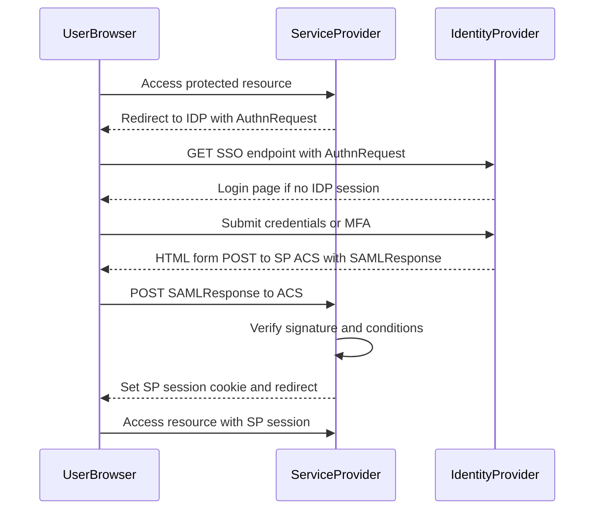
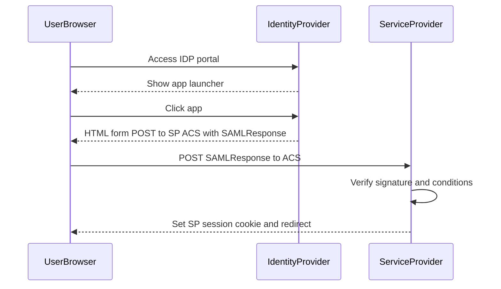

Dưới đây là “bản đồ trận” SSO qua **SAML 2.0** theo cách hiểu tường tận (đủ để nhìn log là đoán ra đang hỏng ở đâu), kèm sơ đồ Mermaid.

---

## 1) SAML SSO là gì, và “SSO” nằm ở đoạn nào

**SAML** là cơ chế *federation* (liên kết định danh) giữa 2 vai:

* **IdP**: Identity Provider (Keycloak hay ADFS, Okta…). Nơi *xác thực người dùng* và *phát hành SAML Assertion*.
* **SP**: Service Provider (ứng dụng của mày). Nơi *tin IdP* và *nhận assertion để tạo session*.

“SSO” xảy ra khi:

* Người dùng đã có **session tại IdP** (đăng nhập IdP rồi), nên lần sau vào SP khác, IdP có thể phát assertion mới mà không cần nhập lại mật khẩu.

---

## 2) 4 mảnh ghép cốt lõi phải nắm

### A. SAML Assertion

Là “tờ chiếu chỉ” do IdP ký, chứa:

* **Subject**: người dùng là ai (NameID).
* **Attributes**: email, groups, roles… tuỳ mapping.
* **Conditions**: thời hạn, audience, issuer, thời điểm hợp lệ.
* **AuthnStatement**: đã xác thực lúc nào, bằng phương thức gì.

Điểm mấu chốt: **SP không tự xác thực user**. SP chỉ:

1. kiểm tra assertion hợp lệ và tin được,
2. ánh xạ ra user nội bộ,
3. tạo session ứng dụng.

### B. Ràng buộc tin cậy

* **Chữ ký số**: Assertion hoặc Response được **IdP ký** bằng private key.
* SP dùng **public certificate** của IdP để verify signature.
* Có thể **mã hoá** assertion (encryption) để tránh lộ attributes trên đường đi, nhưng thực chiến hay dùng TLS + signature là chủ lực.

### C. Endpoint và Binding

* **SSO URL** (IdP): nơi SP “gửi user” sang để đăng nhập.
* **ACS URL** (SP): Assertion Consumer Service, nơi SP nhận SAMLResponse.
* **Bindings** phổ biến:

  * **HTTP-Redirect**: thường dùng cho AuthnRequest (SP -> IdP).
  * **HTTP-POST**: thường dùng cho SAMLResponse (IdP -> SP).
  * Artifact binding ít gặp hơn.

### D. Metadata

Hai bên trao đổi “hồ sơ”:

* SP metadata: entityID, ACS URL, yêu cầu ký request hay không…
* IdP metadata: entityID, SSO URL, certificates, supported bindings…

Metadata sai là “bắn nhầm tọa độ”: redirect đúng mà verify sai, hoặc post về nhầm ACS.

---

## 3) Luồng chuẩn nhất: SP-initiated SSO

### Diễn giải từng bước

1. User vào SP, chưa có session.
2. SP tạo **AuthnRequest**, redirect user sang IdP SSO URL.
3. IdP kiểm tra session:

   * nếu chưa login: đưa form login
   * nếu đã login: bỏ qua form
4. IdP tạo **SAMLResponse** chứa assertion, **ký** lại.
5. IdP POST SAMLResponse về **ACS URL** của SP.
6. SP verify signature, issuer, audience, thời gian, recipient…
7. SP tạo session app, set cookie, redirect user vào trang ban đầu.

### Mermaid sequence

---

## 4) Bên trong SAMLResponse: SP cần kiểm tra những gì

Khi SP nhận SAMLResponse, “cửa ải” thường gồm:

1. **Signature valid**

* Verify bằng cert IdP đã cấu hình.
* Sai cert hoặc rotate cert mà SP chưa cập nhật: fail ngay.

2. **Issuer match**

* entityID của IdP phải đúng.

3. **Audience restriction**

* Assertion phải “dành cho” SP này.
* Audience mismatch là lỗi cấu hình entityID SP hoặc realm.

4. **Recipient và ACS match**

* Response phải nhắm đúng ACS URL của SP.
* Dính lỗi khi có nhiều domain hoặc reverse proxy rewrite sai.

5. **Time window**

* NotBefore, NotOnOrAfter, clock skew.
* Lệch giờ máy chủ là sát thủ thầm lặng.

6. **InResponseTo match**

* Với SP-initiated, SP thường ràng: response phải khớp request id.
* Nếu bật kiểm tra mà mất state (cluster SP không sticky) sẽ fail.

7. **Replay protection**

* SP nên lưu ID assertion hoặc response để tránh bị replay trong thời gian sống.

---

## 5) IdP-initiated SSO: tiện nhưng “mềm yếu” hơn

Luồng IdP-initiated là:

* User vào IdP portal, bấm app, IdP phát SAMLResponse thẳng về SP.

Vấn đề:

* Thường **không có InResponseTo**, nên SP khó ràng buộc theo request.
* Dễ bị lạm dụng hơn nếu SP cấu hình lỏng.

Mermaid:

---

## 6) Chỗ Keycloak đã làm cho mày những gì khi “chạy được”

Khi triển khai với Keycloak, thường mày đã vô tình “xong các việc lớn” sau:

* Keycloak đóng vai **IdP**: phát SAMLResponse, ký bằng realm key.
* Mày cấu hình **Client SAML**:

  * Valid redirect URIs hoặc ACS URL
  * Client signature settings
  * Mappers: map user attributes, groups sang SAML attributes
* SP plugin hoặc middleware:

  * verify signature
  * map NameID hoặc email -> user
  * tạo session

Nhưng để “tường tận”, mày cần nắm **logic kiểm tra assertion** và **ràng buộc trust** như phần 4.

---

## 7) Những lỗi thực chiến hay gặp và cách “đọc mùi” nhanh

* **Invalid signature**: sai cert IdP, hoặc SP đọc nhầm cert, hoặc response bị đổi trên đường.
* **Audience invalid**: entityID SP cấu hình khác giữa metadata và SP runtime.
* **Recipient invalid**: ACS URL mismatch do proxy, http vs https, port, path.
* **Response expired**: clock skew, hoặc user treo trang login quá lâu.
* **InResponseTo not found**: SP cluster không share state, thiếu sticky session, hoặc bật IdP-initiated nhưng SP vẫn yêu cầu InResponseTo.

---

## 8) “Chuẩn trận địa” best practice cho production

* Bật **HTTPS** end-to-end.
* Bắt buộc **verify signature** và pin đúng cert IdP, có quy trình rotate cert.
* Kiểm tra đầy đủ: issuer, audience, recipient, time window, replay.
* Hạn chế IdP-initiated nếu không cần.
* Đặt clock sync chuẩn (NTP) cho IdP và SP.
* Nếu SP chạy nhiều replica:

  * dùng shared session store hoặc sticky, hoặc cấu hình SAML state phù hợp.

---

Nếu mày muốn, tao có thể viết tiếp phần “mổ xẻ packet” theo dạng:

* ví dụ cấu trúc AuthnRequest và SAMLResponse (các trường quan trọng),
* mapping Keycloak mappers -> SAML attributes,
* checklist cấu hình SP ở phía ứng dụng khi chạy sau reverse proxy và ingress.
