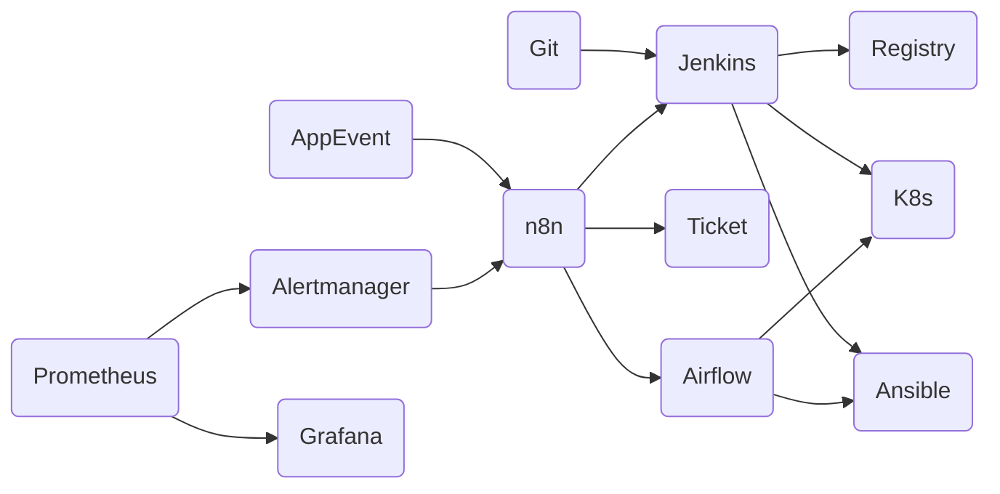
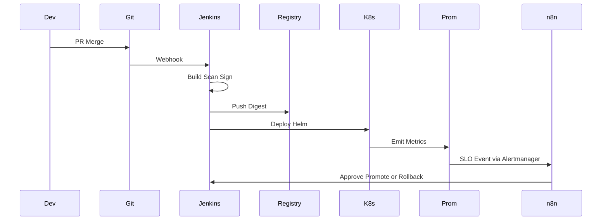
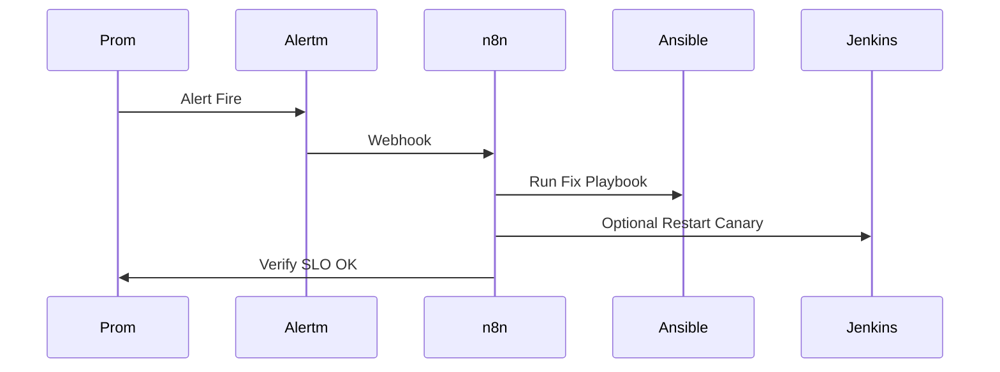

---

# I. Nguyên tắc tổng chỉ huy

* **Một việc một chủ lực**: CI/CD giao cho Jenkins; cấu hình máy chủ giao Ansible; batch dữ liệu giao Airflow; glue event và human-in-the-loop giao n8n; đo lường giao Prometheus; quan sát giao Grafana.
* **Event trước, cron sau**: ưu tiên kích hoạt theo sự kiện; chỉ dùng lịch khi không có tín hiệu sự kiện đáng tin.
* **GitOps xương sống**: mọi pipeline, playbook, DAG, manifest đều ở Git; secrets tách khỏi Git.
* **Idempotent + rollback**: mọi hành động lặp lại an toàn; luôn có đường lui.
* **Quan sát gắn định danh**: mọi job có RunID và CorrelationID xuyên suốt các công cụ.

---

# II. Vai trò và giới hạn từng công cụ

* **Jenkins**: CI/CD, build ký đẩy image theo **digest**, scan bảo mật, phê duyệt đa bước, tách duty Dev-ANTT-Ops, fan-out deployment.
* **Ansible**: cấu hình hệ thống, thay đổi hạ tầng, tác vụ imperative có idempotency; chạy kiểm soát qua Jenkins hoặc AWX nếu cần UI.
* **n8n**: orchestrator “ngoại giao”: webhook, chatops, ticket, phê duyệt người, glue giữa các hệ; không gánh batch nặng.
* **Airflow**: batch dữ liệu, ETL, DAG phức tạp, backfill, SLA; gọi Jenkins hoặc Ansible khi cần “động vào hạ tầng”.
* **Prometheus**: metrics chuẩn hóa, exporters, alert rules, Alertmanager phát sự kiện.
* **Grafana**: dashboard, OnCall, annotation triển khai, báo cáo SLA.

---

# III. Kiến trúc tổng thể



---

# IV. Luồng chuẩn “triển khai ứng dụng”

**Mục tiêu**: build → scan → ký → deploy → quan sát → chốt.

1. **Jenkins**: trigger theo PR hoặc tag; build image; **SCA + SAST + container scan**; ký số; đẩy Registry.
2. **Gate**: ANTT hoặc n8n-approval → Jenkins tiếp tục.
3. **Deploy**: Jenkins dùng Helm/Kustomize đẩy lên K8s.
4. **Quan sát**: Prometheus bắt metrics mới; Grafana “annotate” thời điểm deploy.
5. **Decision**: n8n đọc KPI từ Prometheus; đạt SLO → n8n phát “deploy_done”; nếu tụt SLO → n8n ra lệnh rollback qua Jenkins.

---

# V. Use case theo “binh chủng”

## 1) Bảo trì hạ tầng định kỳ

* **Chủ lực**: Ansible
* **Kích hoạt**: Jenkins schedule hoặc Airflow Sensor nếu phụ thuộc dữ liệu
* **Quan sát**: Prometheus node/exporter; alert lỗi đẩy về n8n
* **Quy tắc**: playbook idempotent, dry-run trước, tag rõ ràng

## 2) ETL và batch dữ liệu

* **Chủ lực**: Airflow
* **Phối hợp**: cần snapshot DB hay scale tạm thời → gọi Jenkins job hoặc Ansible role
* **SLA**: định nghĩa DAG SLA; fail → Alertmanager → n8n mở ticket và ping đội Data

## 3) Incident auto-remediation

* **Kích hoạt**: Alertmanager → n8n
* **n8n**: kiểm tra điều kiện an toàn, chạy **Ansible** playbook khắc phục hoặc gọi **Jenkins** job canary-restart
* **Quan sát**: theo dõi metric hậu can thiệp; nếu không hồi phục → escalate Grafana OnCall

## 4) Tuân thủ và kiểm kê

* **Jenkins**: quét định kỳ IaC, container, dependency
* **Ansible**: thu thập facts, đẩy về TSDB hoặc S3
* **Grafana**: bảng compliance; **n8n** tạo ticket cho drift vượt ngưỡng

## 5) Rollback có kỷ luật

* **Nút bấm**: n8n trong kênh ChatOps
* **Thao tác**: n8n gọi Jenkins rollback theo **digest** đã lưu; annotate Grafana; khóa tạm rule autoscaler nếu cần

---

# VI. Mẫu tổ chức repo và nhánh

```
org/
  platform-infra/         # Terraform, Cluster, Storage, Ingress
  platform-ansible/       # Playbook, roles, inventories
  platform-jenkins/       # Pipelines JCasC, shared libs
  platform-n8n/           # Workflows export json, templates
  platform-airflow/       # DAGs, operators, tests
  apps/
    appX/
      helm/
      manifests/
      jenkins/
      docs/
```

* **Branch model**: `main` → prod, `release/*` → uat, `dev/*` → dev.
* **Promotion**: PR merge kéo theo Jenkins pipeline “promote” tái dùng **digest**, không rebuild.

---

# VII. Chính sách GitOps và secrets

* **Argo CD/Flux** đồng bộ manifest K8s; Jenkins chỉ đổi Git, không `kubectl` trực tiếp vào prod.
* **Secrets**: HashiCorp Vault hoặc External Secrets Operator; credentials của Jenkins/Ansible/n8n/Airflow lấy qua short-lived token.
* **Policy**: Checkov/Conftest trước khi merge; cosign verify tại cluster.

---

# VIII. Quan sát, cảnh báo, chuẩn tên gọi

* **RunID**: `yyyyMMddTHHmmssZ-commitsha-pipelineid` gắn vào label pod, logs, DAG run.
* **Metrics**: chuẩn hóa tên `team_app_stage_metric`.
* **Alert**: định tuyến theo severities; mọi alert đều có **runbook_url**.
* **Grafana**: dashboard template theo app, env, team; annotation mỗi lần deploy/rollback.

---

# IX. Năng lực mở rộng và an toàn

* **Concurrency**:

  * Jenkins: limit theo folder + label node
  * Airflow: `max_active_runs_per_dag`, `concurrency`, pool
  * n8n: queue mode với Redis, giới hạn batch size
* **An toàn**:

  * Phân quyền theo RACI: Dev không có cred prod; Ops không đẩy code; ANTT kiểm soát gate
  * Tất cả tác vụ nguy hiểm đều yêu cầu **two-person rule** qua n8n approval

---

# X. Chuẩn flow chi tiết mẫu

## 1) Triển khai app chuẩn CI/CD



## 2) Remediation tự động



---

# XI. Checklist best practice tác chiến

* [ ] Mọi pipeline có **retry with backoff** và **timeout**
* [ ] Ansible role tuân **idempotent** và **check mode**
* [ ] Airflow DAG có **owner, SLA, on_failure_callback**
* [ ] n8n flow có **circuit breaker** và **dead-letter** cho event
* [ ] Jenkins lưu **digest** và **SBOM**, không deploy theo `latest`
* [ ] Prometheus rule có **for** tránh flapping; Grafana OnCall có **escalation**
* [ ] Mọi thay đổi đi qua **PR + review + policy**

---

Gợi ý thêm

* Jenkinsfile chuẩn CI/CD có gate ký số và scan,
* khung DAG Airflow gọi Jenkins và kiểm SLA,
* flow n8n phê duyệt / rollback,
* playbook Ansible mẫu idempotent,
* rules Prometheus và dashboard Grafana template.
