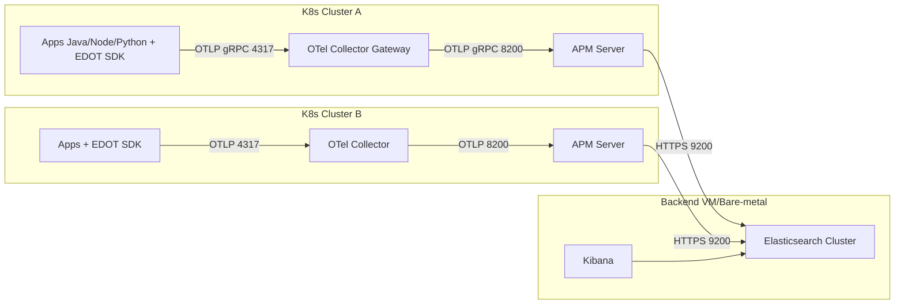
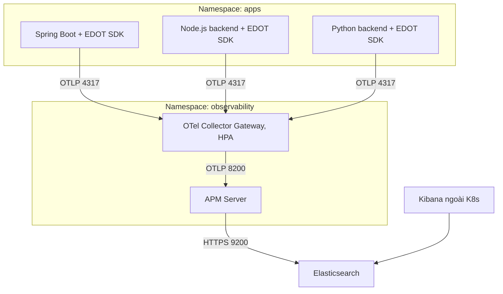

# Thành phần bắt buộc (self-managed)

* **Ứng dụng**: Java Spring Boot, Node.js (backend), Python — chạy trên nhiều **K8s clusters**.
* **EDOT/OTel SDK** trong app (auto-instrumentation + OTLP exporter).
* **OTel Collector (Gateway)** trong mỗi cluster K8s (1 Deployment + HPA).
* **APM Server** đặt **trong từng cluster K8s** (gần Collector).
* **Elasticsearch cluster** (VM/bare-metal, ngoài K8s).
* **Kibana** (VM/bare-metal, ngoài K8s).
# Sơ đồ 1 — Toàn cục (nhiều cluster → 1 backend)

# Sơ đồ 2 — Trong một cluster K8s (một cụm bất kỳ)

---
## ⚙️ Vai trò và trách nhiệm từng thành phần

| Thành phần                                | Vai trò                                                               | Vị trí triển khai                                | Ghi chú                                                               |
| ----------------------------------------- | --------------------------------------------------------------------- | ------------------------------------------------ | --------------------------------------------------------------------- |
| **1️⃣ Ứng dụng (Java / NodeJS / Python)** | Sinh ra telemetry (trace, metric, error) thông qua **EDOT/OTel SDK**  | Trong từng namespace ứng dụng trên K8s           | Mỗi app được instrument một lần, gửi OTLP gRPC → Collector            |
| **2️⃣ OTel Collector (Gateway)**          | Gom, lọc, nén, retry, tail sampling; chịu tải cao thay cho APM Server | Trong namespace `observability` của từng cluster | Nhận từ nhiều app qua port **4317**, đẩy về APM Server port **8200**  |
| **3️⃣ APM Server**                        | Phân tích – enrich – chuẩn hoá theo ECS – forward sang Elasticsearch  | Cũng trong cluster, cùng Collector               | Giữ vai trò “ingest node” cho APM stack, bảo toàn full APM UI         |
| **4️⃣ Elasticsearch Cluster**             | Lưu trữ trace, span, metric, error, metadata                          | VM hoặc bare-metal bên ngoài K8s                 | Gồm master + data node + ingest; dùng ILM để xoá dữ liệu cũ           |
| **5️⃣ Kibana**                            | Giao diện quan sát: APM dashboard, trace explorer, alerting           | VM hoặc bare-metal                               | Nói chuyện với ES qua HTTPS port **9200**, user truy cập qua **5601** |

---
## 🔁 Trình tự triển khai hợp lý
1️⃣ **Cài backend trước**:
* Elasticsearch cluster (3–5 nodes tuỳ dung lượng)
* Kibana (trỏ vào ES, bật module Observability)

2️⃣ **Tạo APM Server image + secret**:
* Một image chuẩn cho tất cả cluster, config trỏ về ES bên ngoài.
* Deploy bằng Helm chart hoặc manifest.

3️⃣ **Triển khai OTel Collector trong từng cluster**:
* Config exporter OTLP → APM Server nội bộ cluster.
* Bật batching, retry, sampling nhẹ.

4️⃣ **Instrument ứng dụng**:
* Thêm EDOT/OTel SDK phù hợp từng ngôn ngữ.
* Config OTLP endpoint trỏ vào Collector (`otel-collector:4317`).

5️⃣ **Kiểm thử & xác minh**:
* Trên Kibana → tab APM → thấy service name, transaction, trace, error.

6️⃣ **Hoàn thiện**:
* Bật alerting rule trong Kibana (latency/error rate).
* Thiết lập ILM (15–30 ngày) cho chỉ mục APM.
* Monitor health (APM Server queue, Collector metrics, ES disk).

---

## 🔍 Nhìn nhanh dòng chảy dữ liệu

> **App SDK (OTel) → Collector (Gateway) → APM Server → Elasticsearch → Kibana (UI)**
> → Dòng chảy duy nhất, sạch, chuẩn OTel, tương thích lâu dài.

---

Nếu bạn muốn, bước tiếp theo ta sẽ **triển khai chi tiết từng lớp**.
Tôi đề xuất đi theo thứ tự:

✅ Bước 2: Backend ngoài K8s — Elasticsearch & Kibana setup (cluster sizing, index policy, TLS).
✅ Bước 3: APM Server trong cluster — config kết nối ES, bảo mật, cert.
✅ Bước 4: OTel Collector config mẫu.
✅ Bước 5: Instrument ứng dụng (Java, NodeJS, Python).

---

