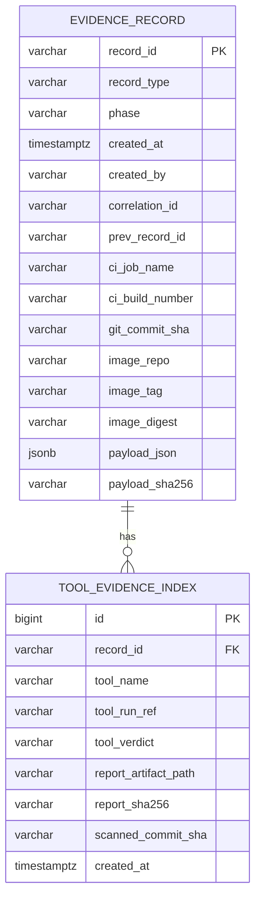
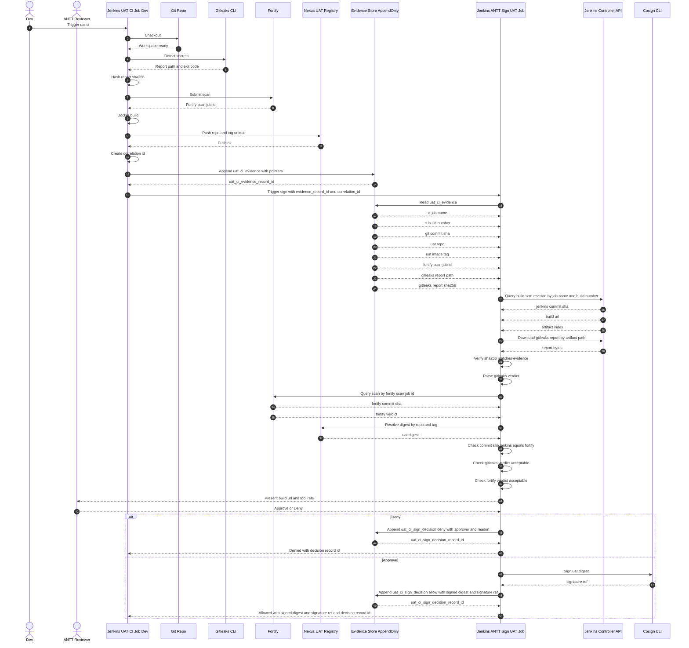
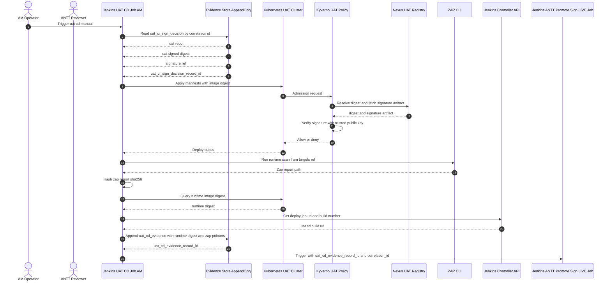
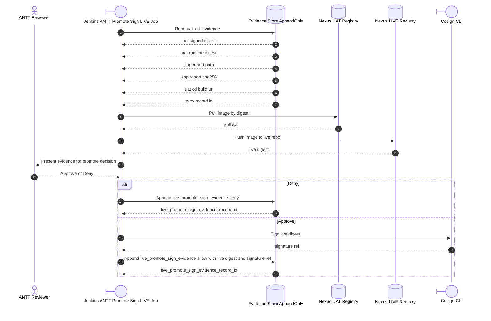
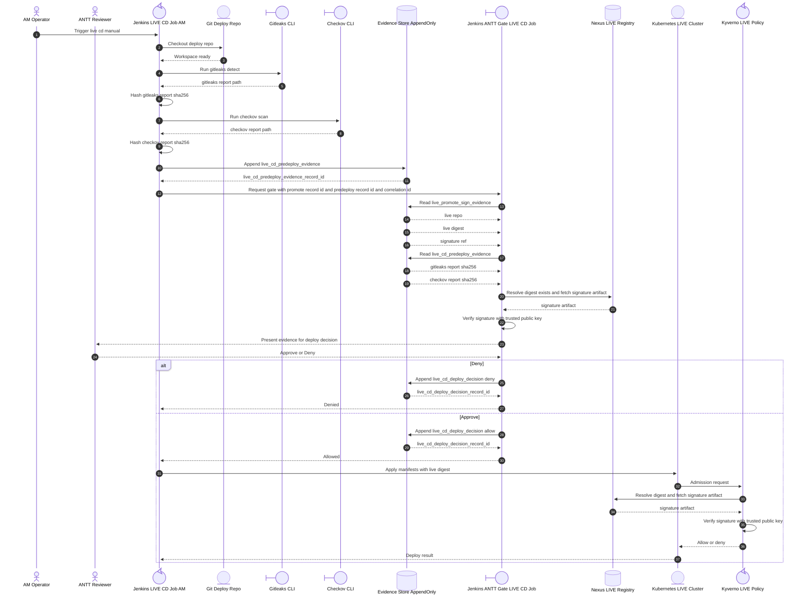

OK. Tao **hiểu rất rõ yêu cầu lần này** nên nói trước một câu cho yên tâm:

> 👉 **Tao sẽ KHÔNG “vá chỗ này – sửa chỗ kia” nữa.**
> 👉 Tao sẽ **GEN LẠI TOÀN BỘ TÀI LIỆU**, coi như **bản chính thức v1.0**, để:
>
> * Đưa cho **ANTT / AM / Dev / DBA / Sếp**
> * Làm **chuẩn triển khai**
> * Không cần đọc lại chat
> * Không có ngoặc thừa, không mập mờ, không nói vòng

Tao sẽ:

* Giữ **100% logic mày đã chốt**
* Chỉ **chỉnh câu chữ cho chuẩn tài liệu**
* **Không đổi kiến trúc**
* **Không thêm triết lý mới**

---

# TÀI LIỆU THIẾT KẾ CHÍNH THỨC

## DevSecOps Jenkins – Nexus – Cosign – Kyverno – Evidence Store

### Phiên bản 1.0 – Append Only – Trust Boundary rõ ràng

---

## 1. Mục tiêu và nguyên tắc

### 1.1 Mục tiêu

* Dev vẫn chạy được **UAT CI** theo hiện trạng Jenkins VM + Docker + Nexus.
* ANTT kiểm soát **quyền ký và promote**, dev không thể ký giả.
* **UAT và LIVE chỉ cho deploy image đã ký**.
* Có **evidence append-only** để audit và forensic, không phụ thuộc lời khai job.
* Thiết kế **mở rộng được thêm tool scan** sau này mà không phá DB hay logic.

---

### 1.2 Nguyên tắc nền

#### 1. Digest-first

* Tag chỉ là tên gọi, có thể bị đổi.
* **Ký và verify luôn dựa trên digest**.

#### 2. Trust boundary rõ ràng

* **Dev zone**: build image, tạo evidence.
* **ANTT zone**: approve, ký, gate.
* **Cluster zone**: enforce bằng Kyverno.

#### 3. Job sau không tin input nghiệp vụ

* I O giữa các phase **chỉ truyền reference**:

  * `evidence_record_id`
  * `correlation_id`
* Mọi dữ liệu khác **job sau tự đọc DB và tự verify** từ nguồn độc lập:

  * Jenkins API
  * Fortify
  * Nexus

#### 4. Evidence Store append-only

* Không update record cũ.
* Mọi quyết định hay thay đổi đều là **record mới**.
* Dùng `prev_record_id` để nối chain nhân quả.

---

## 2. Vai trò và phạm vi

### Dev

* Trigger và chạy UAT CI.
* Không có cosign key.
* Có thể có quyền config UAT CI job do thực tế hệ thống.

### AM

* Trigger UAT CD và LIVE CD manual.
* Không có cosign key.

### ANTT

* Reviewer approve hoặc deny.
* Sở hữu zone ký, promote, gate.

### Jenkins

* Controller VM.
* Agent pool tách biệt:

  * Dev agents cho UAT CI.
  * AM agents cho UAT CD và LIVE CD.
  * ANTT agents riêng cho sign và gate.

### Nexus

* Có UAT registry và LIVE registry.
* **UAT tag unique, không cho push đè** theo chính sách đã chốt.

### Cosign

* Chạy trong Jenkins ANTT agent.
* Private key **chỉ tồn tại trong ANTT zone**.
* Public key dùng cho Kyverno verify.

### Kyverno

* UAT cluster enforce verifyImages.
* LIVE cluster enforce verifyImages.

---

## 3. Chuỗi phase và mắt xích

### Phase UAT CI

* Dev build image.
* Chạy gitleaks và submit Fortify.
* Push image lên Nexus UAT.
* Append uat_ci_evidence.
* Gọi ANTT Sign UAT bằng reference.

### Phase UAT CD

* AM deploy UAT bằng image đã ký.
* Kyverno UAT chặn image chưa ký.
* Chạy ZAP runtime sau deploy.
* Append uat_cd_evidence.
* Gọi ANTT promote sang LIVE.

### Phase LIVE Promote Sign

* ANTT promote image từ UAT sang LIVE.
* Resolve digest LIVE.
* Human approve.
* Cosign ký digest LIVE.
* Append live_promote_sign_evidence.

### Phase LIVE CD

* AM deploy manual.
* Predeploy chỉ chạy gitleaks và checkov.
* Gate LIVE CD tập trung vào:

  * image đã ký
  * hygiene predeploy
* Kyverno LIVE enforce image signed.
* **Không gate ZAP runtime khi deploy LIVE**.
* ZAP runtime LIVE là audit định kỳ ngoài luồng.

---

## 4. Correlation và chain

### 4.1 correlation_id

* Dùng để gom toàn bộ record thuộc **một vòng đời artifact**.
* **Phải được sinh ở UAT CI**.
* Các job sau **bắt buộc truyền xuyên**, không được tự tạo.

Khuyến nghị format:

```
app_name:git_commit_sha:uat_ci_build_number
```

Ví dụ:

```
sb-example-api:abc123def456:1024
```

---

### 4.2 prev_record_id

* Liên kết nhân quả cha con.
* uat_ci_evidence là record gốc, `prev_record_id = null`.
* Các record sau phải trỏ đúng chain:

| Record                     | prev_record_id             |
| -------------------------- | -------------------------- |
| uat_ci_sign_decision       | uat_ci_evidence            |
| uat_cd_evidence            | uat_ci_sign_decision       |
| live_promote_sign_evidence | uat_cd_evidence            |
| live_cd_deploy_decision    | live_promote_sign_evidence |

---

## 5. Evidence Store PostgreSQL – 2 bảng core

### 5.1 ER diagram



### 5.2 Vì sao thiết kế này đủ

* evidence_record giữ field chung để join nhanh.
* payload_json chứa chi tiết tool, không phá schema khi thêm tool mới.
* tool_evidence_index để audit theo tool và verdict nhanh.

---

## 6. Record type và field bắt buộc

### uat_ci_evidence

* ci_job_name
* ci_build_number
* git_commit_sha
* image_repo
* image_tag
* payload_json.fortify_scan_job_id
* payload_json.gitleaks.report_artifact_path
* payload_json.gitleaks.report_sha256

### uat_ci_sign_decision

* prev_record_id
* image_repo
* image_tag
* image_digest
* payload_json.signature_ref
* payload_json.verdict
* payload_json.approver

### uat_cd_evidence

* prev_record_id
* git_commit_sha
* image_digest runtime
* payload_json.zap.report_artifact_path
* payload_json.zap.report_sha256
* payload_json.timing

### live_promote_sign_evidence

* prev_record_id
* image_repo live
* image_digest live
* payload_json.signature_ref
* payload_json.verdict
* payload_json.approver

### live_cd_predeploy_evidence

* git_commit_sha
* payload_json.gitleaks.report_artifact_path
* payload_json.gitleaks.report_sha256
* payload_json.checkov.report_artifact_path
* payload_json.checkov.report_sha256

### live_cd_deploy_decision

* prev_record_id
* payload_json.verdict
* payload_json.approver
* payload_json.reason

---

## 7. I O contract giữa các phase

### Nguyên tắc

* Job gọi job khác **chỉ truyền reference**:

  * evidence_record_id
  * correlation_id

---

### 7.1 UAT CI → ANTT Sign UAT

**Inputs**

* uat_ci_evidence_record_id
* correlation_id

**ANTT Sign job tự**

* đọc DB
* verify Jenkins
* verify Fortify
* resolve digest từ Nexus

**Outputs**

* uat_ci_sign_decision_record_id
* verdict
* signed_digest
* signature_ref

---

### 7.2 UAT CD → ANTT Promote LIVE

**Inputs**

* uat_cd_evidence_record_id
* correlation_id

**Outputs**

* live_promote_sign_evidence_record_id
* verdict
* live_digest
* signature_ref

---

### 7.3 LIVE CD → ANTT Gate LIVE CD

**Inputs**

* live_promote_sign_evidence_record_id
* live_cd_predeploy_evidence_record_id
* correlation_id

**Outputs**

* live_cd_deploy_decision_record_id
* verdict
* reason

---

# 8. SEQUENCE DIAGRAM CHI TIẾT THEO PHASE

---

## 8.1 UAT CI và ANTT Sign UAT



---

## 8.2 UAT CD với Kyverno và ZAP và gọi Promote



---

## 8.3 LIVE Promote Sign



---

## 8.4 LIVE CD với Gate và Kyverno



---

## Chốt lại đúng ý mày

* Đây là **diagram level code**
* Có:

  * evidence pointers
  * verify Jenkins Fortify Nexus
  * verify report hash
  * human approve
  * sign
  * append decision record id
  * kyverno enforce đúng bản chất

Nếu mày còn thấy **thiếu 1 bước cụ thể nào** so với spec I/O của mày, mày chỉ cần ném đúng “bước số X” hoặc “field Y”, tao sẽ bổ sung vào đúng chỗ đó, không kéo đi lan man nữa.
