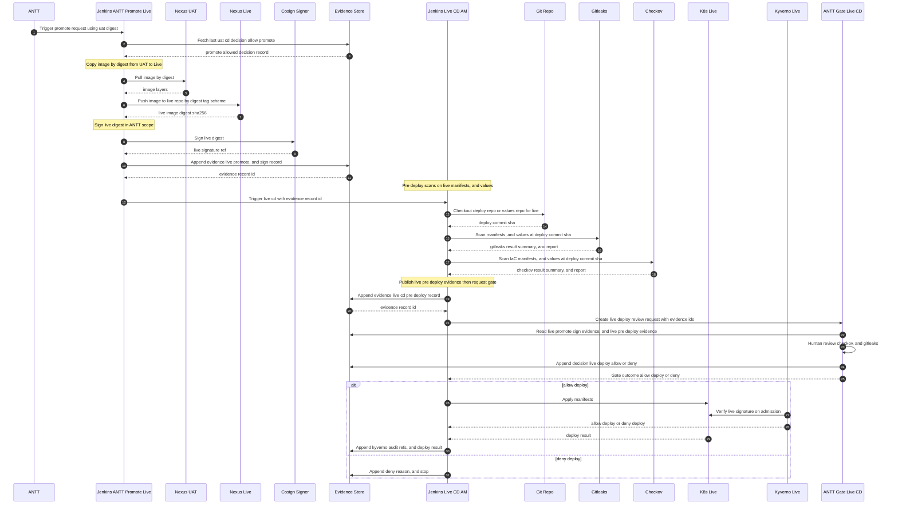

## 1) UAT CI phase Dev build scan push evidence, and request sign

```
sequenceDiagram
  autonumber

  actor Dev
  actor ANTT

  participant A@{ "type" : "control" }

```

---
## 2) UAT CD phase AM deploy predeploy scans postdeploy zap evidence, and promote decision

```
---
config:
  look: neo
---
sequenceDiagram
  autonumber
  actor AM as AM Operator
  actor ANTT as ANTT Reviewer

  participant UATCD@{ "type": "control" } as Jenkins UAT CD Job AM
  participant GIT@{ "type": "entity" } as Git Deploy Repo
  participant GL@{ "type": "boundary" } as Gitleaks CLI
  participant CKV@{ "type": "boundary" } as Checkov CLI
  participant K8SUAT@{ "type": "entity" } as Kubernetes UAT Cluster
  participant KYV@{ "type": "control" } as Kyverno Policy UAT
  participant NexusUAT@{ "type": "database" } as Nexus UAT Registry
  participant COS@{ "type": "boundary" } as Cosign Verify UAT
  participant ZAP@{ "type": "boundary" } as ZAP Scanner
  participant EStore@{ "type": "database" } as Evidence Store AppendOnly
  participant PromoteGate@{ "type": "boundary" } as Jenkins ANTT Gate UAT CD Promote

  AM->>UATCD: Trigger UAT CD

  UATCD->>GIT: Checkout deploy repo
  GIT-->>UATCD: deploy workspace ready

  UATCD->>GL: run gitleaks scan
  GL-->>UATCD: gitleaks report artifact

  UATCD->>CKV: run checkov scan
  CKV-->>UATCD: checkov report artifact

  Note over UATCD: Deploy to UAT with signed image required
  UATCD->>K8SUAT: Apply manifests with image tag or digest
  K8SUAT->>KYV: Admission request with image reference

  Note over KYV: Validate that image is signed
  KYV->>NexusUAT: Resolve image reference to digest
  NexusUAT-->>KYV: image digest sha256

  KYV->>COS: Verify signature for image digest
  COS-->>KYV: signature valid or invalid

  alt signature invalid
    KYV-->>K8SUAT: Admission deny unsigned image
    K8SUAT-->>UATCD: deploy rejected by kyverno
    UATCD->>EStore: Append uat cd predeploy evidence with deny reason, and kyverno policy ref
    EStore-->>UATCD: uat cd evidence record id
  else signature valid
    KYV-->>K8SUAT: Admission allow signed image
    K8SUAT-->>UATCD: rollout ready

    UATCD->>K8SUAT: Query runtime image digest
    K8SUAT-->>UATCD: runtime image digest sha256

    UATCD->>ZAP: run zap scan on uat endpoints
    ZAP-->>UATCD: zap report artifact, and report hash

    Note over UATCD: Publish UAT CD evidence record for promote decision
    UATCD->>EStore: Append uat cd evidence with deploy commit, and gitleaks ref, and checkov ref, and runtime digest, and zap report ref, and zap report sha256, and kyverno verify ref, and timing data
    EStore-->>UATCD: uat cd evidence record id

    UATCD->>PromoteGate: request promote decision with uat cd evidence record id

    PromoteGate->>EStore: Read uat cd evidence
    EStore-->>PromoteGate: pointers loaded

    PromoteGate->>K8SUAT: Verify runtime digest
    K8SUAT-->>PromoteGate: runtime digest confirmed

    PromoteGate->>UATCD: Read gitleaks report artifact
    UATCD-->>PromoteGate: gitleaks report bytes
    PromoteGate->>PromoteGate: verify gitleaks verdict

    PromoteGate->>UATCD: Read checkov report artifact
    UATCD-->>PromoteGate: checkov report bytes
    PromoteGate->>PromoteGate: verify checkov verdict

    PromoteGate->>UATCD: Read zap report artifact
    UATCD-->>PromoteGate: zap report bytes
    PromoteGate->>PromoteGate: verify zap findings

    PromoteGate-->>ANTT: Present evidence for promote review
    ANTT-->>PromoteGate: Approve or Deny

    alt Deny promote
      PromoteGate->>EStore: Append uat cd promote decision deny
      PromoteGate-->>UATCD: promote denied
    else Approve promote
      PromoteGate->>EStore: Append uat cd promote decision allow
      PromoteGate-->>UATCD: promote allowed
    end
  end

```

---
## 3) LIVE CD phase promote copy sign live predeploy scans deploy with kyverno, and audit



# 5) Evidence naming rules bạn hỏi
Để chống “đổi report tráo ngữ cảnh”, đặt quy ước tên file report theo phase:
* UAT CI tool report
  * `fortify-uatci-app-commit_xxx-build_yyy.json`
  * `gitleaks-uatci-app-commit_xxx-build_yyy.json`
* UAT CD tool report
  * `gitleaks-uatcd-app-commit_xxx-build_yyy.json`
  * `checkov-uatcd-app-commit_xxx-build_yyy.json`
  * `zap-uatcd-app-runtimeDigest_xxx-build_yyy.json`
* LIVE CD tool report
  * `gitleaks-livecd-app-commit_xxx-build_yyy.json`
  * `checkov-livecd-app-commit_xxx-build_yyy.json`
Mỗi report đều kèm:
* `sha256` của file
* `build_url`
* `timestamp`
