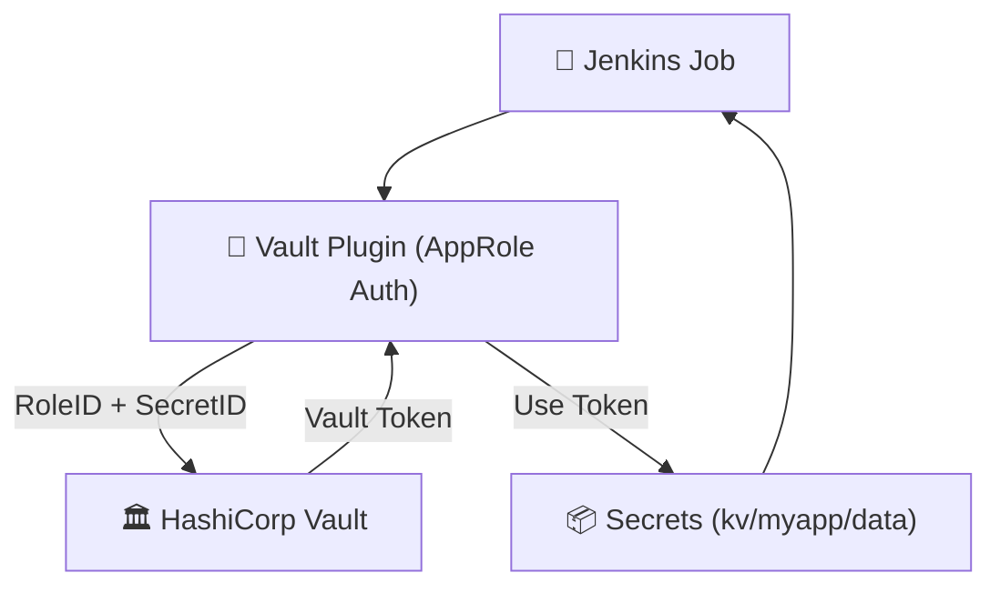

---
## 🔁 **Tổng Quan Flow**



---

## 🔨 **Cấu hình từng bước**

### ✅ 1. Enable AppRole Auth với custom path (VD: `approle-cicd`)

```bash
vault auth enable -path=approle-cicd approle
```

---

### ✅ 2. Tạo AppRole & gán policy

```bash
# Tạo policy
vault policy write jenkins-bi-cicd - <<EOF
path "bi/data/cicd/*" {
  capabilities = ["read"]
}

path "bi/metadata/cicd/*" {
  capabilities = ["list"]
}
EOF

# Tạo AppRole
vault write auth/approle-cicd/role/jenkins-bi-cicd \
  token_policies="jenkins-bi-cicd" \
  token_ttl=10m \
  token_max_ttl=60m \
  secret_id_ttl=0 \
  secret_id_num_uses=0

```

---

### ✅ 3. Lấy `role_id` và `secret_id` (đưa vào Jenkins)

```bash
vault read auth/approle-cicd/role/jenkins-bi-cicd/role-id
vault write -f auth/approle-cicd/role/jenkins-bi-cicd/secret-id
```

---

### ✅ 4. Tạo Jenkins Credential

Vào: `Manage Jenkins → Credentials → Global → Add Credentials`

Chọn `Vault App Role Credential`, điền:

- `Role ID`: (bên trên)
    
- `Secret ID`: (bên trên)
    
- `Path`: `approle-cicd`
    
- `ID`: `vault-creds-cicd` ← bạn sẽ dùng ID này trong pipeline
    

---

## 📜 Pipeline script mẫu

### 🔧 `VaultHelper.groovy`

```groovy
def getSecret(String path, String credentialId, String key) {
  def secretValue = null
  withVault(configuration: [
    vaultCredentialId: credentialId,
    vaultUrl: 'https://vault.example.com'
  ], vaultSecrets: [[
    path: path,
    secretValues: [[envVar: 'SECRET_VALUE', vaultKey: key]]
  ]]) {
    secretValue = env.SECRET_VALUE
  }
  return secretValue
}
```

---

### 🧪 Jenkinsfile sử dụng:

```groovy
@Library('shared-lib') _  // nếu VaultHelper được load qua thư viện dùng @Library

pipeline {
  agent any
  environment {
    VAULT_CREDS = 'vault-creds-cicd'
    VAULT_PATH  = 'kv/data/jenkins/dev'
  }
  stages {
    stage('Get Secret from Vault') {
      steps {
        script {
          def mySecret = VaultHelper.getSecret(env.VAULT_PATH, env.VAULT_CREDS, 'git_token')
          echo "✔️ Đã lấy được Git Token có độ dài: ${mySecret.length()}"
        }
      }
    }
  }
}
```

---

## ✅ Gợi ý quản lý bảo mật

|Thành phần|Quản lý bằng|
|---|---|
|`role_id`|Public (ok để nhúng vào Jenkins)|
|`secret_id`|Cần bảo mật. Không nên hardcode, nên đặt trong credential|
|Vault plugin|Luôn dùng `withVault` để tránh lộ log|
|Token TTL|Nên hạn chế ngắn & rotate định kỳ|

---

Nếu cần, ta có thể nâng cấp thêm:

- Auto rotate `secret_id`
    
- Sử dụng `AppRole Pull Mode`
    
- Cấu hình audit log và revocation tự động cho Jenkins agent.
    

👉 Sẵn sàng hỗ trợ các tầng nâng cao bất cứ lúc nào!