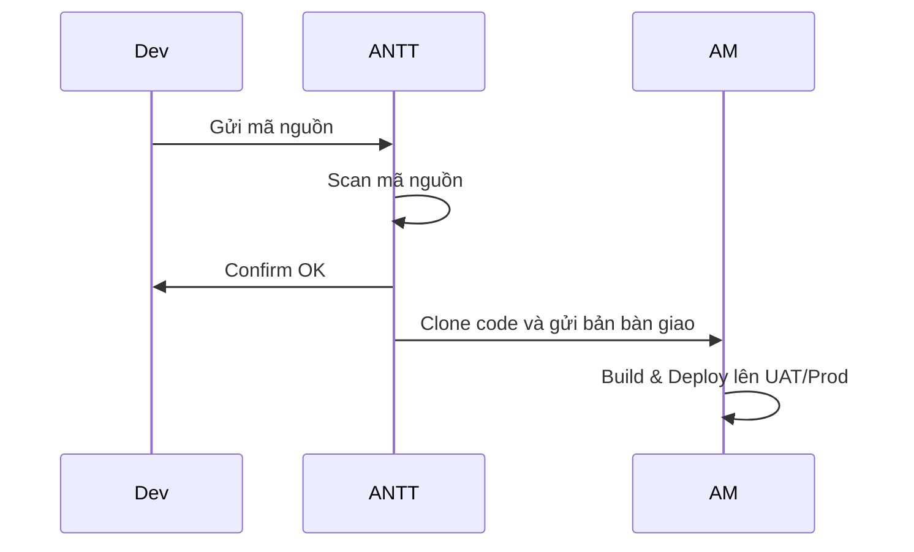
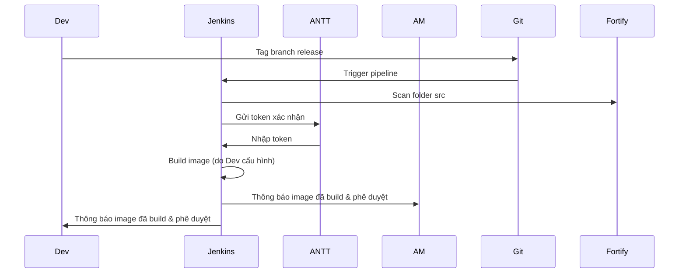
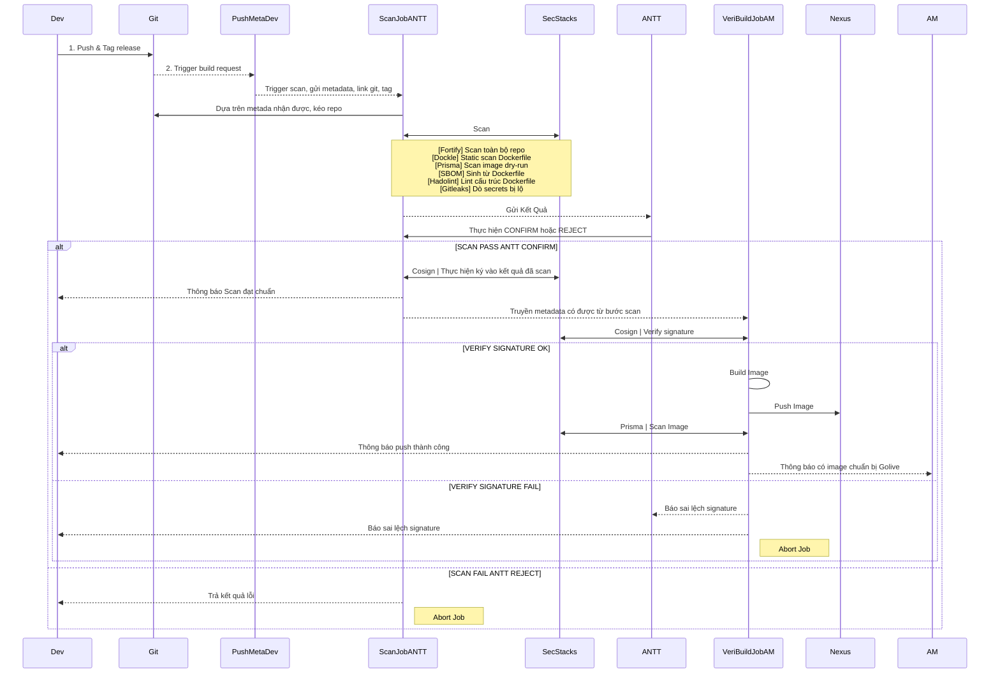
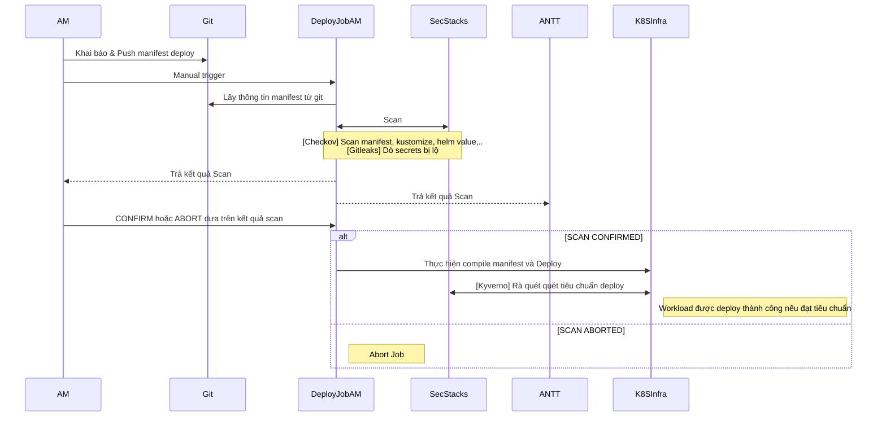

---

# 📘 **Tài liệu Hoá Toàn Diện – Cải Tiến Quy Trình DevSecOps**

---
---
## 🧭 I. Diễn giải lại quy trình – trước và sau CICD

### 🔹 Truyền thống (Pre-CICD)



### 🔹UAT CI hiện tại



> ❌ Lỗ hổng:
> 
> - Dev có toàn quyền thao tác pipeline → **có thể lách luật**
>     
> - ANTT không kiểm soát được Dockerfile / build thật sự
>     
> - Không có liên kết xác thực giữa scan và build
>     
> - Image là sản phẩm cuối nhưng chưa từng được kiểm duyệt độc lập
>     

---

## ⚠️ II. Các vấn đề cốt lõi của mô hình UAT hiện tại

| Vấn đề                      | Nguy cơ                                                                                          | Note                                    |
| --------------------------- | ------------------------------------------------------------------------------------------------ | --------------------------------------- |
| Dev kiểm soát pipeline      | Lách luật CI dễ dàng                                                                             | Scan một đằng – build một nẻo           |
| Token gửi cho ANTT          | Dễ bị lộ                                                                                         | Nếu trong global lib → không còn bí mật |
| Không xác minh build đầu ra | Không biết image có sạch không                                                                   | Cần kiểm tra thực tế build context      |
| AM từ chối build            | So với truyền thống, AM thay vì được 'nhận hàng' sạch 100%, ==người **'đóng hàng'** lại là dev== | Không thể kiểm chứng Dockerfile         |

---

## 🔬 III. Image Scan – Mức độ hiệu quả

✅ Có thể phát hiện:

|Thành phần|Có thể phát hiện|Công cụ|
|---|---|---|
|Layer hệ thống|CVE, package lỗi thời|Trivy, Clair, Grype|
|File nhúng|JAR, Class, Binary|Trivy, DeepScan|
|Secrets/Cấu hình|`.env`, Token|Dockle|
|Runtime|Hành vi build-time|Falco (runtime)|

❌ Không phát hiện được:

- Logic mã độc giấu trong code bị build
    
- Build script bị chỉnh để cấy mã độc sau khi scan
    

⛔ Do đó, scan image **không thay thế được việc scan mã nguồn + xác minh build logic**.

---

## 🌱 IV. Cải tiến  (Concept)

> Toàn bộ pipeline phải phân tầng:
> 
> - **Dev không thể can thiệp CI logic, chỉ gọi**
>     
> - Các bước chính chạy ở các Job riêng (do AM/ANTT hoặc Platform quản lý)

---
### 🔹UAT CI

---
### 🔹UAT CD

---

## 🔐 V. Kỹ thuật triển khai phân quyền CI/CD

| Thành phần                   | Chủ sở hữu     | Mô tả                                          |
| ---------------------------- | -------------- | ---------------------------------------------- |
| `Trigger&PushMetadata (Dev)` | Dev            | Trigger đơn thuần, không có logic build        |
| `Scan&SignJob`               | ANTT           | Thực hiện scan & sinh chữ ký                   |
| `Verify&BuildJob`            | AM/CI Platform | Build lại từ Dockerfile đã ký, kiểm tra & push |
| `DeployJob`                  | AM             | Triển khai image đã verify                     |

---

## 📦 Metadata chuẩn truyền giữa các job

```yaml
artifact:
  tag: "release-1.2.3"
  commit_hash: "abc123def456"
  dockerfile_checksum: "sha256:aaaa..."
  scan_signature: "Cosign.sig"
  scan_result_url: "https://vault/scan-results/abc123"
  sbom_url: "https://vault/sbom/abc123.json"
```

---

## 🛠 Công cụ hỗ trợ cho AM (không cần build nhưng vẫn kiểm tra được)

|Mục tiêu|Công cụ / Giao diện|
|---|---|
|Xem layer, build logic|[Dive](https://github.com/wagoodman/dive)|
|So sánh image trước/sau|`container-diff`|
|Kiểm tra policy|[Dockle](https://github.com/goodwithtech/dockle)|
|Xem log build lại|GitLab UI / Tekton Dashboard|

> 🔐 Có thể xác minh lại image từ commit gốc nếu cần.

---

## ✍️ Giao ước bàn giao Dockerfile (cho Dev)

| Tiêu chí                     | Mô tả                            |
| ---------------------------- | -------------------------------- |
| Dockerfile trong repo        | Không tải về từ script bên ngoài |
| Không dùng `curl             | bash`                            |
| Có bước `RUN test` (nếu cần) | Đảm bảo verify ngay trong build  |
| Có `.dockerignore` chuẩn     | Không chứa file bí mật           |
| Ký toàn bộ context           | SHA256 hoặc Cosign Signature     |

---

## 🎯 Tổng kết chiến lược DevSecOps cải tiến

- Dev bị cô lập khỏi logic CI/CD quan trọng
    
- Mọi bước scan, build, verify chạy ở vùng CI trung lập
    
- AM không build nhưng vẫn kiểm soát & xác minh được
    
- Mỗi artifact đều có hash, chữ ký, trace rõ ràng từ đầu đến cuối
    
- Có thể mở rộng audit trail, SBOM, policy scan theo chuẩn SLSA