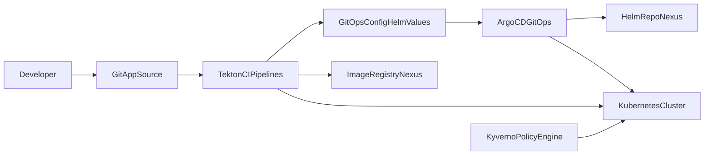
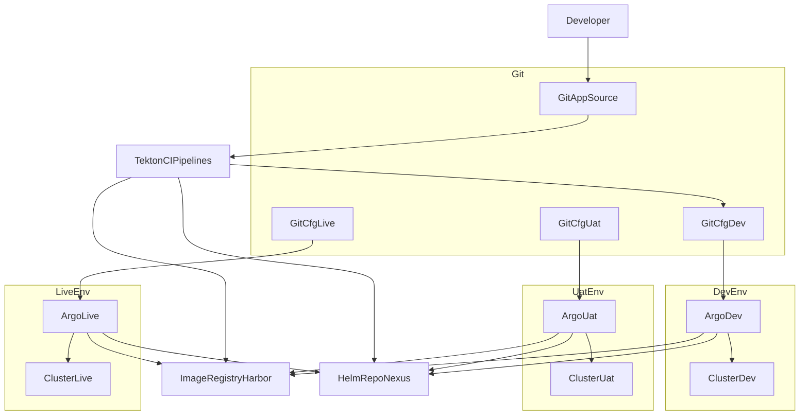
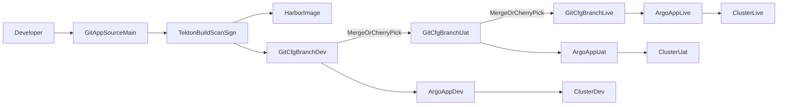

---

## 🗺️ Sơ đồ luồng tương tác tổng thể

Copy nguyên khối này vào Obsidian là chạy:

> Lưu ý:
>
> * `GitApp` là repo chứa source app
> * `GitCfg` là repo GitOps chứa Helm values, manifest, overlay
> * `Harbor` là registry image
> * `Nexus` là Helm repo
> * `Kyverno` đứng dưới chặn luật khi Tekton hoặc Argo tạo resource trên K8s

---

## 🔄 Diễn giải theo bước tác chiến

### 1️⃣ Dev và Git
1. **Dev** chỉnh code → push vào **GitAppSource**
2. Git webhook → trigger **TektonCIPipelines**
### 2️⃣ Tekton lo CI
3. **Tekton**:
   * Pull source từ **GitAppSource**
   * Build image
   * Scan bảo mật
   * Ký image nếu có Cosign
3. Tekton push image lên **ImageRegistryHarbor**
4. Sau khi build ổn:
   * Tekton update **GitOpsConfigHelmValues** (ví dụ sửa `image.digest` trong values yaml hoặc kustomize) → commit vào đó
### 3️⃣ Argo lo CD
6. **ArgoCDGitOps**:
   * Poll **GitOpsConfigHelmValues**
   * Thấy commit mới → trạng thái `OutOfSync`
   * Khi tới giờ deploy hoặc được người bấm sync:
     * Argo đọc chart từ **HelmRepoNexus** (theo URL config trong GitCfg)
     * Render manifest với image digest mới
     * Apply lên **KubernetesCluster**

### 4️⃣ Kyverno đứng sau cầm quân pháp
7. **KyvernoPolicyEngine**:
   * Canh cổng API **KubernetesCluster**
   * Khi:
     * Tekton tạo `PipelineRun` hay resource gì đó
     * Argo apply Deployment, Ingress, vân vân
   * Kyverno check policy:
     * Chỉ cho phép dùng **ClusterTask** và **bundles** chuẩn
     * Chỉ cho phép image từ **ImageRegistryHarbor** đúng pattern
     * Chặn mọi manifest sai quy chuẩn
---

## 🎯 Tóm tắt vai trò từng ông
* **GitAppSource**: chỗ code app
* **GitOpsConfigHelmValues**: chỗ định nghĩa trạng thái cần triển khai
* **TektonCIPipelines**: build, scan, sign, update GitCfg
* **ImageRegistryHarbor**: kho chứa image thật dùng để chạy
* **HelmRepoNexus**: nơi host chart, Argo dùng để render
* **ArgoCDGitOps**: kéo từ GitCfg + Nexus, apply xuống cluster
* **KyvernoPolicyEngine**: quân kỷ luật, không cho CI CD làm bậy trên K8s

Dưới đây là **2 sơ đồ**:
1. Toàn cảnh: các env cùng dùng chung Tekton, Harbor, Nexus
2. Flow promote code: dev → uat → live qua Git + Argo

---

## 1️⃣ Multi-env tổng thể: dev / uat / live

**Ý nghĩa:**

* **Tekton** dùng chung cho mọi env, build xong:

  * Push image → **Harbor**
  * Push chart → **Nexus**
  * Update Git config → **GitCfgDev** trước
* Mỗi env có:

  * Một **Argo App** riêng: `ArgoDev`, `ArgoUat`, `ArgoLive`
  * Một **Cluster** tương ứng: `ClusterDev`, `ClusterUat`, `ClusterLive`
* `ArgoDev` thường bật **auto sync**
* `ArgoUat`, `ArgoLive` thường **manual sync + review**

---

## 2️⃣ Flow promote: Dev → UAT → Live qua Git

**Kịch bản chuẩn:**

* Dev commit code → **Tekton** build, scan, sign → push image lên **Harbor**
* Tekton update `GitCfgBranchDev` với `image.digest` mới → **ArgoDev** auto sync → lên **ClusterDev**
* Khi ổn:

  * Mở PR từ `GitCfgBranchDev` → `GitCfgBranchUat`
  * Review xong → merge → **ArgoUat** thấy thay đổi, báo OutOfSync
  * Ops chọn thời điểm → bấm sync → deploy lên **ClusterUat**
* Khi UAT pass:

  * PR từ `GitCfgBranchUat` → `GitCfgBranchLive`
  * Merge → **ArgoLive** OutOfSync
  * Chờ giờ go live → sync thủ công → lên **ClusterLive**

---
