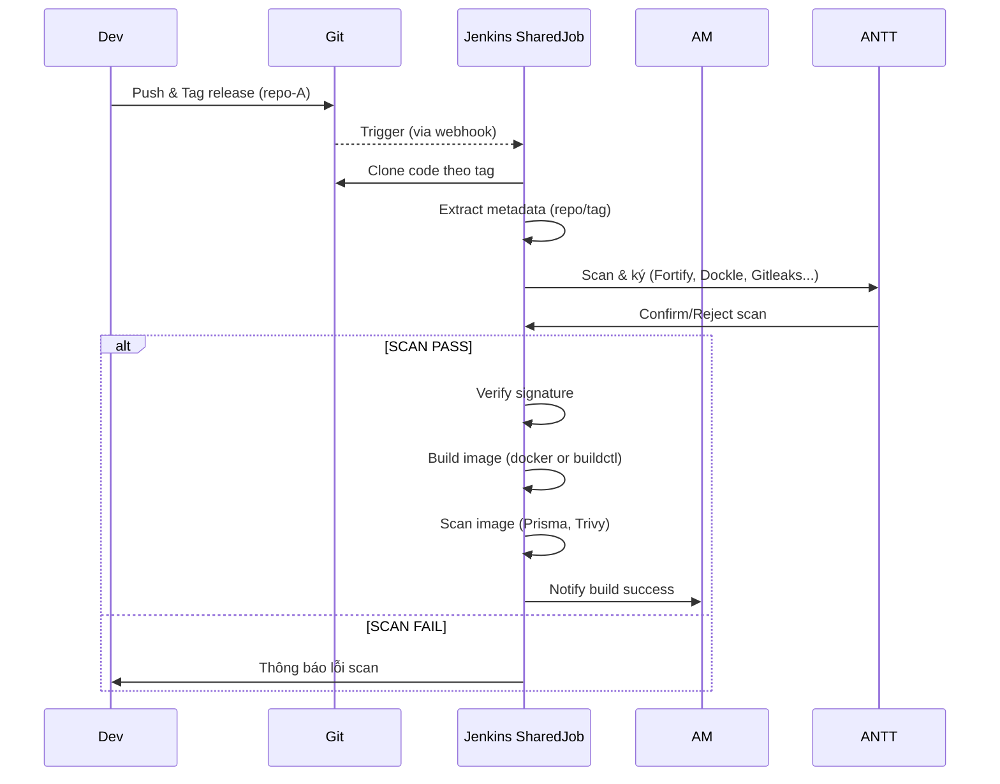
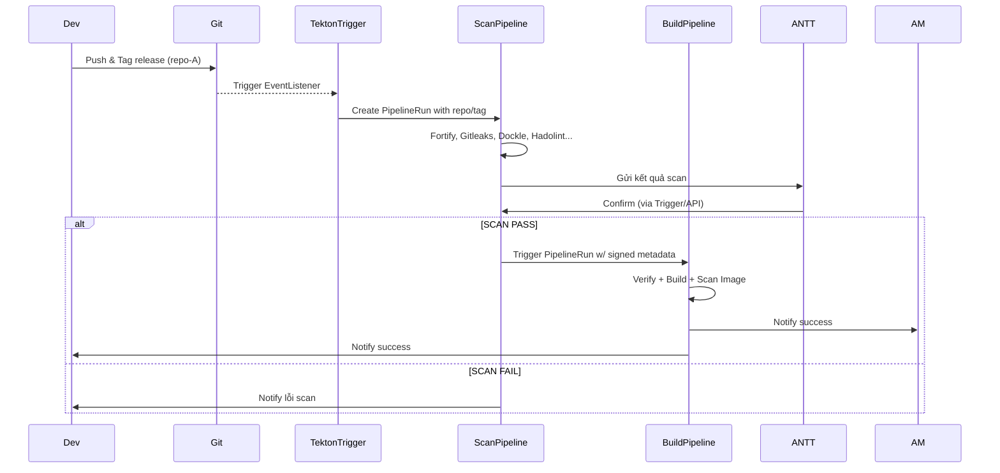

> Nếu ta đã có mô hình Jenkins với 2 job tách biệt (Scan + Build), liên kết bằng webhook –  
> **Tại sao phải chuyển sang Tekton? Có lợi gì, có tốn gì?**
---
# 🧭 I. So sánh trực tiếp mô hình Jenkins (2 job) vs Tekton Pipelines

| Tiêu chí                              | Jenkins + Webhook (2 Job)                                    | Tekton Pipelines (scan/build tách)                              |
| ------------------------------------- | ------------------------------------------------------------ | --------------------------------------------------------------- |
| **Kiến trúc**                         | 2 Jenkins job độc lập, gọi nhau bằng webhook hoặc API        | 2 pipeline tách biệt, chạy trên Tekton controller               |
| **Kết nối giữa 2 bước**               | Dùng `HTTP trigger`, global lib, `credentials` hoặc token    | Dùng Tekton `PipelineRun` + `params` hoặc TriggerTemplate       |
| **RBAC phân quyền (Dev/AM/ANTT)**     | Phải cấu hình Jenkins Role plugin, dễ rối                    | Native Kubernetes RBAC – phân quyền theo Task, namespace        |
| **Traceability (Xem lại quá trình)**  | Logs chia ra theo job, khó truy ngược                        | Mỗi `PipelineRun` có metadata rõ ràng, dễ query/lọc             |
| **Tính sandbox / isolate**            | Build và scan vẫn chạy trên Jenkins agent – shared workspace | Mỗi step là container riêng, chạy trên Pod riêng (true isolate) |
| **Scaling**                           | Thêm agent bằng plugin hoặc mở slave                         | Auto scale bằng K8s native (horizontal + namespace)             |
| **Maintainability (Quản lý lâu dài)** | Càng nhiều repo thì càng nhiều job Jenkins                   | Tekton dùng chung pipeline → chỉ tăng TriggerBindings           |
| **SBOM, ký số, security scan**        | Phải tự viết step trong Jenkinsfile hoặc dùng plugin         | Có Task `cosign`, `trivy`, `syft`, `slsa-generator` sẵn         |
| **Hiển thị / audit / log**            | Log Jenkins Console theo job                                 | Tekton Dashboard → trace theo repo/tag                          |
| **Dev chỉ xem log được không?**       | Cần plugin + phân quyền UI                                   | RBAC + Tekton Dashboard → Dev xem log nhưng không run được      |

---

# ✅ II. Tại sao **nên chuyển sang Tekton**?

### 1. 🔐 **An toàn hơn – phân quyền đúng vai**

| Vai trò | Jenkins                                       | Tekton                                                      |
| ------- | --------------------------------------------- | ----------------------------------------------------------- |
| Dev     | Có thể bị lộ credential nếu webhook không kín | Chỉ được gắn TriggerBinding, không có quyền sửa Pipeline    |
| ANTT    | Phải can thiệp UI Jenkins để confirm          | Có thể xác nhận bằng `kubectl`, WebUI hoặc gắn thêm Trigger |
| AM      | Dễ nhầm giữa job của 20 repo                  | Tekton phân quyền rõ ràng theo repo/tag/namespace           |

---
### 2. ⚙️ **Hiện đại hóa pipeline – chuẩn cloud-native**

> Nếu Jenkins là nhà cổ kiểu phố cổ Hà Nội, thì Tekton là chung cư có bảo vệ, thang máy, bãi xe riêng, và... hệ thống phòng cháy chữa cháy tự động.
- **Tách các bước thành container độc lập**
- Có thể `reuse` từng `Task` cho repo khác
- Gắn được security scan, SBOM, Cosign theo chuẩn SLSA
---
### 3. 📈 **Quy mô lớn – vận hành càng dễ**

| Tình huống | Jenkins                             | Tekton                                     |
| ---------- | ----------------------------------- | ------------------------------------------ |
| 10 repo    | 20 job Jenkins, phân quyền phức tạp | 1 pipeline, 10 triggerBinding              |
| 100 repo   | Nổ dashboard                        | Tekton: lọc theo `label: repo=...` là xong |

---
### 4. 🤝 **Dễ tích hợp hệ sinh thái DevSecOps**
- Trivy, Cosign, SBOM Generator, OPA Gatekeeper, Kyverno…  
    → đều tích hợp vào Tekton như bước `Task`  
    → còn Jenkins thì phải chơi `sh "docker run ..."` cho mỏi tay

---
# ⚠️ III. Khi nào **không nên chuyển sang Tekton**?

| Tình huống                                                                    | Vì sao?                                                          |
| ----------------------------------------------------------------------------- | ---------------------------------------------------------------- |
| ❌ Không có K8s (hoặc không có đội DevOps duy trì nó)                          | Tekton cần chạy trên Kubernetes                                  |
| ❌ AM, ANTT chưa quen YAML + kubectl                                           | Tekton không có UI đẹp như Jenkins – Dashboard đơn giản, cần CLI |
| ❌ Toàn bộ hệ thống đã gắn chặt vào Jenkins plugin (vault, slack, approval...) | Chuyển sẽ mất công viết lại toàn bộ logic                        |

---
# ✅ IV. Tổng kết :

| Mục tiêu                                                           | Ghi chú                                                        |
| ------------------------------------------------------------------ | -------------------------------------------------------------- |
| ✅ Muốn **phân quyền chặt**, không để Dev lách build                | **Tekton mạnh vượt trội**                                      |
| ✅ Có nhiều repo, cần `reuse` pipeline, muốn standard hóa DevSecOps | **Tekton thắng thế rõ ràng**                                   |
| ⚠️ Nếu chỉ có 2 repo, team nhỏ, chưa có K8s                        | Cứ để Jenkins chạy cũng được – Tekton lúc này sẽ hơi “quá tay” |
| ❗ Nhưng: Jenkins đang già nua, khó mở rộng, devops lủng củng       | **Chuyển sang Tekton là bước cải tiến bền vững**               |

---

> ❝ Nếu ta giữ Jenkins như hiện tại, và **chỉ dùng 1 job `ScanPipeline`, 1 job `VeriBuildPipeline` cho toàn bộ repo/workload**,  
> thì **liệu có đạt được hiệu quả tương tự như Tekton hay không?** ❞
1. ✅ **Điều gì có thể làm được giống Tekton**
2. ⚠️ **Điều gì sẽ bất tiện hoặc phải hack**
3. ❌ **Điều gì Jenkins không thể đạt được, mà Tekton sinh ra để làm**

---

# ✅ I. Cái gì **Jenkins 1-job** có thể làm giống Tekton?

|Mục tiêu|Có thể làm được không?|Cách làm|
|---|---|---|
|**Chia pipeline scan & build**|✅ Có thể tách 2 job `scan` và `build`|Jenkins freestyle hoặc Declarative|
|**Dùng chung 1 job cho nhiều repo**|✅ Qua `parameters` truyền repo URL, tag, dockerfile path…|`REPO_URL`, `TAG`, `DOCKERFILE` param|
|**Scan Fortify, Dockle, Trivy**|✅ Gọi shell / plugin|`sh "trivy image ..."`, `sh "fortify-scan"`|
|**Verify Cosign Signature**|✅ Gọi CLI|`sh "cosign verify ..."`|
|**Push Nexus / SBOM**|✅ Dùng artifact plugin hoặc shell|`sh "curl ..."`|
|**Notify Dev/AM**|✅ Email / Slack plugin / Webhook|Cần plugin tương ứng|

> → Nếu chỉ xét về **chức năng** → Jenkins hoàn toàn làm được mọi thứ như Tekton **nếu chịu khó scripting**

---

# ⚠️ II. Nhưng **điều gì khó hoặc lởm hơn Tekton?**

### 1. 🔐 **Phân quyền**

|Tình huống|Jenkins khó làm gọn|
|---|---|
|Dev chỉ được trigger job, không được sửa Jenkinsfile|✅ nhưng cần Role Plugin, phức tạp|
|AM chỉ xem log, retry build|✅ có thể setup nhưng vướng UX|
|Jenkins không native RBAC như Tekton|→ **Chia role dễ lỗi – Dev đôi khi vẫn có quyền gây hại**|

---
### 2. 🧱 **Isolation giữa các build**

- Jenkins Job chia repo bằng `workspace/$REPO`, nhưng:
    - Build từ nhiều repo vẫn dùng chung Jenkins agent
    - Nếu Dev “trỏ” Dockerfile ngoài repo thì vẫn có thể inject bậy
    - Phân quyền theo folder Jenkins không tách thực sự môi trường build
→ **Không sandbox mạnh như Tekton (mỗi step chạy riêng trong Pod)**

---
### 3. 🧹 **Maintain & Trace Job**

| Tình huống                                                                                      | Jenkins dễ bị rối                                          |
| ----------------------------------------------------------------------------------------------- | ---------------------------------------------------------- |
| Có 20 repo → cần 1 job `ScanPipeline` + 1 job `BuildPipeline` → Dev không biết job nào của mình | Nếu không gắn dashboard hoặc naming convention → khó trace |
| Quản lý logs, metadata theo repo/tag                                                            | Khó lọc – unless gắn thư viện log riêng                    |
| Dev/AM muốn xem log pipeline A@tag v1.2.3                                                       | Phải vào console log thủ công hoặc cài thêm plugin         |

---

# ❌ III. Jenkins **không thể đạt được** điều Tekton làm tốt

| Tính năng                                                          | Jenkins không có (hoặc cực kỳ khó)                  |
| ------------------------------------------------------------------ | --------------------------------------------------- |
| 🧘 **Task reusable + modular**                                     | Tekton Task viết 1 lần, dùng cho mọi pipeline       |
| 🧱 **RBAC phân tầng theo namespace / role**                        | Jenkins không phân quyền sâu theo Task              |
| 🧪 **Standard hoá security pipeline** (SLSA, Sigstore, SBOM trace) | Jenkins phải script hết                             |
| 📦 **Audit trail chuẩn K8s (per PipelineRun)**                     | Không có CRD, không có object traceable             |
| ☁️ **Kết hợp native GitOps (ArgoCD, Flux)**                        | Tekton rất phù hợp với GitOps flow                  |
| 🔄 **Scale theo workload (per Pod)**                               | Jenkins phải scale agent – không tự scale step được |

---
## 🎯 Kết luận – nên chọn gì?

|Tình huống|Lời khuyên|
|---|---|
|✅ Bạn chỉ có < 10 repo, team nhỏ, không có Kubernetes|**Dùng Jenkins cũng được**, gom job vào shared pipeline|
|✅ Bạn muốn pipeline chuẩn DevSecOps, tách quyền Dev/AM/ANTT rõ ràng|**Dùng Tekton** – hiệu quả lâu dài|
|✅ Bạn muốn log + task + trace dễ debug, dùng chung 1 job mà vẫn tách bạch rõ|**Tekton mạnh vượt trội**|

---
# 🔄 Sơ đồ Flow: Jenkins Shared Job vs Tekton Pipelines

## 🌐 Jenkins Shared Build Job



🧱 **Vấn đề chính**:

- UI Jenkins không phân biệt được build theo repo
- Phải rely vào `echo`, `notify` để Dev biết build của mình đâu
- Không có CRD/PipelineRun để trace lịch sử dễ dàng

---

## ☁️ Tekton: scan-pipeline + build-pipeline



✅ **Lợi thế**:
- Mỗi `PipelineRun` có metadata rõ ràng `repo/tag`
- AM/Dev/ANTT dễ tra cứu theo label
- Tekton Dashboard hỗ trợ filter theo repo
    
---

# ✅ Checklist “Bắt buộc phải Script” nếu dùng Jenkins Shared Job

| Tác vụ                               | Jenkins (Phải script)                               | Tekton (Built-in hoặc nhẹ YAML)                  |
| ------------------------------------ | --------------------------------------------------- | ------------------------------------------------ |
| Phân biệt repo/tag theo build        | ✅ Gắn thủ công vào build name / log                 | ✅ Gắn label `repo:`, `tag:` trong PipelineRun    |
| Lưu SBOM, signature, scan log        | ✅ Phải push thủ công vào Nexus/MinIO                | ✅ Dùng Task template Cosign/Trivy có output path |
| Trace history theo workload          | ✅ Không có UI hỗ trợ                                | ✅ Dashboard filter theo `label.repo=xyz`         |
| RBAC chi tiết từng vai (Dev vs AM)   | ⚠️ Rất khó, cần Role Plugin, matrix                 | ✅ Native Kubernetes RBAC per role/namespace      |
| Trigger bằng webhook Git             | ✅ Có, dễ dùng                                       | ✅ Có, dùng EventListener + Binding               |
| Reuse Task scan/build cho nhiều repo | ❌ Jenkinsfile phải clone logic hoặc dùng shared lib | ✅ Task/Step dùng lại thoải mái                   |
| Hiển thị log riêng từng pipeline     | ✅ Nhưng log chung job, phải tìm                     | ✅ Log theo từng PipelineRun/TaskRun rõ ràng      |
|                                      |                                                     |                                                  |
- Tóm lại: Nếu xác định cần maintain lâu dài cho > 10 repo, có phân quyền đa vai, và cần build an toàn minh bạch → **Tekton vượt trội ở tính quản lý và trace**. Nếu chỉ dừng ở Jenkins, thì phải đầu tư rất nhiều script để vá từng chỗ mà Tekton xử lý tự nhiên.

---
## 📊 Bảng quy chiếu: Jenkins vs Tekton

| Khái niệm Jenkins                          | Tương đương Tekton                            | Diễn giải                                                                          |
| ------------------------------------------ | --------------------------------------------- | ---------------------------------------------------------------------------------- |
| ✅ **Global Library Hàm**                   | **`Task` (và `Step` trong Task)**             | Một Task Tekton giống như một hàm re-usable dùng trong nhiều pipeline.             |
| ✅ **Declarative Pipeline (`Jenkinsfile`)** | **`Pipeline`**                                | Chính là tập hợp logic CI/CD theo thứ tự stage – chính là pipeline Tekton.         |
| ✅ **Build của Jenkins Job**                | **`PipelineRun`**                             | Mỗi lần thực thi Tekton Pipeline là 1 `PipelineRun`, tương đương `#123 Build`.     |
| ✅ **Stage / Step trong Jenkinsfile**       | **`TaskRun`**                                 | Từng Task (Fortify, Build, Scan...) → sinh ra `TaskRun` riêng biệt (có log riêng). |
| ✅ **Multibranch Pipeline**                 | **TriggerTemplate + EventListener**           | Tự động tạo PipelineRun theo tag/push từ repo.                                     |
| ✅ **Jenkins Parameter**                    | **Tekton `params` trong PipelineRun**         | Dùng để truyền repo, tag, dockerfile path...                                       |
| ✅ **Job View UI**                          | **Tekton Dashboard (cộng thêm label filter)** | UI xem log, trạng thái từng pipeline và từng task.                                 |
| ✅ **Jenkins Shared Library**               | **`Task + TaskRef` từ Tekton Hub**            | Có thể kéo về dùng lại giống thư viện.                                             |

---
```text
           Declarative Pipeline (Jenkinsfile)  -->     Pipeline
             |– Stage("Scan")                  -->       Task (fortify)
             |– Stage("Build")                 -->       Task (build)
             |– Stage("Sign")                  -->       Task (cosign)
             
           Build #123                         -->     PipelineRun
               |- Stage #1                    -->     TaskRun (fortify)
               |- Stage #2                    -->     TaskRun (build)
```

---