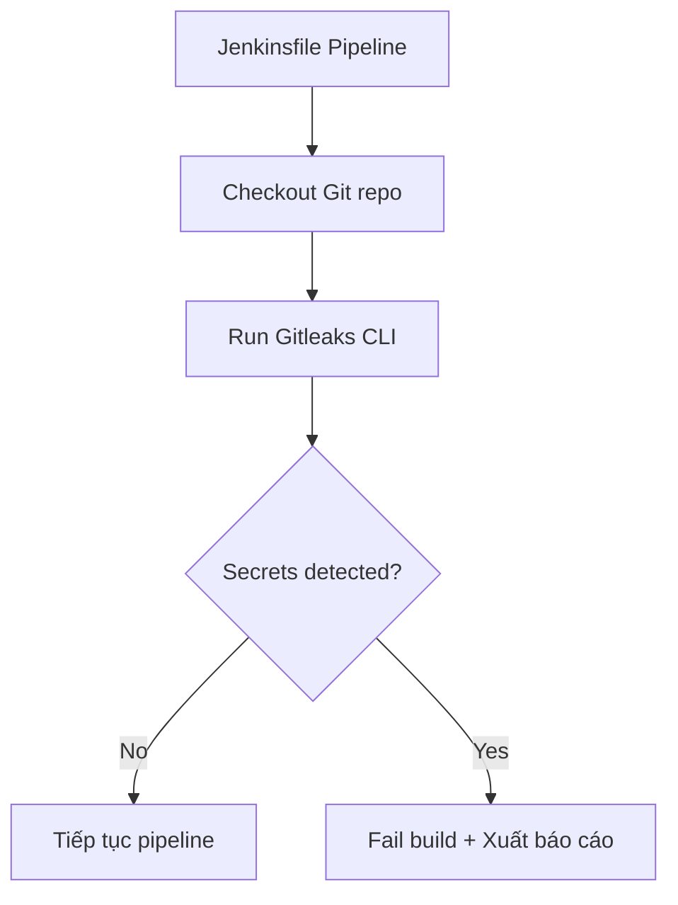

>**Tích hợp Gitleaks vào Jenkins pipeline** :
---

## 🧱 Mô hình tích hợp Gitleaks với Jenkins


---

## 🛠️ Jenkinsfile mẫu dùng Gitleaks

```groovy
pipeline {
    agent any

    environment {
        GITLEAKS_VERSION = 'v8.18.1'
        REPORT_FILE = 'gitleaks-report.json'
    }

    stages {
        stage('Checkout') {
            steps {
                checkout scm
            }
        }

        stage('Install Gitleaks') {
            steps {
                sh '''
                    curl -sSL https://github.com/gitleaks/gitleaks/releases/download/$GITLEAKS_VERSION/gitleaks-linux-amd64 -o gitleaks
                    chmod +x gitleaks
                    mv gitleaks /usr/local/bin/
                '''
            }
        }

        stage('Scan Secrets') {
            steps {
                script {
                    def result = sh (
                        script: "gitleaks detect --source=. --report=$REPORT_FILE --exit-code 1 || echo 'leaks_detected'",
                        returnStdout: true
                    ).trim()

                    if (result.contains("leaks_detected")) {
                        error "❌ Gitleaks phát hiện secrets. Xem $REPORT_FILE"
                    } else {
                        echo "✅ Không phát hiện secrets."
                    }
                }
            }
        }

        stage('Continue Other Steps') {
            steps {
                echo "Build, test, deploy..."
            }
        }
    }

    post {
        always {
            archiveArtifacts artifacts: 'gitleaks-report.json', allowEmptyArchive: true
        }
    }
}
```

---

## 💡 Gợi ý nâng cao

|Tính năng|Gợi ý thực hiện|
|---|---|
|📝 Rule tùy chỉnh|Mount `gitleaks.toml` vào project hoặc tải từ S3/Git|
|⛔ Ignore thư mục/file|Dùng `.gitleaksignore` trong repo|
|📧 Alert nếu có secrets|Gửi email/slack/webhook nếu `gitleaks detect` trả về mã lỗi|
|🧪 Chạy song song với Unit Test|Đưa vào nhánh riêng, đánh tag ‘security’|
|🔒 Dùng container gitleaks|`docker run --rm -v $(pwd):/src zricethezav/gitleaks detect ...`|

---

## 📦 Nếu Jenkins chạy trong Docker (Jenkins Agent)

- Cài `gitleaks` sẵn trong Docker image Jenkins agent
    
- Hoặc dùng container riêng chạy `gitleaks` → gắn `volume`
    

```sh
docker run --rm -v $(pwd):/src zricethezav/gitleaks:latest detect --source=/src
```

---

## ✅ Tổng kết

|Ưu điểm khi dùng Gitleaks trong Jenkins||
|---|---|
|✔️ Không phụ thuộc UI, thuần CLI|Dễ tích hợp mọi môi trường CI|
|✔️ Tự động fail nếu có secrets|Ngăn secrets từ pipeline|
|✔️ Có thể xuất JSON/SARIF|Phân tích thêm hoặc tích hợp SonarQube|

---