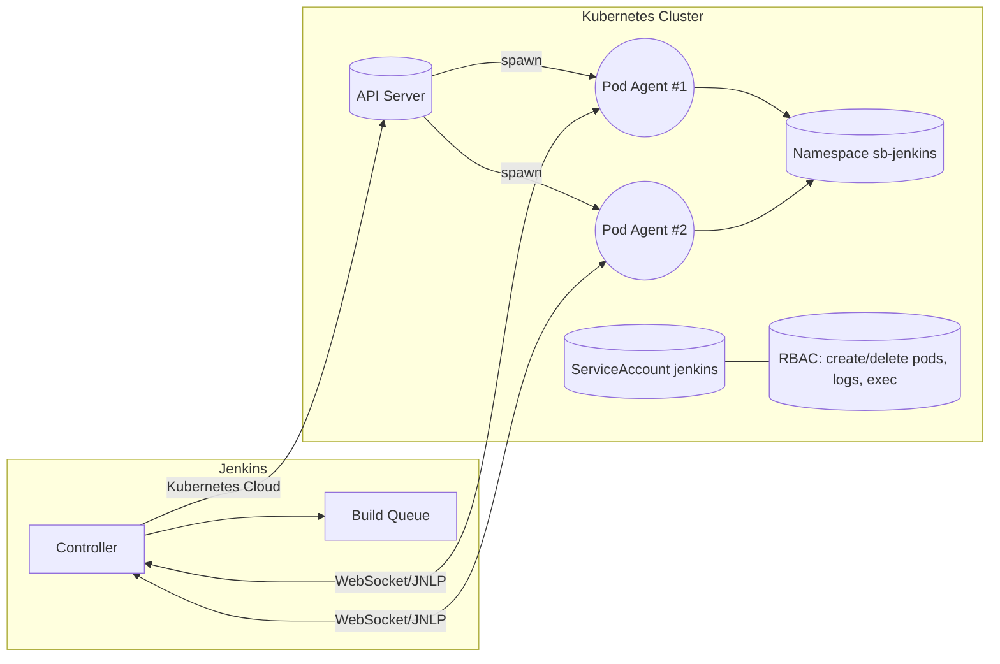
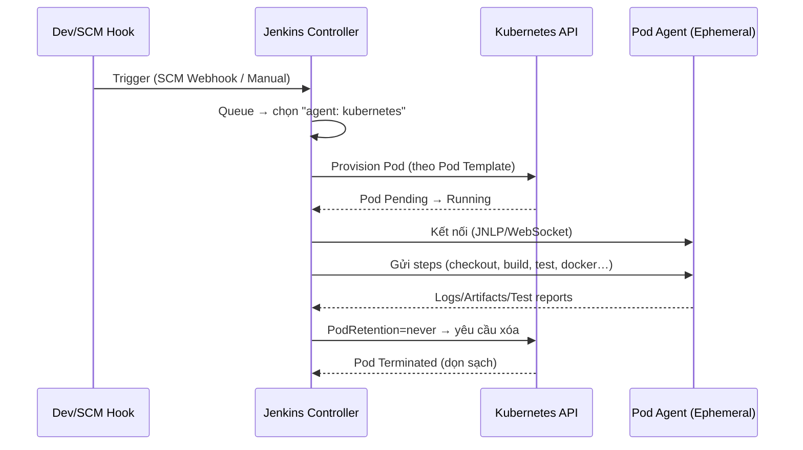

Rõ lệnh, Đại Nguyên Soái. Dưới đây là **bản thuyết minh chiến thuật toàn diện** về Jenkins Kubernetes Agent Plugin — từ kiến trúc, vòng đời tác chiến (build), đến cấu hình, override, bảo mật/RBAC, lưu trữ workspace, và checklist vận hành. Kèm **sơ đồ Mermaid** để hành quân dễ nhìn.

---

# 1) Bức tranh tổng thể

* **Mục tiêu:** mỗi lần build → **đẻ 1 Pod agent tạm thời (ephemeral)** trong K8s, chạy xong là **thu hồi**.
* **Điều phối:** Jenkins Controller nói chuyện với **Kubernetes (API Server)** qua **Kubernetes Cloud** (plugin).
* **Định nghĩa “môi trường build”:** qua **Pod Template** (YAML), có thể:

  * Khai sẵn bằng **JCasC** (values Helm).
  * Khai inline trong **Jenkinsfile** (Declarative/Scripted).
* **Sử dụng trong pipeline:** chọn **container** theo tên bằng `container('tên') { ... }`.

## Sơ đồ kiến trúc (component)



---

# 2) Vòng đời một lần build (ephemeral pod)



**Ý chính:**

* Controller **không build**. Chỉ **điều phối** tạo Pod + gửi lệnh.
* Mỗi stage có thể đổi **container** trong cùng Pod bằng `container('name')`.
* Kết thúc: Pod **terminated** (trừ khi cấu hình giữ lại để debug).

---

# 3) Cấu hình: từ “cloud” tới “template” (JCasC)

**Tầng Cloud (bắt buộc):** định nghĩa cluster, namespace, cơ chế kết nối.

```yaml
# values.yaml (Helm chart Jenkins)
controller:
  additionalPlugins:
    - kubernetes
  JCasC:
    configScripts:
      kubernetes-cloud.yml: |
        jenkins:
          clouds:
            - kubernetes:
                name: "kubernetes"
                serverUrl: "https://kubernetes.default"   # nếu controller chạy trong cluster
                jenkinsUrl: "http://jenkins:8080"         # service nội bộ
                namespace: "sb-jenkins"
                webSocket: true                           # bền hơn trong nhiều topology
                podRetention: "never"                     # dọn ngay sau build
                # workspaceVolume: # (tùy chọn - xem mục 6)
                templates: []                             # (có thể để trống—define riêng)
```

**Tầng Pod Template:** định nghĩa “môi trường build” chuẩn dùng chung:

```yaml
controller:
  JCasC:
    configScripts:
      pod-templates.yml: |
        jenkins:
          clouds:
            - kubernetes:
                templates:
                  - name: "maven-docker"
                    label: "maven-docker"
                    nodeUsageMode: NORMAL
                    yaml: |-
                      apiVersion: v1
                      kind: Pod
                      spec:
                        serviceAccountName: jenkins
                        restartPolicy: Never
                        containers:
                          - name: maven
                            image: maven:3.9.9-eclipse-temurin-21
                            tty: true
                            command: ["cat"]
                            resources:
                              requests: { cpu: "500m", memory: "1Gi" }
                              limits:   { cpu: "2",    memory: "2Gi" }
                          - name: docker
                            image: docker:27-cli
                            tty: true
                            command: ["cat"]
                        # volumes, tolerations, nodeSelector... (nếu cần)
```

**Dùng trong Jenkinsfile (Declarative):**

```groovy
pipeline {
  agent {
    kubernetes {
      inheritFrom 'maven-docker'    // Xài template đã đăng ký
      // yaml ''' ... '''           // (Tuỳ chọn) Patch/override cục bộ
      retries 2                     // Hạ tầng trục trặc → spawn lại pod
      // defaultContainer 'maven'   // (Tuỳ chọn) Set container mặc định
    }
  }
  stages {
    stage('Build') {
      steps {
        container('maven') { sh 'mvn -version' }
      }
    }
    stage('Docker ops') {
      steps {
        container('docker') { sh 'docker version || true' }
      }
    }
  }
}
```

> **Kết luận quan trọng:** Block `yaml ''' ... '''` **không bắt buộc**; nó là **patch/override tạm thời**. Nếu template đã đủ, **có thể bỏ** để giảm độ phức tạp.

---

# 4) Các mode khai báo khác (tùy chiến thuật)

* **Inline trong Jenkinsfile** (không đụng JCasC):

  ```groovy
  agent {
    kubernetes {
      yaml '''
        apiVersion: v1
        kind: Pod
        spec:
          containers:
          - name: maven
            image: maven:3.9.9-eclipse-temurin-17
            command: ["cat"]
            tty: true
      '''
    }
  }
  ```

* **`yamlFile`**: tham chiếu file YAML trong repo:

  ```groovy
  agent {
    kubernetes {
      yamlFile 'ci/pod-template.yaml'
    }
  }
  ```

* **Kết hợp**: `inheritFrom 'base-template'` + `yaml` để patch một vài thông số (image tag, resource, env…).

---

# 5) Bảo mật & RBAC (điều kiện tác chiến)

* **ServiceAccount** (ví dụ `jenkins`) trong namespace spawn agent (ví dụ `sb-jenkins`).
* **Role/ClusterRole**: cho phép **create/delete/get/list/watch** `pods`, `pods/log`, `pods/exec`, `secrets` (nếu cần), v.v.
* **RoleBinding/ClusterRoleBinding**: gán quyền cho SA `jenkins`.
* **NetworkPolicy** (nếu dùng): cho phép agent Pod nói chuyện với registry, SCM, nội bộ cần thiết (Maven repo, artifact repo…).
* **PodSecurity** (PSA/PSP cũ): đảm bảo container specs hợp lệ (chế độ rootless nếu policy yêu cầu).

> Lưu ý: Nếu controller **ngoài cluster**, cần `serverUrl`, credential, CA/cert và **bật `webSocket: true`** để agent kết nối tin cậy.

---

# 6) Workspace & Volume (tránh mất source giữa các stage)

* **Mặc định:** mỗi agent Pod có **emptyDir**; trong cùng một Pod thì các container **dùng chung volume** (qua `workingDir`).
* **Nếu stage chạy cùng một Pod:** không vấn đề (checkout ở container A, build ở container B vẫn thấy source).
* **Nếu bạn tách pipeline thành nhiều “node/agent” khau khác** (spawn Pod mới) → source **mất**. Khi đó:

  * Dùng **stash/unstash** trong Jenkins.
  * Hoặc set **`workspaceVolume`** (PVC/shared) trong cloud để **giữ workspace**:

    ```yaml
    controller:
      JCasC:
        configScripts:
          cloud.yml: |
            jenkins:
              clouds:
                - kubernetes:
                    workspaceVolume:
                      persistentVolumeClaim:
                        claimName: jenkins-workspace-pvc
                        readOnly: false
    ```

> Best practice phổ biến: **giữ toàn bộ stages trong 1 agent Pod**; chỉ spawn pod khác khi thực sự cần.

---

# 7) Container selection & toolchain

* **Nhiều container trong cùng Pod** (ví dụ `maven`, `node`, `trivy`, `kaniko`…), chọn bằng:

  ```groovy
  container('trivy') { sh 'trivy --version' }
  ```

* Có thể đặt **`defaultContainer 'maven'`** trong agent block để khỏi phải gọi `container()` cho mọi step.

* **Lưu ý về Docker-in-Docker:**

  * Tránh chạy `dockerd` trong agent nếu không cần; dùng **kaniko**, **buildah** cho môi trường K8s “thuần”.
  * Nếu buộc chạy `docker` CLI, thường cần **docker socket** hoặc **registry auth** thích hợp.

---

# 8) Pod Retention, Retry, và Debug

* `podRetention: "never"` → dọn rác ngay sau build.
* Debug lỗi môi trường:

  * Tạm đổi `podRetention: "onFailure"` để giữ pod khi fail; vào **kubectl logs/exec** soi file.
  * `retries N` trong Declarative agent → nếu hạ tầng lắc, **thử spawn pod khác**.

---

# 9) Sai lầm thường gặp & cách né

1. **Thiếu quyền RBAC** → pod không spawn / không lấy logs → **fix Role/Binding**.
2. **Indent YAML sai** (inline `yaml` trong Jenkinsfile) → build die sớm → dùng **YAML plugin/Prettier** và `Ctrl+K Ctrl+F`.
3. **Không mount đúng workspace** khi tách nhiều agents → **stash/unstash** hoặc **workspaceVolume**.
4. **Quên `serviceAccountName`** hoặc SA không đủ quyền.
5. **Quên đặt `tty: true` & `command: ["cat"]`** → container exit ngay → agent không attach được.

---

# 10) Mẫu “đánh trận” đầy đủ (khuyên dùng)

**JCasC – Cloud + Templates (values.yaml):**

```yaml
controller:
  additionalPlugins:
    - kubernetes
  JCasC:
    configScripts:
      cloud-k8s.yml: |
        jenkins:
          clouds:
            - kubernetes:
                name: "kubernetes"
                serverUrl: "https://kubernetes.default"
                jenkinsUrl: "http://jenkins:8080"
                namespace: "sb-jenkins"
                webSocket: true
                podRetention: "never"
      tmpl-ci.yml: |
        jenkins:
          clouds:
            - kubernetes:
                templates:
                  - name: "ci-base"
                    label: "ci-base"
                    yaml: |-
                      apiVersion: v1
                      kind: Pod
                      spec:
                        serviceAccountName: jenkins
                        restartPolicy: Never
                        containers:
                          - name: maven
                            image: maven:3.9.9-eclipse-temurin-21
                            command: ["cat"]
                            tty: true
                          - name: trivy
                            image: aquasec/trivy:latest
                            command: ["cat"]
                            tty: true
```

**Jenkinsfile (Declarative) – inheritFrom + override nhẹ:**

```groovy
pipeline {
  agent {
    kubernetes {
      inheritFrom 'ci-base'
      yaml '''
        spec:
          containers:
          - name: maven
            resources:
              requests: { cpu: "500m", memory: "1Gi" }
              limits:   { cpu: "2",    memory: "2Gi" }
      '''
      retries 2
      // defaultContainer 'maven'
    }
  }
  options {
    timestamps()
  }
  stages {
    stage('Checkout') {
      steps {
        container('maven') {
          checkout scm
        }
      }
    }
    stage('Build & Test') {
      steps {
        container('maven') {
          sh 'mvn -B -ntp clean verify'
        }
      }
    }
    stage('Security Scan') {
      steps {
        container('trivy') {
          sh 'trivy fs --exit-code 0 --no-progress .'
        }
      }
    }
  }
  post {
    always {
      echo "Done."
    }
  }
}
```

---

# 11) Checklist triển khai (mang ra trận)

* [ ] Cài **Kubernetes plugin** + bật **webSocket**.
* [ ] Tạo **ServiceAccount + Role/RoleBinding** đủ quyền (pods, logs, exec…).
* [ ] JCasC: define **cloud** + **ít nhất 1 pod template** chuẩn đội / dự án.
* [ ] Jenkinsfile: dùng `agent { kubernetes { inheritFrom 'template' } }`.
* [ ] Chọn **container** đúng tên với `container('name')`.
* [ ] Quy hoạch **resource requests/limits** thực tế (Quota namespace).
* [ ] (Tuỳ chọn) `workspaceVolume` hoặc `stash/unstash` nếu tách nhiều agent.
* [ ] `podRetention` hợp lý; `retries` > 0 để chống rung hạ tầng.

---

Muốn ta **xuất skeleton** Helm `values.yaml` (JCasC) + **2 Jenkinsfile mẫu** (inline vs inheritFrom) đúng tên container, đúng indent, Tôn Chủ chỉ việc copy là chạy — ta soạn ngay, theo đúng namespace `sb-jenkins` của ngài.
