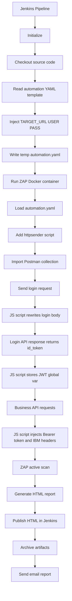
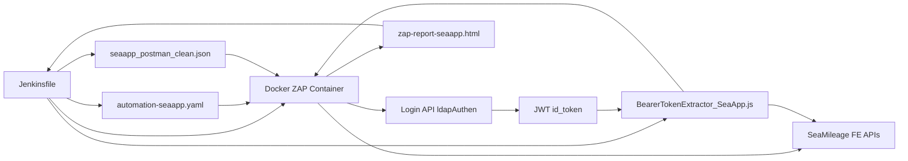
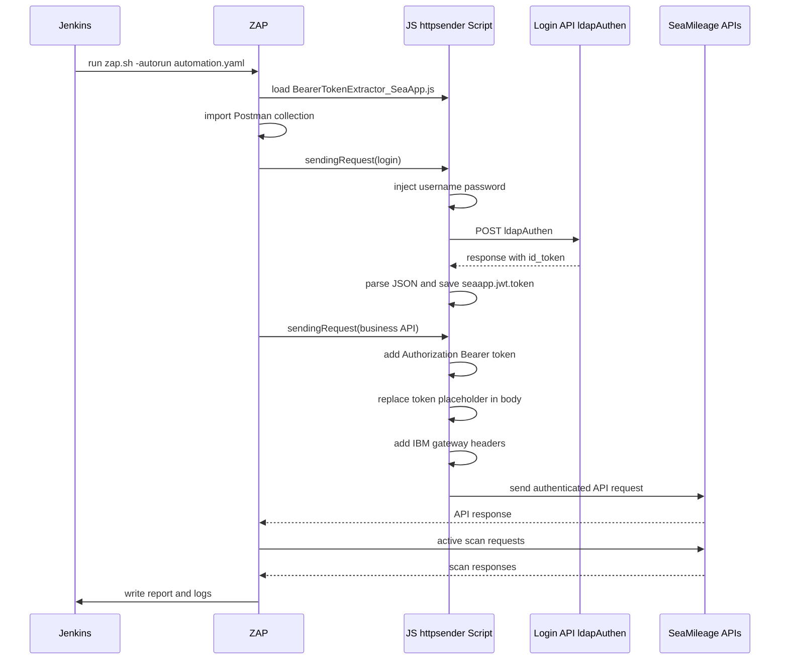
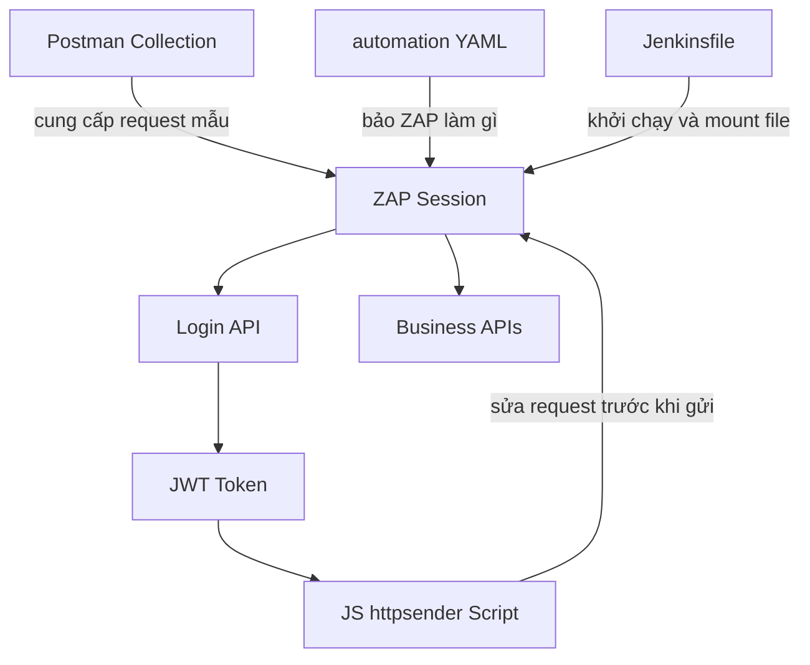

Đại Nguyên Soái, bộ này là một **pipeline Jenkins dùng OWASP ZAP để quét DAST tự động cho SeaApp/SeaTeller**, theo kiểu:

* Jenkins dựng cấu hình quét
* nhét credential vào YAML runtime
* chạy container ZAP
* ZAP đọc Postman collection để biết các API cần gọi
* script JavaScript trong ZAP tự lo:

  * đăng nhập lấy JWT
  * chèn Bearer token vào các request nghiệp vụ
  * chèn thêm header bắt buộc của IBM/API Gateway
* ZAP active scan lên các endpoint đó
* cuối cùng xuất report HTML, archive artifact, rồi email báo cáo

Nói ngắn gọn: **đây là dây chuyền “Jenkins điều binh, ZAP công thành, JS script làm nội gián lấy token”**.

---

# 1. Bức tranh tổng thể

## Mục tiêu của bộ này

Nó không quét web kiểu crawl UI thông thường, mà đi theo hướng:

* **API-driven DAST**
* dùng **Postman collection** làm danh sách API seed
* dùng **httpsender script** để xử lý auth động
* dùng **ZAP Automation Framework YAML** để orchestration

Tức là thay vì ngồi đợi ZAP tự mò hệ thống như gà lạc chợ, ta **chỉ mặt đặt tên** cho nó:
“đây là các API, đây là cách login, đây là token, đây là header gateway, cứ thế mà đánh”.

---

# 2. Vai trò từng file

## A. Jenkinsfile

Đây là **bộ tổng chỉ huy**.

Nó làm mấy việc chính:

1. nhận tham số runtime
2. checkout source
3. đọc file YAML template
4. inject credential Jenkins vào YAML
5. chạy Docker container ZAP
6. mount các file config/script vào container
7. chạy `zap.sh -autorun automation.yaml`
8. publish report HTML
9. archive log/report
10. gửi email kết quả

Nói cách khác: **Jenkinsfile không tự quét**, nó chỉ **chuẩn bị chiến trường và ra lệnh cho ZAP đánh**.

---

## B. automation-seaapp.yaml

Đây là **kịch bản tác chiến của ZAP**.

Nó nói cho ZAP biết:

* context nào được scan
* URL nào thuộc scope
* path nào include / exclude
* có script nào cần nạp
* có Postman collection nào cần import
* có chạy active scan không
* có xuất report không

Đây là file **mô tả workflow scan**, không phải code logic phức tạp.

---

## C. seaapp_postman_clean.json

Đây là **bản đồ mục tiêu**.

Nó chứa danh sách API cụ thể mà ZAP sẽ import vào session, ví dụ:

* login
* getPermission
* getAllAccount
* getAccountById
* sendAccount
* updateAccount
* saveConfigTime
* updateConfigTime
* ...

Mỗi item mô tả:

* method
* URL
* header
* body

Tức là Postman collection này đóng vai trò **seed requests** cho ZAP. Không có nó thì ZAP phải tự crawl API, mà API gateway/internal flow kiểu này thì tự mò thường ngu người.

---

## D. BearerTokenExtractor_SeaApp.js

Đây là **linh hồn auth động**.

Script này là loại `httpsender`, nghĩa là nó can thiệp:

* **trước khi request được gửi đi**
* **sau khi response quay về**

Nó làm 2 việc cực quan trọng:

### 1) Khi gặp request login

Nó sửa body request login để dùng:

* username lấy từ biến global `seaapp.username`
* password lấy từ biến global `seaapp.password`

Tức là request login trong Postman chỉ là cái vỏ. Script mới là thằng **thực sự đổ credential vào**.

### 2) Khi nhận response login

Nó parse JSON response, lấy:

* `jsonResp.body.data.id_token`

rồi lưu vào global var:

* `seaapp.jwt.token`

### 3) Khi gặp request business API

Nó đọc token từ global var rồi:

* set header `Authorization: Bearer <token>`
* nếu body có placeholder `token_se_duoc_inject_tu_js` thì thay bằng token thật
* thêm các header gateway:

  * `X-IBM-Client-Id`
  * `X-IBM-Client-Secret`
  * `x-client-id`

Nói trắng ra: **script này biến một collection tĩnh thành một luồng API sống có xác thực**.

---

# 3. Luồng chạy từ đầu đến cuối

## Sơ đồ tổng thể



---

# 4. Tương tác chi tiết giữa các thành phần

## Sơ đồ thành phần



---

# 5. Diễn giải từng stage trong Jenkinsfile

## Stage 1: Initialize

```groovy
cleanWs()
checkout scm
mkdir -p reports temp
```

Ý nghĩa:

* dọn workspace cũ
* kéo source hiện tại
* tạo thư mục report và temp

Đây là bước **dựng doanh trại**.

---

## Stage 2: Generate Configuration

```groovy
def template = readFile(params.CONFIG_FILE)
withCredentials(...) {
    def finalYaml = template
        .replace('{{TARGET_URL}}', params.TARGET_URL)
        .replace('{{USERNAME}}', USER)
        .replace('{{PASSWORD}}', PASS)
    writeFile file: "${WORKSPACE}/temp/automation.yaml", text: finalYaml
}
```

Ý nghĩa:

* đọc YAML template
* lấy username/password từ Jenkins Credentials
* thay placeholder bằng giá trị thật
* ghi ra file runtime `temp/automation.yaml`

Điểm hay là **credential không hardcode chết trong repo** mà lấy từ Jenkins Credentials.

Nhưng lưu ý: trong YAML Soái đưa, ta chưa thấy rõ placeholder `{{USERNAME}}` `{{PASSWORD}}`. Có thể template thực tế khác đoạn paste, hoặc credential chủ yếu đang truyền qua `-config script.globalvar...`. Chỗ này lát nữa thuộc hạ sẽ nói ở mục “điểm cần soi”.

---

## Stage 3: Execute ZAP Scan

Đây là bước chính.

Jenkins chạy:

```groovy
docker run ...
    -v automation.yaml
    -v reports
    -v scripts
    -v config
    zap.sh -cmd -autorun /zap/wrk/automation.yaml
```

Ngoài ra còn có nhiều `--add-host` để ép resolve domain về IP gateway cụ thể.

Ý nghĩa:

* container ZAP bên trong có thể gọi đúng domain
* nhưng DNS được override về IP `172.18.253.8`
* tức là toàn bộ request sẽ đi qua Apigee/API Gateway đích mong muốn

Đây là kiểu **giữ nguyên Hostname để TLS/Host header hợp lệ, nhưng route vật lý về IP chỉ định**.

Khá thực chiến.

---

# 6. automation-seaapp.yaml đang chỉ đạo ZAP như thế nào

## 6.1 Context

```yaml
contexts:
  - name: "SeaApp-Context"
    urls:
      - "https://uat-nhsfe-gw.seauat.com.vn"
      - "https://uat-seatellergwint.seauat.com.vn"
      - "https://gwint-uat.seauat.com.vn"
```

Ý nghĩa:

* định nghĩa các host nằm trong scope

## 6.2 Include paths

```yaml
includePaths:
  - "https://uat-nhsfe-gw.seauat.com.vn/.*"
  - "https://uat-seatellergwint.seauat.com.vn/.*"
  - "https://gwint-uat.seauat.com.vn/.*"
```

Ý nghĩa:

* chỉ quét các URL match regex này

## 6.3 Exclude paths

```yaml
excludePaths:
  - ".*\\.js"
  - ".*\\.css"
  - ...
```

Ý nghĩa:

* bỏ qua static assets
* giảm nhiễu
* tăng tốc scan

Cái này hợp lý, vì bài toán là API DAST chứ không phải frontend asset audit.

---

## 6.4 Job `script`

```yaml
- type: script
  parameters:
    action: "add"
    type: "httpsender"
    engine: "Graal.js"
    name: "BearerTokenExtractor_SeaApp.js"
    file: "/zap/wrk/scripts/BearerTokenExtractor_SeaApp.js"
```

Ý nghĩa:

* nạp script JS vào ZAP
* script này sẽ chặn/giải phẫu HTTP request-response

Đây là mắt xích **bắt buộc** để auth flow sống được.

---

## 6.5 Job `postman`

```yaml
- type: postman
  parameters:
    collectionFile: "/zap/wrk/config/seaapp_postman_clean.json"
```

Ý nghĩa:

* import collection
* biến các request trong đó thành request trong ZAP session

Đây là nguồn target seed chính.

---

## 6.6 Job `activeScan`

```yaml
- type: activeScan
  parameters:
    context: "SeaApp-Context"
    policy: "API-Minimal"
    ...
```

Ý nghĩa:

* ZAP dùng các request đã biết trong context để active attack
* policy `API-Minimal` thường là quét gọn hơn, tránh quá hung bạo
* `threadPerHost: 5` tức là mỗi host tối đa 5 thread scan

Đây là giai đoạn **đem pháo ra bắn**, không còn chỉ thám báo nữa.

---

## 6.7 Job `report`

```yaml
- type: report
  parameters:
    template: "traditional-html"
    reportDir: "/zap/wrk/reports"
    reportFile: "zap-report-seaapp"
```

Ý nghĩa:

* ZAP xuất report HTML ra thư mục mount từ Jenkins

Lưu ý ngay chỗ này có một quả mìn nhỏ, lát nữa nói.

---

# 7. Luồng auth động trong script JS

## Sơ đồ sequence



---

# 8. Cách 3 file phối hợp với nhau

## Phối hợp logic

### Jenkinsfile

đóng vai trò **orchestrator**

### automation-seaapp.yaml

đóng vai trò **playbook**

### Postman collection

đóng vai trò **danh sách endpoint + request mẫu**

### JS script

đóng vai trò **authentication adapter + request enricher**

---

## Có thể hình dung như sau



---

# 9. Điểm tinh tế nhưng quan trọng

## 9.1 Vì sao dùng Postman collection thay vì openapi?

Vì hệ thống này có vẻ:

* auth phức tạp
* gateway headers riêng
* body request đặc thù nghiệp vụ
* không chắc có OpenAPI spec chuẩn

Nên dùng Postman collection là thực dụng hơn. Nó giống kiểu:
“đừng ngồi mơ kiến trúc đẹp, cứ lấy request thật mà bắn”.

---

## 9.2 Vì sao phải có JS script?

Vì collection tĩnh không tự:

* login động
* lấy token từ response
* inject token vào request sau
* add IBM client headers

Nếu không có script này, ZAP chỉ gửi request “xác sống”, phần lớn ăn 401/403 rồi đứng khóc.

---

## 9.3 Vì sao dùng `--add-host` hàng loạt?

Để container ZAP resolve các domain đó về đúng IP gateway mong muốn.

Điều này hữu ích khi:

* DNS thật không trỏ như mong muốn
* cần ép đi qua gateway UAT cụ thể
* vẫn giữ hostname thật để TLS SNI / Host header không vỡ trận

---

# 10. Các biến runtime đang đi đâu

## Từ Jenkins sang ZAP

Trong `docker run`:

```bash
-config script.globalvar.seanet.username=${USER}
-config script.globalvar.seanet.password=${PASS}
```

Ý định là truyền global variable cho script dùng.

Nhưng ở JS script Soái đưa thì script đọc:

```js
ScriptVars.getGlobalVar("seaapp.username")
ScriptVars.getGlobalVar("seaapp.password")
```

Ở đây có **lệch namespace**:

* Jenkins truyền: `seanet.username`, `seanet.password`
* JS đọc: `seaapp.username`, `seaapp.password`

Nếu đúng như paste, thì script **không đọc được credential Jenkins truyền vào** và sẽ rơi về fallback hardcoded:

```js
"SEAMILEAGE.UAT.03"
"225588cC"
```

Đây là một lỗi logic rất đáng ngờ.

---

# 11. Những điểm đang có mùi rủi ro hoặc bug

## 11.1 Sai tên global variable giữa Jenkins và JS

Như nói trên:

* Jenkins: `script.globalvar.seanet.username`
* JS: `seaapp.username`

Hai họ khác nhau như họ Trương với họ Lý, gặp nhau chỉ để ngó rồi đi.

Muốn chạy đúng thì phải đồng bộ.

Ví dụ nên sửa Jenkins thành:

```bash
-config script.globalvar.seaapp.username=${USER} \
-config script.globalvar.seaapp.password=${PASS}
```

---

## 11.2 Tên report file không khớp

Trong YAML:

```yaml
reportFile: "zap-report-seaapp"
```

Nhưng trong Jenkins `publishHTML` lại tìm:

```groovy
reportFiles:'zap-report.html'
```

Và email attach:

```groovy
attachmentsPattern: "reports/${SCAN_ID}/zap-report.html"
```

Trong khi ZAP nhiều khả năng sẽ xuất file kiểu:

* `zap-report-seaapp.html`

Nếu vậy thì:

* publishHTML có thể fail hoặc không hiện report
* email attachment không đính kèm đúng file

Đây là lỗi rất dễ dính.

---

## 11.3 `catch` nuốt lỗi hơi mạnh tay

```groovy
catch (Exception e) {
    echo ">>> ZAP Scan hoàn tất. Kiểm tra kết quả trong báo cáo."
}
```

Câu này hơi “bị đấm vẫn báo trời quang mây tạnh”.

Nếu ZAP fail thật, pipeline vẫn có thể trông như không quá nghiêm trọng. Với job bảo mật, kiểu này dễ làm người xem báo cáo tưởng quét xong, nhưng thực ra là chết giữa đường.

---

## 11.4 Hardcoded secret trong Postman và JS

Trong dữ liệu Soái paste có:

* `x-api-key`
* `X-IBM-Client-Id`
* `X-IBM-Client-Secret`
* `x-client-id`
* thậm chí password fallback trong script

Về mặt vận hành nội bộ có thể là POC, nhưng về chuẩn bảo mật thì mấy thứ này nên đưa vào:

* Jenkins Credentials
* Secret mounted runtime
* hoặc template injection

Chứ để trong repo là hơi kiểu “treo chìa khóa kho đạn trước cổng doanh trại”.

---

## 11.5 Có active scan trên API mutation endpoints

Collection có cả endpoint như:

* `sendAccount`
* `updateAccount`
* `saveConfigTime`
* `updateConfigTime`

Tức là không chỉ read-only mà có cả thao tác thay đổi dữ liệu.

DAST active scan trên các endpoint này có thể:

* tạo dữ liệu rác
* update trạng thái sai
* trigger side effect
* làm bẩn UAT

Nếu không có account/sandbox riêng và cleanup plan, đây là thứ cần kiểm soát rất kỹ.

---

# 12. Bộ này thực tế đang làm gì theo từng lớp

## Lớp CI/CD

* Jenkins nhận lệnh
* chuẩn bị file
* chạy ZAP container
* gom log/report
* phát hành kết quả

## Lớp scan orchestration

* automation YAML định nghĩa flow quét

## Lớp target discovery

* Postman collection cung cấp API inventory ban đầu

## Lớp authentication/session handling

* JS script lo login, lấy token, chèn token

## Lớp attack engine

* ZAP active scan thực thi payload/rule scan

## Lớp reporting

* HTML report
* Jenkins HTML publisher
* email attachment

---

# 13. Tóm tắt theo kiểu chiến báo

Bộ này là một **DAST pipeline cho API có xác thực**, thiết kế theo hướng:

* **Jenkins** = tổng chỉ huy
* **automation YAML** = quân lệnh
* **Postman collection** = bản đồ mục tiêu
* **httpsender JS script** = nội gián lấy giấy thông hành
* **ZAP container** = công thành xa
* **HTML report + email** = chiến báo hậu chiến

Luồng chính là:

1. Jenkins dựng môi trường
2. ZAP load YAML
3. ZAP load JS script
4. ZAP import Postman collection
5. login API được script sửa body bằng credential thật
6. response login trả `id_token`
7. script giữ token
8. các API sau được gắn Bearer token + IBM headers
9. ZAP active scan các request đó
10. xuất report, publish Jenkins, gửi mail

---

# 14. Kết luận ngắn gọn

Nó không phải “một file scan đơn giản”, mà là **một hệ DAST API có auth flow động**.

Giá trị thật của nó nằm ở 3 chỗ:

* **tái sử dụng Postman collection**
* **tự động login và giữ session**
* **tích hợp CI/CD và báo cáo**

Nhưng hiện tại có vài điểm cần soi ngay:

* mismatch `seanet.*` và `seaapp.*`
* mismatch tên file report
* nguy cơ nuốt lỗi
* hardcoded secret
* scan trúng endpoint mutation có side effect

Nếu Đại Nguyên Soái muốn, thuộc hạ sẽ đi tiếp bước hai: **mổ xẻ từng file line-by-line, giải thích từng block Jenkins/YAML/JS/JSON và chỉ ra chỗ nào nên refactor để đưa từ POC lên bài bản production**.
