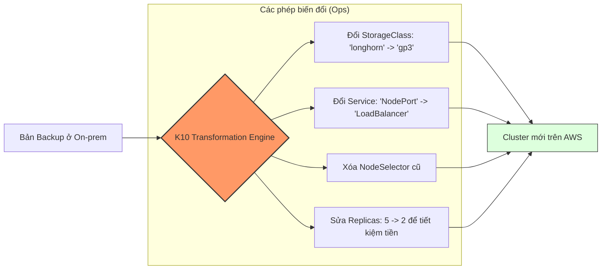

Cơ chế **Transformation** (Biến đổi dữ liệu) chính là "đặc sản" giúp Kasten K10 giải quyết bài toán di trú (Migration) cực kỳ mượt mà.

Hãy tưởng tượng bạn đang có một ứng dụng chạy ở **On-premise (Dùng Longhorn làm Storage)** và muốn chuyển nó lên **AWS (Dùng EBS - gp3)**.

* **Với Velero:** Bạn phải tạo một `ConfigMap` dài ngoằng, viết các rule mapping bằng tay, hoặc dùng `Resource Modifiers` khá "khô khan" và dễ sai một dấu cách là hỏng cả bản restore.
* **Với K10:** Nó coi việc biến đổi dữ liệu là một **bước logic riêng biệt** trong quy trình Restore.

---

### 1. Nguyên lý hoạt động: "Phẫu thuật thẩm mỹ" cho YAML

K10 không restore y hệt những gì nó backup. Trước khi đưa dữ liệu vào Cluster mới, nó đi qua một bộ lọc gọi là **Transformation Engine**. Bộ lọc này sẽ "soi" vào file YAML và thay đổi các thông số theo ý bạn.

---

### 2. Tại sao cái này khiến Velero phải "khóc thét"?

#### A. Giao diện trực quan (Visual Interface)

Trong Dashboard của K10, bạn có một trình soạn thảo kéo thả. Bạn chọn: *"Nếu tìm thấy Object là PersistentVolumeClaim, hãy thay thế giá trị của trường spec.storageClassName thành 'gp3'"*. Bạn nhìn thấy rõ ràng những gì mình sắp sửa đổi, không cần phải đoán mò qua CLI.

#### B. Thử nghiệm trước khi chạy (Test Drive)

K10 cho phép bạn **Dry-run** (chạy thử). Nó sẽ hiển thị file YAML trước và sau khi biến đổi để bạn so sánh. Velero thì "hên xui", bạn phải restore thật mới biết cái mapping của mình có chạy đúng không.

#### C. Khả năng "Xóa bỏ" (Strip)

Khi di chuyển giữa các Cloud, có những thông số nếu giữ lại sẽ khiến Pod không thể khởi động (ví dụ: `nodeSelector` chỉ định tên máy chủ vật lý ở nhà bạn).

* **K10** có lệnh `Remove` cực mạnh để dọn dẹp các "rác thải" môi trường cũ.
* **Velero** làm việc này rất vất vả thông qua các plugin hoặc script bổ trợ.

#### D. Thay đổi cả Annotations (Cấu hình nâng cao)

Mỗi hãng Cloud có một bộ Annotations riêng cho Load Balancer.

* On-prem dùng: `metalb.universe.tf/address-pool`.
* AWS dùng: `service.beta.kubernetes.io/aws-load-balancer-type`.
K10 cho phép bạn "tráo" các thẻ này chỉ trong một nốt nhạc.

---

### 3. Ví dụ thực tế: Kịch bản "Di tản khẩn cấp"

Giả sử Data Center của bạn bị lụt, bạn cần kéo toàn bộ App lên Cloud ngay lập tức.

| Thành phần | Ở On-prem (Dữ liệu cũ) | Sau khi K10 Transform (Dữ liệu mới) |
| --- | --- | --- |
| **StorageClass** | `ceph-rbd` (Không tồn tại trên AWS) | `gp3` (AWS EBS chuẩn) |
| **Replicas** | `10` (Chạy cho sướng vì RAM rẻ) | `2` (Giảm bớt để tiết kiệm tiền Cloud) |
| **Service Type** | `NodePort` | `LoadBalancer` (Để lấy IP của AWS) |
| **Resource Limits** | `CPU: 4` | `CPU: 1` (Tối ưu hóa tài nguyên) |

**Kết quả:** Bạn chỉ mất vài phút để cấu hình một **Restore Policy**. Sau đó, cứ mỗi lần bạn muốn chuyển App, K10 tự động thực hiện "cuộc phẫu thuật" này mà không cần sự can thiệp của con người.

---

### 4. Flow tư duy: "Transformation as a Service"

K10 cho phép bạn lưu các bộ quy tắc biến đổi này thành các **Profiles**.

* Profile "On-prem to AWS"
* Profile "Dev to Production" (Tự động đổi config, tăng tài nguyên)
* Profile "AWS to GCP"

Điều này biến Kasten K10 từ một công cụ Backup đơn thuần trở thành một **Nền tảng quản lý di động ứng dụng (Application Mobility Platform)**.

### Tóm lại là:

* **Velero:** Bạn là thợ sửa ống nước, mỗi lần nối ống (migrate) bạn phải tự mang băng keo, kìm, kéo ra đo đạc và dán bằng tay.
* **K10:** Bạn có một cái đầu nối thông minh, cứ cắm ống vào là nó tự co giãn và thay đổi kích thước cho khớp với đầu ra.

**Bạn có thấy "phê" với tính năng này chưa? Nếu bạn đang vận hành đa nền tảng (Multi-cloud), đây chính là thứ cứu rỗi cuộc đời DevOps đấy!**