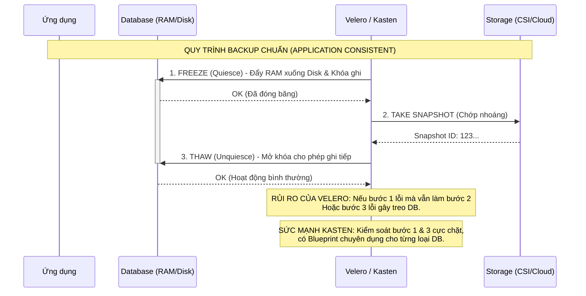
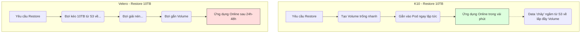

Đây chính là phần "xương xẩu" nhất trong quản trị dữ liệu. Để hiểu tại sao Velero dễ gây lỗi (Data Corruption) và Kasten K10 lại "thần thánh" đến thế, chúng ta phải nói về khái niệm **Application Consistency** (Tính nhất quán của ứng dụng).

Hãy tưởng tượng Database là một người đang viết sổ cái liên tục với tốc độ chóng mặt.

---

### 1. Vấn đề cốt lõi: RAM vs. DISK

Dữ liệu của Database luôn tồn tại ở 2 nơi:

1. **RAM (Buffer Pool/Cache):** Những thay đổi mới nhất đang nằm ở đây (chưa kịp ghi xuống đĩa).
2. **DISK (Data Files):** Những gì đã được lưu bền vững.

* **Chụp ảnh kiểu "Cướp":** Nếu bạn chỉ Snapshot ổ đĩa (PV) mà không báo trước cho Database, bạn sẽ thu được một bản backup ở trạng thái **Crash-consistent**. Khi Restore, Database sẽ giống như vừa bị mất điện đột ngột. Nó phải chạy quy trình phục hồi (Recovery) từ log. Nếu xui xẻo, các file dữ liệu sẽ bị hỏng hoàn toàn (Corrupted) vì Snapshot rơi đúng vào lúc DB đang ghi dở dang một trang dữ liệu.

---

### 2. Velero: "Manual Hooks" - Cuộc chơi đầy rủi ro

Velero sử dụng các **Annotations** (chú thích) để ra lệnh cho Pod chạy một cái gì đó trước (`pre-hook`) và sau (`post-hook`) khi Snapshot.

**Tại sao "non tay" thì dễ hỏng?**

* **Lỗi 1: Nuốt lỗi (Silent Failure).** Script của bạn chạy lệnh `FLUSH TABLES WITH READ LOCK;` (khóa database để ghi). Nhưng vì lý do gì đó (network lag, quyền hạn), lệnh này thất bại. Nếu script của bạn không có cơ chế bắt lỗi cực tốt, Velero vẫn tiến hành Snapshot. Kết quả: Bạn có một bản Snapshot "rác" mà cứ tưởng là ngon.
* **Lỗi 2: Quên mở khóa (DB Locking).**
Nếu `pre-hook` chạy ngon, nhưng `post-hook` (mở khóa - UNLOCK) gặp lỗi hoặc Pod bị restart đúng lúc đó. Database của bạn sẽ bị **treo cứng ở chế độ Read-only**. Chúc mừng, bạn vừa gây ra một vụ sập hệ thống (Outage) chỉ vì muốn backup.
* **Lỗi 3: Timeout.**
Bạn khóa DB, nhưng Snapshot diễn ra quá lâu (do dung lượng lớn hoặc Cloud chậm). Database bị khóa quá thời gian quy định của ứng dụng, dẫn đến lỗi "Connection Timeout" hàng loạt ở phía người dùng.
* **Lỗi 4: HA Cluster (Cụm nhiều Node).**
Với MySQL Galera hoặc PostgreSQL Patroni, việc khóa 1 node không có nghĩa là cả cụm dừng ghi. Bạn phải biết khóa đúng node Leader hoặc dừng đồng bộ hóa toàn cụm. Viết script cho cái này bằng Velero là một cực hình.

---

### 3. Kasten K10: "Kanister Blueprints" - "Bí kíp" chuyên gia

Kasten không dùng mấy dòng lệnh script lẻ tẻ. Họ dùng một Framework riêng gọi là **Kanister**.

**Tại sao nó an toàn?**

* **Cấu trúc hóa (Structured Logic):** Blueprint là một file YAML định nghĩa các bước: `Backup`, `Restore`, `Delete`. Nó không chỉ là "chạy 1 dòng lệnh", mà nó là cả một workflow có kiểm tra trạng thái (State machine).
* **Nhận diện thông minh:** Blueprint hiểu về Database. Ví dụ, với MongoDB, nó không chỉ khóa đĩa, mà nó gọi API của Mongo để tạo một `checkpoint` chuẩn.
* **Xử lý lỗi tự động (Error Handling):** Nếu bước "Khóa DB" không thành công, Kasten sẽ dừng ngay lập tức và bắn Alert "Backup Failed" thay vì cố đấm ăn xôi chụp một bản Snapshot hỏng. Nếu Snapshot xong, nó đảm bảo lệnh "Mở khóa" phải được thực thi thành công bằng mọi giá.
* **Cộng đồng thẩm định:** Các bản Blueprint cho Postgres, MySQL, MongoDB, Redis, Cassandra... được Kasten và cộng đồng kiểm thử qua hàng nghìn môi trường khác nhau. Bạn chỉ việc lấy về dùng (Use as-is), không cần "phát minh lại cái bánh xe".

---

### 4. So sánh Flow tư duy: Freeze - Snapshot - Thaw



---

### Tóm lại:

* **Dùng Velero:** Bạn giống như một bác sĩ tự chế dụng cụ phẫu thuật. Nếu bạn cực giỏi về Database, bạn vẫn có thể làm tốt. Nhưng chỉ cần một sơ suất nhỏ trong script bash, dữ liệu của bạn sẽ lâm nguy.
* **Dùng Kasten K10:** Bạn sử dụng một bộ dụng cụ phẫu thuật chuyên dụng đã được chứng nhận y khoa. Bạn không cần quan tâm lệnh SQL cụ thể để khóa Mongo hay Postgres là gì, K10 lo việc đó thay bạn một cách chuyên nghiệp.

> **Góc thực chiến:** Nếu bạn backup Website cá nhân, dùng Velero Hook là ổn. Nhưng nếu bạn backup **Core Banking** hay **Hệ thống đơn hàng TMĐT**, dùng Manual Hook của Velero là một sự "mạo hiểm" đánh cược bằng sự nghiệp của chính mình.

---
Để thấy sự khác biệt, hãy tưởng tượng chúng ta đang backup một Database **PostgreSQL**. Một bên là cách làm "thủ công" (Velero Hook) và một bên là cách làm "công nghiệp" (Kanister Blueprint).

---

### 1. Phía Velero: Cách làm "Nông dân" (Manual Hook)

Bạn phải nhét đoạn script này vào **Annotation** của Pod hoặc Deployment. Nó trông cực kỳ rối rắm và khó quản lý.

**File: `deployment-patch.yaml**`

```yaml
metadata:
  annotations:
    # Lệnh chạy TRƯỚC khi snapshot
    pre.hook.backup.velero.io/command: '["/bin/bash", "-c", "psql -U postgres -c \"SELECT pg_start_backup('velero-backup', true);\""]'
    pre.hook.backup.velero.io/container: postgres
    
    # Lệnh chạy SAU khi snapshot
    post.hook.backup.velero.io/command: '["/bin/bash", "-c", "psql -U postgres -c \"SELECT pg_stop_backup();\""]'
    post.hook.backup.velero.io/container: postgres

```

> **Rủi ro ở đâu?**
> * **Mù quáng:** Nếu lệnh `pg_start_backup` lỗi (ví dụ: sai password), Velero vẫn cứ thản nhiên Snapshot ổ đĩa. Bạn nhận được một bản backup hỏng mà không hề hay biết.
> * **Treo DB:** Nếu bước `post-hook` thất bại vì Pod bị nghẽn mạng, Database sẽ bị kẹt ở chế độ backup mãi mãi, ghi log đầy ổ cứng và sập hệ thống.
> 
> 

---

### 2. Phía Kasten K10: Cách làm "Chủ tịch" (Kanister Blueprint)

K10 sử dụng một Object riêng gọi là **Blueprint**. Nó tách biệt hoàn toàn logic backup ra khỏi định nghĩa của ứng dụng. Đây là một đoạn trích từ bộ "bí kíp" chuẩn:

**File: `postgresql-blueprint.yaml**`

```yaml
apiVersion: cr.kanister.io/v1alpha1
kind: Blueprint
metadata:
  name: postgres-blueprint
actions:
  backup:
    phases:
    - func: KubeExec # Thực thi lệnh bên trong Pod
      name: lockPostgres
      args:
        namespace: "{{ .StatefulSet.Namespace }}"
        pod: "{{ index .StatefulSet.Pods 0 }}"
        container: postgres
        command:
          - bash
          - -o
          - errexit
          - -c
          - |
            # Logic thông minh: Kiểm tra trạng thái DB trước khi khóa
            psql -U postgres -c "SELECT pg_start_backup('kanister-backup', true);"
    - func: CreateSnapshot # Ra lệnh cho Storage chụp ảnh
      name: takeSnapshot
      args:
        volume: data-volume
  post-backup:
    phases:
    - func: KubeExec
      name: unlockPostgres
      args:
        # Tự động mở khóa, kể cả khi bước trước đó có vấn đề (Error Handling)
        command:
          - psql -U postgres -c "SELECT pg_stop_backup();"

```

---

### 3. Tại sao nhìn Blueprint lại thấy "An tâm" hơn?

1. **Tính đóng gói (Encapsulation):** Bạn thấy không? Blueprint có `phases` (các giai đoạn). Nó không chỉ là chạy một dòng lệnh, nó là một **quy trình (Workflow)**.
2. **Biến số động (Dynamic Templates):** K10 tự biết tìm tên Pod, tên Namespace thông qua các biến như `{{ .StatefulSet.Namespace }}`. Bạn không cần sửa script mỗi khi đổi tên Pod.
3. **Xử lý lỗi (Error Handling):** Kanister có cơ chế **"Defer"** hoặc **"Cleanup"**. Nếu bước Snapshot bị crash, Blueprint sẽ đảm bảo lệnh `pg_stop_backup` phải được gọi để giải phóng Database. Velero Hook không đủ thông minh để làm điều này.
4. **Tái sử dụng (Reusability):** Bạn viết một cái Blueprint cho Postgres, bạn có thể áp dụng nó cho **tất cả** các cụm Postgres trong toàn bộ công ty chỉ bằng một cái nhãn (Label). Với Velero, bạn phải đi dán Annotation vào từng Deployment một.

---

### 4. So sánh thực tế khi Restore

Đây mới là lúc "ăn tiền" này:

* **Velero:** Khi restore, nó chỉ kéo data về. Nếu DB yêu cầu các bước hậu kiểm (như recovery mode), bạn lại phải tự tay vào gõ lệnh.
* **K10 Blueprint:** Có sẵn action `restore`. Nó sẽ tự động biết cách đưa DB vào trạng thái recovery, kiểm tra tính toàn vẹn, rồi mới cho phép App kết nối vào.

---

### Tóm lại (Flow tư duy)

* **Velero Hook:** Giống như bạn dặn nhân viên: "Lúc nào tôi chụp ảnh thì nhớ nhắm mắt lại nhé". Nhân viên có nhắm hay không, hoặc chụp xong có mở mắt ra không thì... hên xui.
* **K10 Blueprint:** Giống như một **Robot vận hành**. Nó kiểm tra xem nhân viên đã sẵn sàng chưa, ra lệnh nhắm mắt, chụp xong thì kiểm tra xem mắt đã mở chưa, nếu chưa mở thì nó "tát" cho tỉnh để làm việc tiếp.

---
Khi đối đầu với các "quái vật" Database dung lượng hàng Terabyte (TB), sự khác biệt giữa Velero và Kasten K10 không còn là ở tính năng nữa, mà là ở **khả năng sống sót**.

Với 10TB dữ liệu, nếu bạn làm không khéo, thời gian backup có thể kéo dài cả ngày, và thời gian restore có thể mất cả tuần. Đây là cách Kasten K10 xử lý để không bị "ngộp thở" như Velero:

---
## Ví dụ xử lý database lớn
### 1. Changed Block Tracking (CBT) - Chỉ lấy những gì thay đổi

Đây là "vũ khí tối thượng".

* **Velero:** Thường thực hiện backup theo kiểu "chụp ảnh" (Snapshot) toàn bộ hoặc copy lại từ đầu nếu dùng Restic/Kopia. Với 10TB, việc quét (scan) lại hàng triệu file để tìm sự thay đổi là một cơn ác mộng về CPU và I/O.
* **Kasten K10:** Tích hợp sâu với API của các hãng Storage (như AWS EBS, vSphere, NetApp). Nó hỏi trực tiếp hệ thống lưu trữ: *"Từ bản backup trước đến giờ, những block dữ liệu nào đã thay đổi?"*.
* K10 chỉ kéo đúng vài GB dữ liệu thay đổi đó đi.
* **Kết quả:** Backup 10TB nhưng chỉ mất vài phút thay vì vài tiếng.


---

### 2. Loại bỏ dữ liệu trùng lặp (Deduplication) & Nén siêu cấp

Dữ liệu càng lớn, hóa đơn S3 của bạn càng "khủng".

* **Velero:** Nén dữ liệu ở mức cơ bản. Nếu bạn có 10 bản backup của 10TB, dung lượng lưu trữ trên Cloud sẽ cực kỳ tốn kém.
* **Kasten K10:** Có bộ máy **Deduplication** cực mạnh. Nếu 10TB của bạn có nhiều dữ liệu giống nhau (ví dụ các block trống hoặc dữ liệu lặp lại), K10 chỉ lưu một bản duy nhất.
* **Tiết kiệm:** Có thể giảm tới 50-80% dung lượng lưu trữ trên Cloud so với Velero.


---

### 3. Song song hóa (Multi-stream Parallelism)

* **Velero:** Thường xử lý tuần tự hoặc giới hạn số lượng luồng dữ liệu. Giống như việc bạn hút 10TB nước qua một cái ống hút nhỏ.
* **Kasten K10:** Mở hàng loạt "vòi rồng" cùng lúc. Nó chia nhỏ dữ liệu và đẩy lên Cloud qua nhiều luồng song song, tận dụng tối đa băng thông mạng của Cluster.

---

### 4. Xử lý Transaction Logs (WAL/Archived Logs)

Với DB siêu lớn, file log phát sinh mỗi ngày có thể lên tới hàng trăm GB.

* **Velero:** Không biết gì về log. Nếu bạn không tự dọn, ổ cứng sẽ đầy (Disk Full) và DB sập.
* **Kasten K10 (qua Blueprint):** Sau khi backup thành công, nó thực hiện lệnh **Log Truncation** (Cắt tỉa log). Nó báo cho DB: *"Tôi đã backup an toàn rồi, bạn có thể xóa các file log cũ đi"*.
* Điều này giúp duy trì hiệu năng và dung lượng đĩa cho các DB lớn ổn định 24/7.


---

### BẢNG SO SÁNH KHI XỬ LÝ DATABASE 10TB+

| Đặc điểm | Velero (Hụt hơi) | Kasten K10 (Băng băng) |
| --- | --- | --- |
| **Thời gian Backup** | Rất lâu (Phụ thuộc vào tốc độ scan file) | Cực nhanh (Nhờ CBT - Changed Block Tracking) |
| **Băng thông mạng** | Bị nghẽn do đẩy quá nhiều dữ liệu thừa | Tối ưu (Chỉ đẩy phần thay đổi - Delta) |
| **Thời gian Restore** | Có thể mất nhiều ngày | Nhanh (Nhờ cơ chế Hydration thông minh) |
| **Chi phí Storage** | Cao (Do lưu nhiều bản Full/Increment kém) | Thấp (Nhờ Deduplication đỉnh cao) |
| **Độ tin cậy** | Dễ hỏng do Snapshot quá lâu gây lag DB | An toàn (Tích hợp sâu tầng phần cứng/Cloud) |

---

### 5. Khôi phục thần tốc (Hydration & Instant Access)

Khi 10TB dữ liệu bị mất, sếp bạn sẽ không đợi được 3 ngày để bạn kéo data từ S3 về.

* **K10** có các cơ chế như **Direct Restore** hoặc tận dụng các tính năng của tủ đĩa (Storage Array) để "gắn" (mount) ngược bản snapshot vào Cluster gần như ngay lập tức, trong khi dữ liệu thật sự vẫn đang được "đổ" về ngầm phía dưới.


