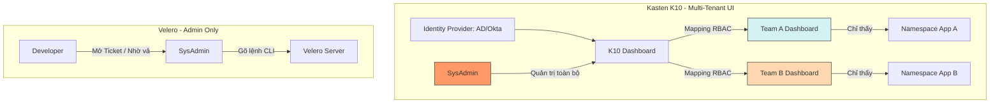

Đây là phần "sướng" nhất đối với một SysAdmin khi quản lý hệ thống lớn. Hãy tưởng tượng bạn đang quản lý 50 team Developer. Mỗi ngày có 5 ông nhắn tin: *"Anh ơi restore hộ em cái DB bản lúc 10h sáng để em debug"* hoặc *"Anh ơi cho em xin bản backup để migrate sang môi trường test"*.

Nếu dùng Velero, bạn sẽ "ngập trong ticket". Nếu dùng Kasten K10, bạn giao chìa khóa cho họ tự làm. Dưới đây là phân tích sâu về sự khác biệt này:

---

### 1. Velero: "Nỗi lo" của người giữ cửa (Admin-Only)

Về lý thuyết, Velero dựa trên RBAC của Kubernetes. Nhưng thực tế, nó cực kỳ khó để phân quyền an toàn cho từng Team.

* **Quyền hạn quá rộng:** Velero hoạt động chủ yếu ở cấp độ Cluster-wide. Để một Developer có thể chạy lệnh `velero restore`, họ thường cần quyền can thiệp vào Custom Resource Definitions (CRDs) trong namespace `velero`. Một khi họ có quyền đó, họ có thể "vô tình" nhìn thấy hoặc restore nhầm bản backup của team khác.
* **CLI là rào cản:** Developer thường không giỏi (hoặc không muốn) cài đặt và cấu hình `velero CLI`, cấu hình `kubeconfig` để trỏ đúng vào cluster.
* **Rủi ro bảo mật:** Bạn không thể dễ dàng giới hạn: *"Team A chỉ được restore bản backup của Namespace A"*. Trong Velero, nếu bạn cấp quyền restore, họ có quyền truy cập vào các bản backup được lưu trên S3. Nếu họ biết tên bản backup của Team B, họ có thể kéo về được.

**Hệ quả:** SysAdmin phải ôm hết. Bạn trở thành "ông bảo vệ" kiêm "người đưa đò", ai cần gì cũng phải qua tay bạn.

---

### 2. Kasten K10: Triết lý "Self-Service" (Tự phục vụ)

K10 được thiết kế để tách biệt quyền quản trị hạ tầng và quyền quản lý ứng dụng.

#### A. Tích hợp OIDC/Active Directory (Đăng nhập bằng tài khoản công ty)

K10 không bắt Dev dùng `kubectl`. Họ đăng nhập vào Dashboard K10 bằng tài khoản công ty (Okta, Keycloak, Google, AD).

* K10 sẽ nhìn vào các nhóm (Groups) của user để quyết định họ được thấy cái gì.

#### B. Phân quyền theo Namespace (Namespace-Level Isolation)

Đây là đòn "chí mạng" với Velero:

* Khi Team A đăng nhập, Dashboard của họ **chỉ hiện ra đúng các ứng dụng trong Namespace A**. Họ không hề biết sự tồn tại của các team khác.
* Họ có nút **"Backup"** và **"Restore"** to đùng. Họ có thể tự bấm.
* **SysAdmin chỉ làm nhiệm vụ:** Cấu hình "đường ống" (Storage Location) và "chính sách tổng" (Global Policy). Còn việc thực thi cụ thể là của Dev.

#### C. "Shift Left" - Đưa trách nhiệm về phía Developer

* Nếu Dev làm hỏng DB lúc 2 giờ sáng, họ tự vào Dashboard nhấn nút Restore bản backup gần nhất.
* Họ không cần gọi bạn dậy.
* Họ tự chịu trách nhiệm về dữ liệu của mình (You build it, you run it, you protect it).

---

### 3. So sánh quy trình làm việc (Workflow)

| Tình huống | Quy trình với Velero | Quy trình với Kasten K10 |
| --- | --- | --- |
| **Yêu cầu Restore** | Dev mở ticket -> SysAdmin tiếp nhận -> Admin gõ lệnh CLI -> Chờ -> Admin báo xong. | Dev tự vào UI -> Chọn bản backup -> Nhấn Restore -> Xong trong 2 phút. |
| **Kiểm soát quyền** | Rất khó, thường phải cấp quyền Cluster-admin cho người thực hiện. | Phân quyền chi tiết (Role-based): View-only, Backup-only, hoặc Full-access theo Namespace. |
| **Tính minh bạch** | Dev không biết bản backup có tồn tại không, phải hỏi Admin. | Dev nhìn thấy lịch sử backup, trạng thái thành công/thất bại ngay trên Dashboard của họ. |
| **Gánh nặng SysAdmin** | **Cực cao.** Bạn là "điểm nghẽn" (Bottleneck) của mọi yêu cầu về dữ liệu. | **Cực thấp.** Bạn chỉ quản lý hạ tầng lưu trữ và giám sát tổng thể. |

---

### 4. Sơ đồ phân cấp quyền hạn

---

### 5. Tại sao SysAdmin lại "yêu" tính năng này?

1. **Hết cảnh "làm dâu trăm họ":** Bạn không còn phải đi phục vụ những yêu cầu nhỏ lẻ.
2. **Audit Logs rõ ràng:** Nếu một Developer restore nhầm và làm đè dữ liệu, K10 ghi lại rõ: *"User Nguyễn Văn A đã thực hiện restore vào lúc 10:00"*. Bạn có bằng chứng để "nói chuyện" với họ. Với Velero, bạn thường là người gõ lệnh nên... mọi lỗi lầm thường bị đổ lên đầu Admin.
3. **Tập trung vào việc lớn:** Bạn có thời gian để tối ưu hóa kiến trúc, bảo mật thay vì ngồi gõ `velero restore create --from-backup...`.

**Chốt lại:** Nếu bạn muốn thoát khỏi cảnh làm "nô lệ" cho các yêu cầu backup/restore của Developer, Kasten K10 là chiếc vé giải phóng sức lao động.

**Bạn có muốn mình hướng dẫn cách cấu hình một cái "RoleBinding" mẫu trong K10 để giới hạn quyền cho một Team cụ thể không?**