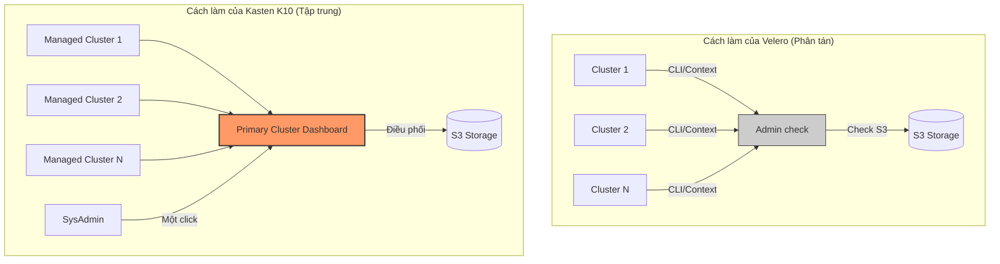

Với tư cách là một **SysAdmin**, việc phải quản lý hàng chục hay hàng trăm Cluster giống như việc chăn dắt một đàn hổ. Nếu mỗi con hổ (Cluster) lại có một tính nết riêng, cách cho ăn (Backup) riêng và bạn phải đến tận chuồng để kiểm tra từng con, thì sớm muộn bạn cũng sẽ kiệt sức.

Đây là lúc khía cạnh **Multi-Cluster** chia rẽ ranh giới giữa một "Công cụ miễn phí" và một "Giải pháp quản trị". Hãy đi sâu vào "nỗi đau" và "liều thuốc" ở đây:

---

### 1. Kiến trúc: Ốc đảo (Velero) vs. Đế chế (K10)

* **Velero (Isolated Architecture):** Mỗi lần bạn cài Velero, nó chỉ biết đến Cluster đó. Để quản lý 100 Cluster, bạn phải chuyển đổi `kube-context` 100 lần. Dữ liệu backup có thể đẩy chung về một S3 Bucket, nhưng "bản đồ" để tìm lại dữ liệu đó nằm rải rác ở 100 nơi khác nhau.
* **Kasten K10 (Primary-Managed Architecture):** K10 thiết lập một mô hình **Hub-and-Spoke**. Bạn chọn một Cluster làm **Primary** (Trung tâm điều khiển). Các Cluster còn lại là **Managed** (Cấp dưới).
* Mọi thông tin về tình trạng backup của toàn bộ đế chế đều đổ về Dashboard của Cluster Primary.
* Bạn đứng ở một nơi và ra lệnh cho tất cả.

---

### 2. Global Policies: "Cấu hình một nơi, áp dụng vạn nơi"

Đây là tính năng giúp SysAdmin "kê cao gối ngủ".

* **Nỗi khổ với Velero:** Bạn muốn thay đổi lịch backup từ 12h trưa sang 1h sáng cho 100 Cluster? Bạn phải chạy script hoặc dùng công cụ CI/CD để cập nhật 100 file YAML. Rủi ro sai sót (Drift) cực cao.
* **Sức mạnh của K10:** Bạn định nghĩa một **Global Policy**. Ví dụ: *"Tất cả các App có nhãn `critical: true` trên TOÀN BỘ các cluster phải backup 1h/lần"*.
* Khi bạn thêm một Cluster thứ 101 vào hệ thống, K10 tự động nhận diện các App có nhãn đó và áp dụng chính sách backup ngay lập tức. Bạn không cần động tay vào.

---

### 3. Di chuyển và Khôi phục thảm họa (Multi-Cluster DR)

Khi Cluster A "bốc cháy", SysAdmin cần đưa ứng dụng sang Cluster B ngay lập tức.

* **Với Velero:** Bạn phải sang Cluster B, cấu hình để nó nhìn thấy cái S3 Bucket của Cluster A, tìm cái tên bản backup chính xác, rồi mới chạy lệnh Restore. Quá nhiều bước thủ công trong lúc dầu sôi lửa bỏng.
* **Với Kasten K10:** Trên Dashboard trung tâm, bạn chỉ cần chọn bản backup của Cluster A và nhấn **"Restore to Cluster B"**.
* K10 tự động điều phối việc di chuyển Metadata, biến đổi dữ liệu (Transformation) cho phù hợp với môi trường mới và khởi động ứng dụng. Nó giống như một người nhạc trưởng điều khiển dòng chảy dữ liệu giữa các Cluster.

---

### 4. Visibility & Alerting: Một cái nhìn quét sạch nỗi lo

* **Velero:** Bạn cần xây dựng một hệ thống Prometheus/Grafana cực kỳ phức tạp để gom Metrics từ 100 Cluster về một chỗ. Nếu một Cluster chết hẳn (không đẩy được metric), có khi bạn còn không biết bản backup của nó đã hỏng.
* **K10:** Cung cấp một **Aggregated View**. Bạn mở màn hình lên, nếu thấy một chấm đỏ trên bản đồ 100 Cluster, bạn biết ngay vấn đề nằm ở đâu. K10 cũng quản lý việc đẩy Alert (Slack/Email) tập trung, tránh tình trạng bị "loãng" thông báo từ quá nhiều nguồn.

---

### 5. So sánh Flow quản trị dành cho SysAdmin

---

### 🛠️ Giải pháp "Bù đắp" cho Velero (Nếu bạn vẫn muốn dùng đồ miễn phí)

Nếu bạn là một SysAdmin "nghèo nhưng giỏi", bạn có thể dùng **GitOps (ArgoCD hoặc FluxCD)** để quản lý Velero đa cụm:

1. Đẩy toàn bộ YAML cấu hình Velero (Backup, Schedule, StorageLocation) lên một Git Repository.
2. Dùng ArgoCD để "ép" 100 Cluster phải chạy đúng các file YAML đó.
3. Kết hợp với **Grafana Centralized Dashboard** để xem Metrics.

**Tuy nhiên**, GitOps chỉ giải quyết được phần "Cấu hình", nó không giải quyết được phần "Orchestration" (điều phối khôi phục) và "Visibility" (trạng thái chi tiết từng bản backup) mượt mà như K10.

**Lời kết cho SysAdmin:** * Quản lý **< 5 Cluster**: Velero + GitOps là một lựa chọn kinh tế và thú vị.

* Quản lý **> 10 Cluster**: Kasten K10 sẽ cứu rỗi thời gian và mái tóc của bạn. Khoản phí License lúc này rẻ hơn rất nhiều so với chi phí nhân sự và rủi ro khi xảy ra thảm họa trên quy mô lớn.

**Bạn có muốn mình hướng dẫn cách thiết lập một "Aggregated Dashboard" cho Velero bằng Grafana để bạn thử sức với phương án Multi-cluster giá rẻ không?**