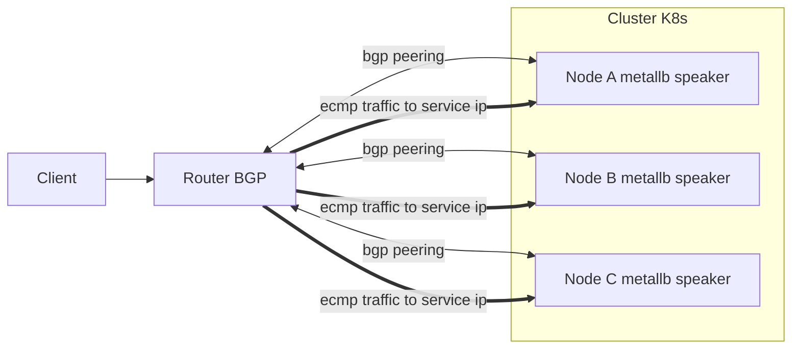
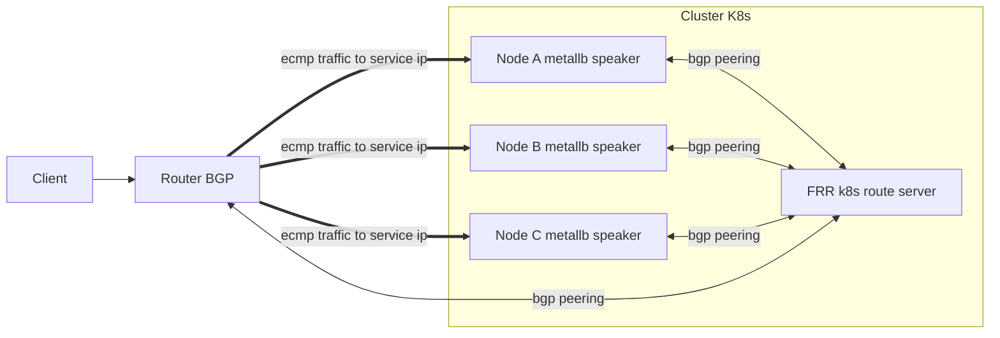
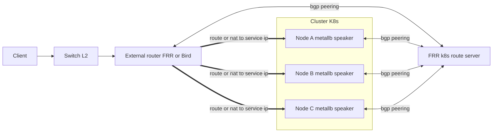

---

# ⚔️ Bản chất MetalLB BGP mode

### 1. Cách nó hoạt động

* Mỗi node Kubernetes (nơi pod MetalLB speaker chạy) sẽ đóng vai **BGP peer**.
* Khi một `Service` kiểu **LoadBalancer** xuất hiện, MetalLB sẽ **advertise route /32** (IPv4) hoặc /128 (IPv6) đại diện cho IP của service đó.
* Router “hàng xóm” (thường là ToR switch, core router, hoặc firewall có hỗ trợ BGP) sẽ **nhận update BGP** và cài route:

  ```
  10.10.10.50/32 → next-hop 192.168.1.21 (Node A)
  ```
* Nếu có nhiều node cùng advertise, router sẽ có nhiều next-hop → chia tải bằng ECMP (Equal Cost Multi Path).
* Nếu node down, BGP session bị hạ, route biến mất. Router sẽ tự động ngừng chuyển lưu lượng về node đó.

> Nói nôm na: thay vì “thét ARP cho cả xóm biết” (L2), giờ MetalLB **nói chuyện riêng với ông trưởng làng (router)**, và router sẽ điều phối thay.

---

### 2. Có cần thiết bị mạng phối hợp không?

**CÓ**. BGP mode **bắt buộc** cần một “peer” hiểu BGP:
* Switch/router ở tầng aggregation/ToR phải hỗ trợ **BGP**.
* Hoặc dựng thêm **FRR/FRR-k8s** như một BGP router ảo để làm “cầu nối” với hạ tầng.
Nếu thiết bị mạng hiện tại không support BGP → MetalLB BGP **không hoạt động**.

---

### 3. Vai trò thiết bị mạng

* **Thiết bị mạng nhận route**: Là “single source of truth”, quyết định IP nào đang ở đâu.
* **Không còn ARP flap**: Vì IP không bind với MAC node nào cụ thể, mà bind vào **route entry** trong FIB của router.
* **Cần cấu hình**:

  * ASN cho mỗi bên (router và MetalLB node).
  * Peering relationship (EBGP/IBGP).
  * Policy route nếu cần (lọc prefix, cộng weight, bật multipath).

---

### 4. Ưu điểm BGP mode

* Triệt tiêu lỗi “1 IP ↔ 2 MAC”.
* Failover nhanh và rõ ràng, đặc biệt nếu bật thêm **BFD** (Bidirectional Forwarding Detection).
* Dễ scale: thêm node → thêm peer, router chỉ học thêm next-hop.
* Chuẩn mực: nhiều datacenter enterprise đã quen vận hành BGP.

---

### 5. Nhược điểm

* Cần thiết bị mạng (hoặc FRR trung gian) **biết BGP**.
* Phải làm việc với team network (nếu có), không phải cứ “kubectl apply” là xong như L2.
* Nếu router cấu hình chưa chuẩn (policy, filter), có thể không học được route hoặc bị drop.

---

📌 **Tóm lược:**

* **MetalLB BGP** = “K8s node → nói chuyện trực tiếp với Router bằng BGP → Router điều phối traffic.”
* **Không còn ARP** = không còn cảnh IP–MAC flap.
* **Có cần phối hợp với thiết bị network** = CHẮC CHẮN CÓ, nếu không thì phải dựng FRR-k8s làm trung gian.

---

## 🎯 Hai mô hình BGP khi dùng MetalLB

### **1. Node peering trực tiếp với thiết bị mạng**

* MetalLB speaker trên mỗi node **tự mở BGP session với router/ToR**.
* Khi Service LB tạo ra IP, **node đó advertise /32 route** cho router.
* 👉 Trường hợp này: **router PHẢI hỗ trợ BGP**. Nếu không có BGP, vô dụng.

---

### **2. FRR-k8s làm trung gian (route reflector / route server)**

* MetalLB speaker không cần kết nối trực tiếp ra router.
* Thay vào đó, nó **advertise route nội bộ tới FRR-k8s** (chạy như một BGP daemon trong cluster).
* FRR-k8s đóng vai trò **concentrator**: gom tất cả prefix dịch vụ trong cluster, rồi **advertise ra ngoài**.
* 👉 Trường hợp này:

  * Nếu **ra ngoài cluster vẫn muốn traffic đi chuẩn** → thiết bị mạng ở biên **VẪN PHẢI hiểu BGP**, vì FRR-k8s cũng chỉ “nói BGP” ra ngoài.
  * Nếu **thiết bị mạng KHÔNG có BGP** → bắt buộc phải dựng thêm một “router ảo” (VM, box Linux chạy FRR/Bird) **ngoài cluster**, vừa có BGP peering với FRR-k8s, vừa có kết nối L2/L3 với mạng ngoài. Router này sau đó sẽ **NAT hoặc static route** để phân phối IP service ra ngoài.

---

## 🔑 Kết luận

* **FRR-k8s không loại bỏ yêu cầu BGP từ thiết bị mạng.** Nó chỉ giúp gom và quản lý session BGP từ cluster → ra một điểm duy nhất.
* Nếu hạ tầng network hoàn toàn “dumb” (chỉ L2 switch, không BGP):

  * Dùng FRR-k8s thì vẫn phải dựng thêm **router BGP trung gian**.
  * Nghĩa là cluster sẽ không thể “nói chuyện” trực tiếp với L2 switch, mà phải có **một ông trung gian BGP-aware** để làm “cầu nối” với thế giới bên ngoài.

---

📌 Nói cách khác:

* Nếu hạ tầng **có router BGP** → MetalLB BGP (có hoặc không qua FRR-k8s) đều chạy ngon.
* Nếu hạ tầng **chỉ có switch dumb L2** → BGP không dùng được → cần dựng router/VM Linux ngoài cluster làm BGP gateway.


---

### 1) Trực tiếp peering BGP giữa node và router



**Ý chính:** Mỗi node chạy speaker làm BGP peer với Router. Router học prefix service ip dạng slash 32 và chia tải ecmp. Không còn phụ thuộc arp.

---

### 2) FRR k8s làm concentrator trong cluster



**Ý chính:** Speaker chỉ nói chuyện BGP nội bộ với FRR k8s. FRR k8s gom prefix và quảng bá ra Router. Router vẫn cần hỗ trợ BGP.

---

### 3) Không có BGP trên thiết bị mạng, dùng router ao ảo bên ngoài



**Ý chính:** Switch chỉ L2 nên không bgp. Dựng external router có bgp để peering với FRR k8s. External router sau đó route hoặc nat service ip ra mạng ngoài.

---

%%  %%