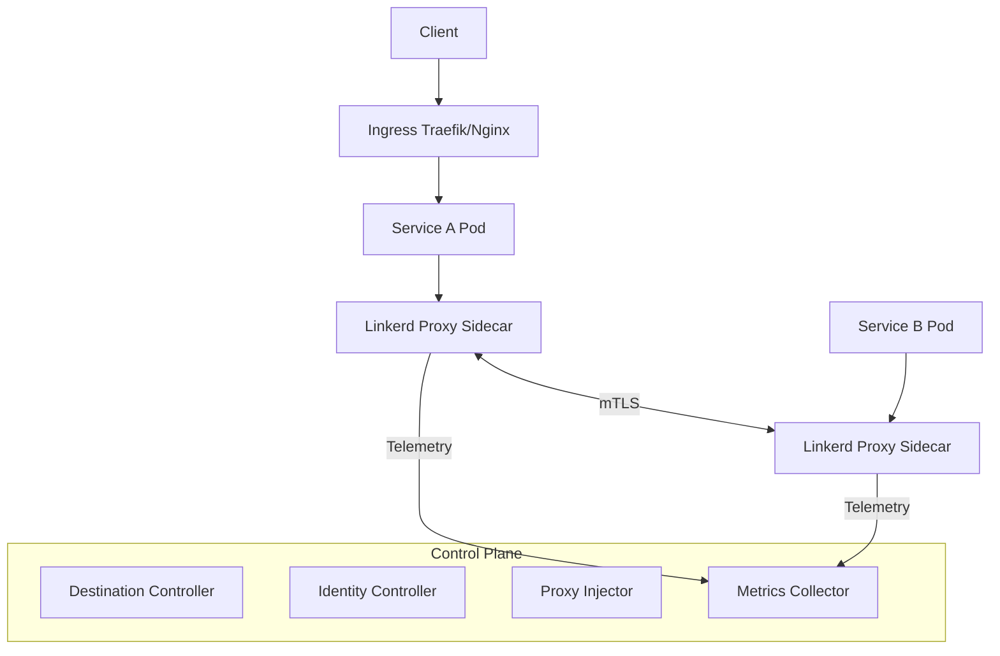
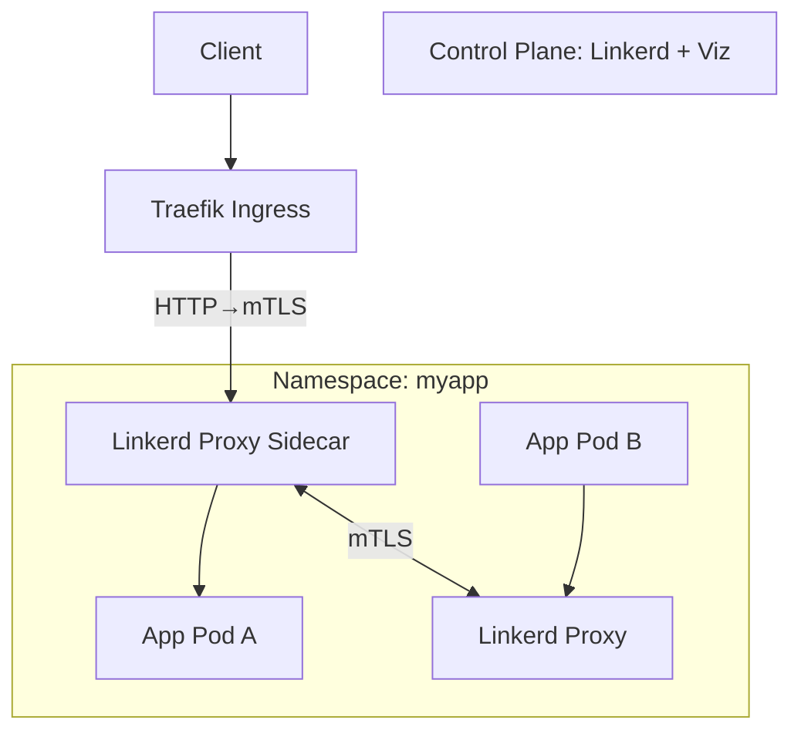

---

## ⚔️ I. Linkerd là gì?

**Linkerd** (đọc: *linker-dee*) là **Service Mesh tối giản, hiệu năng cao**.
Nó chèn vào hệ thống một **lớp giao tiếp trung gian (data plane)**, giúp:

* Bảo mật (mTLS tự động giữa các service),
* Quan sát (telemetry, metrics),
* Quản trị (routing, retry, failover, traffic split, canary...).

Điểm độc đáo:

> Không cần cấu hình phức tạp, không sidecar bạo lực như Istio.
> Linkerd hướng tới triết lý “**càng ít, càng an toàn, càng nhanh**”.

---

## 🧱 II. Kiến trúc chiến lược



### 🧩 Thành phần chính:

| Thành phần          | Vai trò                                                                   |
| ------------------- | ------------------------------------------------------------------------- |
| **Data Plane**      | Mỗi pod có 1 sidecar proxy (Linkerd-proxy, viết bằng Rust → cực nhẹ).     |
| **Control Plane**   | Tập hợp các service quản trị như `controller`, `identity`, `destination`. |
| **CLI (`linkerd`)** | Công cụ để cài đặt, kiểm tra, và giám sát mesh.                           |
| **Viz extension**   | Bổ sung dashboard, Grafana, Prometheus, Tap (real-time tap flow).         |

---

## 🔐 III. Cơ chế vận hành

1. Khi Pod được **“inject”** Linkerd sidecar:

   * Pod có thêm 1 container `linkerd-proxy`.
   * Tất cả outbound/inbound traffic của app đều đi qua proxy này.

2. **Proxy sẽ tự động mã hóa (mTLS)** mọi traffic giữa các pod đã được inject.

   * Không cần code thay đổi.
   * Tự cấp và rotate certificate nội bộ.

3. **Control plane** cung cấp:

   * Discovery (`Destination`)
   * Policy
   * Telemetry
   * Identity / trust anchor management.

---

## 🧭 IV. Quy trình triển khai chuẩn (K8s)

1. **Cài control plane:**

   ```bash
   linkerd install --crds | kubectl apply -f -
   linkerd install | kubectl apply -f -
   linkerd check
   ```

2. **Cài extension Viz (giám sát):**

   ```bash
   linkerd viz install | kubectl apply -f -
   linkerd viz dashboard &
   ```

3. **Inject vào namespace hoặc deployment:**

   ```bash
   kubectl annotate ns myapp linkerd.io/inject=enabled
   kubectl rollout restart deploy -n myapp
   ```

4. **Xem trạng thái mesh:**

   ```bash
   linkerd check
   linkerd viz stat deployments -n myapp
   linkerd viz tap deploy/myapp
   ```

---

## 🧩 V. Chức năng nổi bật

| Nhóm                   | Tính năng                               | Mô tả                                                                     |
| ---------------------- | --------------------------------------- | ------------------------------------------------------------------------- |
| 🔒 **Security**        | mTLS by default                         | Tự động mã hóa toàn bộ service-to-service traffic                         |
| ⚙️ **Reliability**     | Retry, Timeout, Failover                | Cho phép định nghĩa chính sách trong `Server` / `ServerAuthorization` CRD |
| 🩺 **Observability**   | Metrics, Tap, Grafana                   | Quan sát realtime latency, RPS, success rate                              |
| 🚦 **Traffic Control** | Traffic Split, Blue-Green, Canary       | Dễ dàng triển khai rollout dần                                            |
| 🧠 **Simplicity**      | Không sidecar Envoy, không CRD phức tạp | Proxy Rust native, nhẹ hơn 10–20 lần so với Envoy                         |

---

## 🧠 VI. CRD trong Linkerd

| CRD                   | Chức năng                                                            |
| --------------------- | -------------------------------------------------------------------- |
| `Server`              | Mô tả nhóm Pod cụ thể và cổng chúng expose                           |
| `ServerAuthorization` | Xác định ai được phép kết nối đến `Server`                           |
| `ServiceProfile`      | Định nghĩa retry, timeout, metrics route                             |
| `TrafficSplit`        | Điều khiển phân phối traffic giữa nhiều service (canary, blue-green) |

---

## 📊 VII. Giám sát & Metrics

* **Prometheus**: cài sẵn qua extension Viz.
* **Grafana dashboards**: cung cấp sẵn 4–5 bảng tổng quan.
* **Tap**: giống như Wireshark trong mesh, xem luồng request thật.
* **CLI / Web Dashboard**: realtime service dependency graph.

---

## ⚖️ VIII. So sánh Linkerd vs Istio vs Traefik

| Tiêu chí      | **Linkerd**                               | **Istio**                    | **Traefik**                    |
| ------------- | ----------------------------------------- | ---------------------------- | ------------------------------ |
| Mục tiêu      | Service Mesh (bảo mật + quan sát)         | Service Mesh full            | Reverse proxy / Ingress        |
| Proxy         | Rust-native (linkerd2-proxy)              | Envoy (C++)                  | Traefik custom Go              |
| Hiệu năng     | ⚡ Rất cao, footprint thấp                 | 🧱 Nặng, nhiều CRD           | ⚡ Tốt ở Ingress                |
| mTLS          | Auto, mặc định bật                        | Có, phức tạp hơn             | Không có mesh                  |
| CRD           | Ít, rõ ràng                               | Nhiều, phức tạp              | Không cần (IngressRoute riêng) |
| Observability | Tap, Viz, Prometheus                      | Mixer, Telemetry (cồng kềnh) | Dashboard & Prometheus         |
| Triển khai    | Dễ, nhẹ                                   | Phức tạp                     | Dễ nhất                        |
| Thích hợp     | Mid→large cluster cần bảo mật và quan sát | Enterprise mesh toàn diện    | Web ingress linh hoạt          |

---

## 🧭 IX. Khi nào nên chọn Linkerd

| Tình huống                                               | Khuyến nghị                       |
| -------------------------------------------------------- | --------------------------------- |
| Cần mTLS toàn diện, đơn giản triển khai                  | ✅ Linkerd                         |
| Muốn có Service Mesh mà không chịu đau đầu như Istio     | ✅ Linkerd                         |
| Cần routing HTTP level cao (A/B, JWT, header routing...) | ⚙️ Traefik hoặc Istio             |
| Cần Ingress Controller chuẩn                             | ❌ Không phải mục tiêu của Linkerd |
| Hạ tầng container-native, microservice, yêu cầu SLA cao  | ✅ Linkerd + Traefik combo         |

---

## 🧩 X. Mô hình “Thiên hạ bình định” – Traefik kết hợp Linkerd



* Traefik xử lý HTTPS ingress ngoài cluster.
* Linkerd kiểm soát toàn bộ **east-west traffic** trong cluster.
* Kết hợp này được xem là **“Song kiếm hợp bích”: Ingress + Mesh**, rất phổ biến ở môi trường production hybrid.

---
