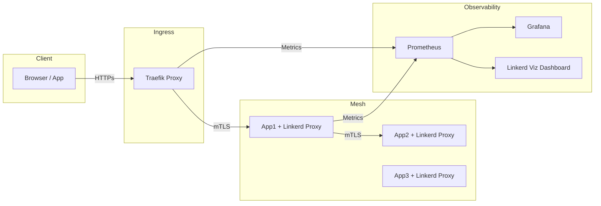

> **Istio = hạm đội hạng nặng**, có đủ Jaeger, Kiali, Prometheus, Grafana, Zipkin, Mixer, Telemetry, Envoy access log,…
> **Traefik + Linkerd = đặc nhiệm cơ động**, không mang cả “pháo binh”, nhưng **đủ vũ khí để nắm thế trận** — gọn nhẹ, nhanh, và dễ kiểm soát hơn nhiều.

Giờ ta vào chi tiết từng tầng, để so sánh thực chiến giữa hai bên.

---

## ⚙️ I. Hệ quan sát trong Istio

**Istio’s Observability Stack**:

| Thành phần                       | Vai trò                                                   |
| -------------------------------- | --------------------------------------------------------- |
| **Prometheus**                   | Thu metrics từ Envoy (rps, latency, error rate)           |
| **Grafana**                      | Dashboard visualization                                   |
| **Jaeger / Zipkin**              | Distributed tracing (theo dõi luồng request giữa service) |
| **Kiali**                        | Service graph, traffic topology, policy viewer            |
| **Envoy access log / telemetry** | Log chi tiết từng request                                 |
| **Mixer (đã deprecated)**        | Thành phần cũ thu thập policy và metrics                  |

→ Mạnh, đầy đủ, nhưng cồng kềnh.
Cài xong Istio + Jaeger + Kiali + Grafana = ~1.5–2GB RAM control plane chỉ để “quan sát”.

---

## 🧭 II. Tổ hợp tương đương trong **Traefik + Linkerd**

Traefik và Linkerd chọn hướng **tối giản và tách lớp rõ ràng**:

| Thành phần                            | Vai trò tương đương                                             | Nguồn dữ liệu                    |
| ------------------------------------- | --------------------------------------------------------------- | -------------------------------- |
| **Prometheus**                        | Thu metrics của cả Traefik và Linkerd                           | Metric endpoint `/metrics`       |
| **Grafana**                           | Visualization tương tự như Istio                                | Dashboard template sẵn có        |
| **Linkerd Viz Extension**             | Thay thế Kiali (xem traffic graph, topology, success rate, RPS) | ServiceMesh telemetry            |
| **Traefik Dashboard**                 | Quan sát ingress, routes, TLS, middlewares                      | Traefik API `/dashboard/`        |
| **Linkerd Tap**                       | Thay thế Jaeger ở mức lightweight (live tracing realtime)       | Proxy-level streaming            |
| **OpenTelemetry Exporter (optional)** | Nếu muốn tracing chuẩn Jaeger/Zipkin                            | Optional plugin ở Linkerd/Trafik |

---

## 🩺 III. Cấu trúc quan sát trong Traefik + Linkerd



---

## 📊 IV. Mức độ quan sát tương đương

| Tính năng                              | Istio (Jaeger + Kiali) | Traefik + Linkerd                                      |
| -------------------------------------- | ---------------------- | ------------------------------------------------------ |
| **Service topology graph**             | Kiali                  | ✅ Linkerd Viz (auto generate graph, success rate, RPS) |
| **Request tracing chi tiết (span)**    | Jaeger                 | ⚙️ Linkerd Tap (real-time stream) hoặc export OTEL     |
| **Metrics & dashboards**               | Prometheus + Grafana   | ✅ Prometheus + Grafana (template sẵn)                  |
| **Request log chi tiết**               | Envoy access log       | ⚙️ Traefik access log + Linkerd Tap                    |
| **Latency, success rate**              | Envoy metrics          | ✅ Có sẵn trong Viz dashboard                           |
| **mTLS status graph**                  | Kiali security view    | ✅ Viz hiển thị mTLS trạng thái từng peer               |
| **JWT, Policy, RBAC view**             | Kiali Policy tab       | ⚙️ Không có giao diện — config text (yaml)             |
| **Integration OpenTelemetry / Jaeger** | Native                 | ⚙️ Có qua exporter (optional setup)                    |

> 👉 Kết luận ngắn:
> **Traefik + Linkerd = 80–90% năng lực quan sát của Istio**,
> nhưng **nhẹ hơn 3–4 lần**, setup nhanh hơn và ít maintenance hơn.

---

## 🧰 V. Cụ thể từng công cụ

### 🔹 1. **Linkerd Viz**

Cài bằng 1 lệnh:

```bash
linkerd viz install | kubectl apply -f -
```

Chức năng:

* Web dashboard (`linkerd viz dashboard`)
* Real-time topology
* Success rate, latency, RPS
* Health check status của từng route/service
* `linkerd tap deploy/myapp` → xem dòng request thật như “Wireshark in mesh”

### 🔹 2. **Traefik Dashboard**

* Giao diện web trực tiếp: routes, services, middlewares, TLS certs
* Cho biết trạng thái dynamic config
* Export metrics qua Prometheus:

  ```yaml
  metrics:
    prometheus:
      addEntryPointsLabels: true
      addRoutersLabels: true
  ```
* Log chi tiết HTTP access, retry, error, latency.

### 🔹 3. **Prometheus & Grafana**

* Cả Traefik và Linkerd đều có endpoint `/metrics`
* Dashboards mẫu:

  * Linkerd: `linkerd-viz-grafana-dashboard.json`
  * Traefik: `traefik-dashboard-prometheus.json`
* Metrics tiêu chuẩn: RPS, error rate, P50/P95/P99 latency, mTLS count, active connections.

### 🔹 4. **Tracing (nếu muốn thêm Jaeger)**

* Linkerd hỗ trợ **OpenTelemetry Exporter**, có thể export trace sang Jaeger/Tempo/Zipkin nếu cần:

  ```yaml
  global:
    tracing:
      enabled: true
      collector:
        address: jaeger-collector.monitoring.svc:4317
  ```
* Traefik cũng có plugin OpenTelemetry:

  ```yaml
  tracing:
    otlp:
      endpoint: jaeger-collector.monitoring.svc:4317
      insecure: true
  ```

→ Nếu cần full distributed tracing, ta **gắn thêm OTEL Collector + Jaeger**, rất nhẹ (~200MB RAM), không cần nguyên stack Istio.

---

## ⚖️ VI. So sánh trọng lượng vận hành

| Stack                       | Thành phần chính                                  | Tổng RAM Control Plane | Sidecar Overhead | Deploy complexity |
| --------------------------- | ------------------------------------------------- | ---------------------- | ---------------- | ----------------- |
| **Istio + Jaeger + Kiali**  | istiod, envoy, jaeger, kiali, prometheus, grafana | ~1.5–2 GB              | 150–250 MB/pod   | ⚠️ Phức tạp       |
| **Traefik + Linkerd + Viz** | traefik, linkerd, viz, prometheus, grafana        | ~500–700 MB            | 40–60 MB/pod     | ✅ Dễ cài          |

---

## 🧠 VII. Kết luận chiến lược

| Mục tiêu                                                        | Nên chọn                           |
| --------------------------------------------------------------- | ---------------------------------- |
| Cần tracing full span, policy phức tạp, multi-tenant enterprise | **Istio (Envoy + Jaeger + Kiali)** |
| Cần quan sát đầy đủ, nhẹ, dễ vận hành, bảo mật mTLS             | **Traefik + Linkerd + Viz**        |
| Cần giám sát realtime mà không chi phí cao                      | ✅ Linkerd Tap + Grafana đủ dùng    |
| Muốn mở rộng sau này                                            | Có thể thêm OTEL + Jaeger dễ dàng  |

---

## ⚔️ VIII. Kết luận ngắn gọn

> 🔥 **Traefik + Linkerd có thể thay thế hoàn toàn bộ quan sát của Istio trong 90% tình huống thực tế.**
> Chỉ thiếu vài phần “trình diễn đồ thị tracing dài dòng” của Jaeger.
>
> Nhưng bù lại, được:
>
> * Triển khai nhanh
> * Gọn nhẹ, ít RAM/CPU
> * Dễ debug, dễ maintain
> * Đủ dữ liệu cho Prometheus, Grafana, và cảnh báo sản xuất.

---