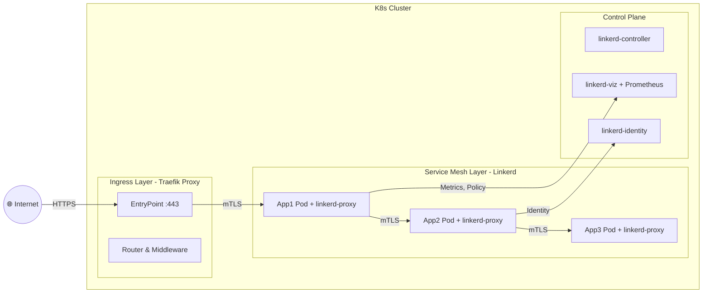

%%  %% **Traefik + Linkerd** — cặp “song kiếm hợp bích” đang dần trở thành **làn sóng thay thế Istio** trong nhiều môi trường production, nhất là **cluster on-prem hoặc multi-tenant cloud**.

---

## ⚔️ I. Tư tưởng chiến lược

* **Istio** là đại đế quốc — mạnh, nhưng cồng kềnh: sidecar Envoy nặng, CRD dày, khó debug, upgrade mệt mỏi.
* **Linkerd + Traefik** là “liên minh cơ động”:

  * Traefik giữ **cửa ải tiền tuyến** (north-south traffic: từ bên ngoài vào cluster).
  * Linkerd nắm **trận địa hậu cần và nội bộ** (east-west traffic: giữa các service).

Kết quả:

> Ta vẫn có đầy đủ mTLS, canary, retry, observability... nhưng giảm được 70–80% độ phức tạp so với Istio.

---

## 🧩 II. Mô hình triển khai kết hợp



### Tầng chức năng:

| Tầng                      | Thành phần                                | Vai trò                                                |
| ------------------------- | ----------------------------------------- | ------------------------------------------------------ |
| **Ingress (North–South)** | Traefik Proxy                             | Nhận HTTP/HTTPS, terminate TLS, route đến service mesh |
| **Mesh (East–West)**      | Linkerd                                   | mTLS nội bộ, retry, canary, failover, telemetry        |
| **Observability**         | Linkerd Viz + Prometheus                  | Theo dõi luồng nội bộ                                  |
| **Security**              | Linkerd Identity + mTLS                   | Bảo mật toàn tuyến nội bộ                              |
| **Traffic Policy**        | Traefik Middleware + Linkerd TrafficSplit | Điều phối ngoài + trong cluster                        |

---

## 🧠 III. Cơ chế phối hợp vận hành

1. **Client → Traefik:**

   * Traefik xử lý HTTPS, routing theo host/path.
   * Có thể sử dụng middleware: `rateLimit`, `authForward`, `compress`, v.v.
   * Traefik forward request tới service nằm trong mesh (`ClusterIP` của app).

2. **Traefik → Linkerd:**

   * Vì các pod trong mesh có sidecar, nên **Traefik chỉ cần gọi ClusterIP của service là được**.
   * Linkerd proxy sẽ bắt inbound traffic → tự động mTLS + telemetry.

3. **Service ↔ Service:**

   * Tất cả internal call (east-west) đều đi qua Linkerd-proxy.
   * Auto mTLS, retry, timeout, traffic-split, failover.

4. **Quan sát & Debug:**

   * `linkerd viz dashboard` cho topology, metrics.
   * `linkerd tap` để xem luồng request real-time.
   * Traefik dashboard hiển thị ingress route và TLS cert status.

---

## 📊 IV. Mức độ phổ biến

Rất cao, nhất là trong các tổ chức có tư duy “**mesh nhẹ - ingress linh hoạt**”.

| Ngành / Môi trường             | Mô tả thực tế                                                                         |
| ------------------------------ | ------------------------------------------------------------------------------------- |
| **Fintech / Banking nội địa**  | Dùng Linkerd cho east-west mTLS, Traefik quản lý ingress HTTPS + JWT auth.            |
| **IoT / Edge Platform**        | Traefik làm ingress gateway MQTT/HTTP, Linkerd bảo vệ nội bộ và đo latency.           |
| **SaaS vừa và nhỏ**            | Không đủ lực cho Istio, chọn Traefik + Linkerd vì dễ vận hành, dùng Helm cài 10 phút. |
| **Cloud-native SME / Startup** | Kết hợp auto Let's Encrypt (Traefik) + mTLS mesh (Linkerd) → bảo mật toàn tuyến.      |

Hiện **Linkerd** được sử dụng tại: Buoyant (tác giả), Nordstrom, PayPal, Hootsuite, Expedia, Evernote, v.v.
Còn **Traefik** thì nằm trong top 3 ingress controller phổ biến nhất (cùng Nginx & HAProxy).

→ Cặp đôi này **không hiếm** mà ngược lại **đang trở thành best practice** ở phân khúc production vừa–lớn, đặc biệt là self-managed cluster.

---

## 🪶 V. Ưu thế so với Istio

| Tiêu chí               | **Linkerd + Traefik**                 | **Istio**                                   |
| ---------------------- | ------------------------------------- | ------------------------------------------- |
| Kiến trúc              | Phân tách rõ ingress và mesh          | Tất cả trong một (Envoy, Pilot, Citadel...) |
| Proxy                  | Rust-native + Go                      | Envoy (C++)                                 |
| MTLS                   | Tự động, luôn bật, cấu hình tối thiểu | Có nhưng yêu cầu CRD và policy phức tạp     |
| Overhead               | Thấp (RAM ~40–60MB/pod)               | Cao (RAM ~150–200MB/pod)                    |
| Cài đặt                | 5 lệnh Helm/CLI, không CRD rườm rà    | Rất phức tạp, nhiều CRD và addon            |
| Canary / Traffic Split | Có qua `TrafficSplit` CRD             | Có qua VirtualService, DestinationRule      |
| Observability          | Viz (Prometheus + Grafana) sẵn có     | Mixer + Prometheus + Kiali (cồng kềnh)      |
| Debug                  | Dễ, `linkerd tap` real-time           | Khó, nhiều tầng Envoy                       |
| Production adoption    | Tăng mạnh ở cluster vừa và on-prem    | Giảm nhẹ vì complexity                      |

---

## ⚖️ VI. Khi nào nên thay thế Istio bằng Traefik + Linkerd

| Tình huống                               | Hành động                           |
| ---------------------------------------- | ----------------------------------- |
| Cluster < 200 service, microservice vừa  | ✅ Thay bằng Traefik + Linkerd       |
| Hạ tầng on-prem, muốn dễ quản trị        | ✅ Rất nên dùng                      |
| Cần mTLS, canary, telemetry cơ bản       | ✅ Đáp ứng đủ                        |
| Cần gRPC routing, JWT, policy phức tạp   | ⚙️ Traefik đảm nhiệm phần HTTP      |
| Cần tracing full (Jaeger, Zipkin)        | ⚙️ Linkerd Viz + Prometheus đủ dùng |
| Cần custom filter Envoy / L7 deep filter | ❌ Istio vẫn cần thiết               |

> Tóm lại: nếu hệ thống của ngài **không cần deep layer Envoy customization**, thì **Linkerd + Traefik hoàn toàn có thể thay thế Istio** mà giảm đáng kể độ phức tạp vận hành.

---

## 🧠 VII. Triển khai thực chiến (Helm combo)

1. **Cài Linkerd (control + viz):**

   ```bash
   linkerd install --crds | kubectl apply -f -
   linkerd install | kubectl apply -f -
   linkerd viz install | kubectl apply -f -
   ```

2. **Cài Traefik (Helm chart):**

   ```bash
   helm repo add traefik https://traefik.github.io/charts
   helm install traefik traefik/traefik -n traefik \
     --set ports.websecure.tls.enabled=true \
     --set ingressClass.enabled=true \
     --set logs.general.level=INFO
   ```

3. **Bật Linkerd injection cho namespace:**

   ```bash
   kubectl annotate ns myapp linkerd.io/inject=enabled
   ```

4. **IngressRoute (Traefik) → Service nội bộ (đã inject):**

   ```yaml
   apiVersion: traefik.containo.us/v1alpha1
   kind: IngressRoute
   metadata:
     name: app-route
     namespace: myapp
   spec:
     entryPoints:
       - websecure
     routes:
       - match: Host(`app.example.com`)
         kind: Rule
         services:
           - name: app
             port: 8080
     tls:
       certResolver: letsencrypt
   ```

---

## 🏁 Kết luận – “Song Kiếm Hợp Bích”

| Thành phần            | Vai trò                                         |
| --------------------- | ----------------------------------------------- |
| **Traefik**           | Xử lý ingress, auth, TLS, HTTP routing          |
| **Linkerd**           | Bảo mật nội bộ (mTLS), telemetry, canary, retry |
| **Cơ chế liên thông** | Traefik → Service Mesh → Pod (mTLS nội bộ)      |
| **Thay thế Istio**    | ✅ Hoàn toàn khả thi, nhẹ hơn, dễ maintain hơn   |

---

