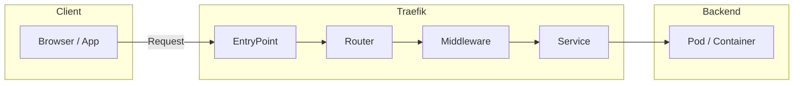
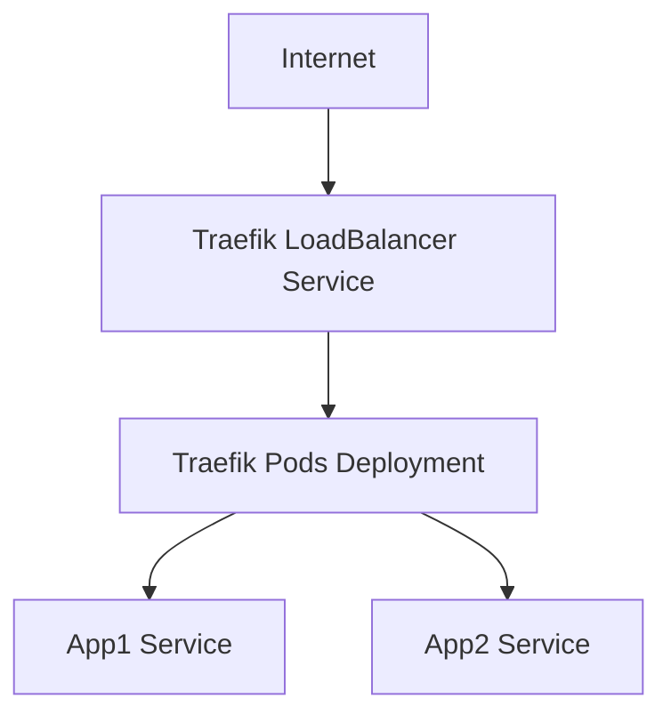

Không chỉ là reverse proxy thường, mà là **proxy động (dynamic reverse proxy)**, sinh ra để làm việc trong môi trường **container, microservice, và Kubernetes**.
Ta sẽ tóm tắt cho ngài theo **chiến báo dạng binh pháp** — vừa dễ nắm, vừa đủ chiều sâu để ra trận thực chiến.

---

## 🧭 I. Tổng quan – Bản chất chiến thuật của Traefik

**Traefik Proxy** (phát âm: *"traffic"*) là một **modern HTTP reverse proxy và load balancer**.
Điểm khác biệt của nó là:

> 🌀 “Không cấu hình thủ công từng route — mà tự phát hiện và cấu hình động (auto-discovery).”

Nói cách khác, thay vì phải edit file config mỗi khi deploy thêm service, Traefik **nghe** (watch) các nguồn cấu hình như Kubernetes, Docker, Consul, v.v.
Khi có service mới, nó **tự tạo route** tương ứng.
→ Đây là điểm khiến nó được ưa chuộng trong hệ sinh thái **K8s, Docker Swarm, Nomad, ECS, Rancher...**

---

## ⚙️ II. Kiến trúc chiến trường

### 🧩 Các thành phần chính:

| Thành phần      | Vai trò                             | Ví dụ                                         |
| --------------- | ----------------------------------- | --------------------------------------------- |
| **Entrypoints** | Cổng vào (port, protocol)           | `:80`, `:443`                                 |
| **Routers**     | Điều hướng request dựa trên rule    | `Host("app.example.com")`                     |
| **Middlewares** | Xử lý request trước khi đến service | `stripPrefix`, `auth`, `rateLimit`            |
| **Services**    | Backend thực tế (target)            | `http://my-app:8080`                          |
| **Providers**   | Nguồn config động                   | `Kubernetes`, `Docker`, `File`, `Consul`, ... |

---

## 🪶 III. Điểm mạnh – Vì sao nên chọn Traefik

| Ưu điểm                                     | Mô tả                                                                                |
| ------------------------------------------- | ------------------------------------------------------------------------------------ |
| ⚡ **Dynamic discovery**                     | Tự nhận biết service mới — cực hợp microservices.                                    |
| 🧰 **Tích hợp TLS tự động (Let's Encrypt)** | Hỗ trợ HTTP→HTTPS redirect, certificate renewal tự động.                             |
| 🧱 **Middleware mạnh**                      | Dễ build chain xử lý: rewrite, auth, redirect, compress, circuit breaker, retry, ... |
| 🧩 **Native với Kubernetes**                | Có CRD: `IngressRoute`, `Middleware`, `TLSStore`, `TLSOption`, ...                   |
| 📊 **Dashboard và metrics Prometheus**      | Giám sát trực quan và sẵn sàng export sang Prometheus.                               |
| 🧭 **Multi-protocol support**               | HTTP, TCP, UDP đều cân được.                                                         |
|                                             |                                                                                      |

---

## 🔐 IV. Ứng dụng trong Kubernetes

Trong K8s, Traefik có 2 mode chính:

### 🏗️ 1. **Ingress Controller mode**

* Traefik đọc Ingress resources hoặc IngressRoute (CRD của chính nó).
* Hợp cho các web app chuẩn HTTP/HTTPS.

### ⚙️ 2. **TCP/UDP Load Balancer**

* Dành cho ứng dụng non-HTTP (MySQL, MQTT, gRPC, v.v.)
* Config qua CRD `TCPRoute` / `UDPRoute`.

---

## 🧠 V. Mô hình triển khai tiêu chuẩn

Traefik thường được triển khai như:

* `Deployment` (replicas ≥ 2 để HA)
* `Service` kiểu `LoadBalancer` hoặc `NodePort`
* CRDs được apply sẵn từ chart
* TLS certificates quản lý qua `certResolver` (Let’s Encrypt hoặc Secret thủ công)

---

## 🧭 VI. So sánh nhanh Traefik vs Istio vs Nginx

| Tiêu chí        | **Traefik Proxy**                 | **Istio**                     | **Nginx Ingress**               |
| --------------- | --------------------------------- | ----------------------------- | ------------------------------- |
| Mục tiêu        | Reverse proxy + LB thông minh     | Service Mesh toàn diện        | Ingress Controller truyền thống |
| Triển khai      | Dễ, nhẹ, single binary            | Nặng, nhiều CRD và sidecar    | Trung bình, cấu hình YAML       |
| TLS             | Auto Let's Encrypt, dynamic       | Quản lý phức tạp, cần mTLS    | TLS thủ công                    |
| Observability   | Dashboard đẹp, Prometheus ready   | Tracing + Telemetry mạnh      | Basic metrics                   |
| Network layer   | L7 + hỗ trợ TCP/UDP               | L4–L7, sidecar routing        | L7 chủ yếu                      |
| Tích hợp Docker | Cực tốt                           | Không                         | Không                           |
| Phù hợp         | SMB–Mid scale, cloud-native stack | Large scale microservice mesh | Legacy hoặc đơn giản            |
|                 |                                   |                               |                                 |

---

## 🧩 VII. Best Practice cho Production

1. **Chạy ≥ 2 replicas** → kết hợp `DaemonSet` nếu cần low latency local.
2. **Bật dashboard qua ingress riêng + auth middleware.**
3. **Lưu certificate Let’s Encrypt vào PVC** để tránh mất khi pod restart.
4. **Sử dụng CRD (`IngressRoute`, `Middleware`, `TLSOption`)** thay vì Ingress cổ điển.
5. **Bật Prometheus metrics và access log.**
6. **Quản lý cấu hình tĩnh (entrypoints, providers)** qua file; cấu hình động (routers, services) qua provider như K8s hoặc file riêng.

---

## 🗡️ VIII. Khi nào nên chọn Traefik

| Tình huống                                   | Đề xuất                |
| -------------------------------------------- | ---------------------- |
| Cluster nhỏ – trung, cần HTTPS tự động       | ✅ Traefik              |
| Cần routing động, nhiều môi trường container | ✅ Traefik              |
| Cần Service Mesh, mTLS toàn diện             | ❌ Istio/Linkerd        |
| Cần HTTP Ingress đơn giản, ổn định           | ⚙️ Nginx               |
| Cần proxy TCP/UDP linh hoạt (MQTT, Redis...) | ✅ Traefik hoặc HAProxy |

---