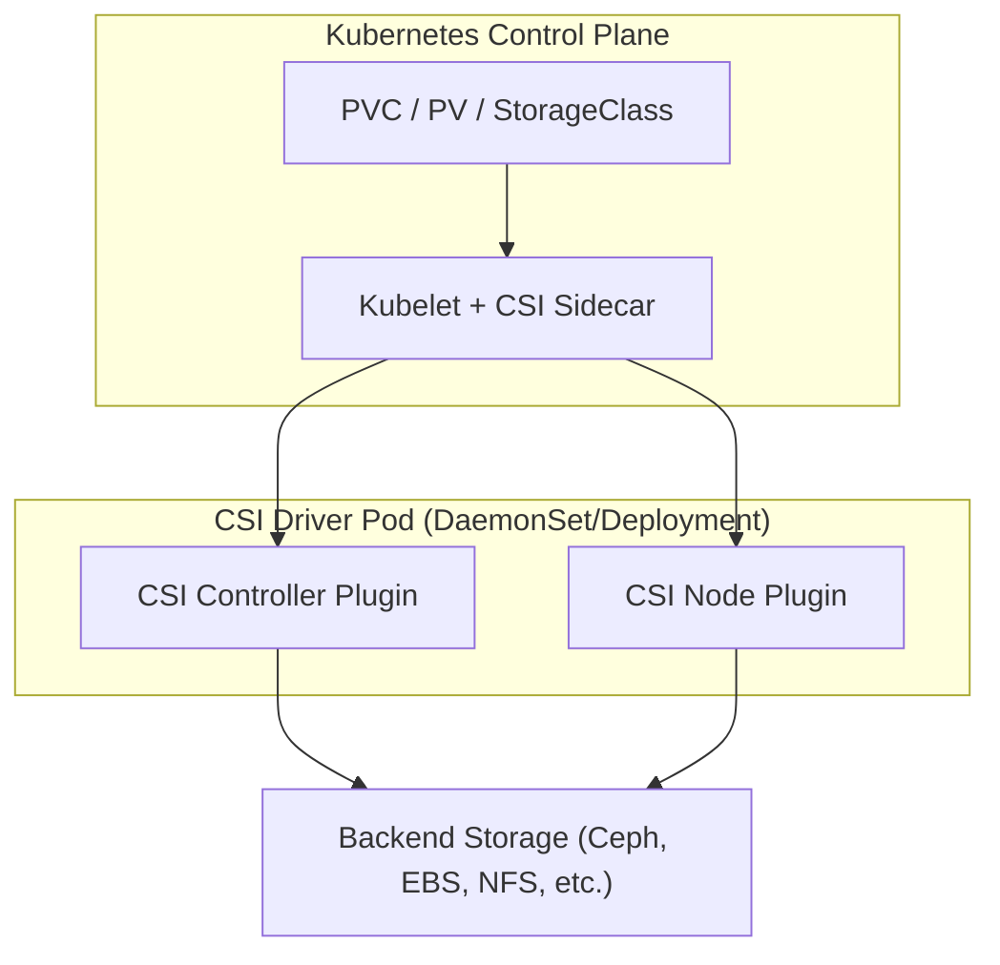

Rõ, Đại Nguyên Soái muốn “đào sâu” vào **CSI** — ta gọi đây là **Container Storage Interface**, cái “cổng thần đạo” giữa Kubernetes và thế giới lưu trữ. Hiểu nó chuẩn là nắm được huyết mạch của PVC, PV, và StorageClass trong K8s.

---

## ⚔️ I. Bản chất: CSI là gì?

**CSI (Container Storage Interface)** là **chuẩn giao tiếp trung lập** (vendor-neutral) giúp **Kubernetes (và các orchestrator khác)** nói chuyện với **storage backend** mà **không cần code driver trong core**.

Trước kia, K8s có các **in-tree driver** (EBS, GCE PD, vSphere, NFS, v.v.) — tức là driver được tích hợp **trực tiếp vào code Kubernetes**.
Nhưng như thế rất khổ:

* Mỗi vendor phải PR lên K8s, release theo chu kỳ K8s.
* Muốn fix bug phải chờ release mới.
* Rối loạn version, testing.

→ CSI tách rời chúng ra. K8s giờ chỉ cần biết chuẩn **API CSI** (gRPC + Protocol Buffers), driver nào tuân theo chuẩn này đều chạy được.

> 🔖 Hình dung: CSI như “chuẩn ổ cắm điện”. Mỗi vendor (Ceph, AWS, GCP, Longhorn, vSphere, NetApp…) chỉ cần làm phích cắm đúng chuẩn là K8s cắm vào được.

---

## 🧩 II. Kiến trúc tổng thể

Mermaid sơ đồ cho Đại Nguyên Soái nhìn dễ:

---

## 🧱 III. Thành phần chính

### 1. **Controller Plugin**

* Chạy ở **Deployment**, 1 hoặc vài Pod trên cluster.
* Thực hiện thao tác **control plane**:

  * `CreateVolume`, `DeleteVolume`
  * `ControllerPublishVolume` (attach)
  * `ControllerUnpublishVolume` (detach)
* Giống “trung tâm điều phối lưu trữ”.

### 2. **Node Plugin**

* Chạy dưới dạng **DaemonSet**, 1 pod/1 node.
* Thực hiện **data plane**:

  * `NodeStageVolume`, `NodePublishVolume` (mount volume lên node)
  * `NodeUnstage`, `NodeUnpublish` (umount)
* Giống “tay sai” trực tiếp gắn đĩa vào host.

### 3. **Sidecar Containers**

Các thành phần phụ trợ do **sig-storage** duy trì:

| Sidecar                 | Nhiệm vụ                   |
| ----------------------- | -------------------------- |
| `csi-provisioner`       | Tạo/xóa volume khi có PVC  |
| `csi-attacher`          | Attach/detach volume       |
| `csi-resizer`           | Mở rộng dung lượng         |
| `csi-snapshotter`       | Snapshot/restore volume    |
| `livenessprobe`         | Health check driver        |
| `node-driver-registrar` | Đăng ký driver với Kubelet |

→ Mỗi CSI driver thường gồm 3–6 container, chạy trong cùng Pod.

---

## 🧭 IV. Chuỗi hành động khi Pod tạo PVC

Giả sử Pod có PVC “mydata”, StorageClass “sc-fast”:

1. K8s tạo PVC → Controller thấy cần PV.
2. CSI Provisioner gọi `CreateVolume()` đến driver backend.
3. Driver backend tạo volume thật (VD: block EBS, RBD, NFS dir).
4. PV được tạo, bind PVC.
5. Khi Pod lên node, Kubelet gọi Node Plugin:

   * `NodeStageVolume()` → mount volume vào staging path.
   * `NodePublishVolume()` → bind mount đến `/var/lib/kubelet/pods/.../volumes/...`
6. Pod thấy volume như ổ đĩa local.

---

## 🧮 V. Giao diện API CSI (rút gọn)

Gồm 3 nhóm chính:

| Nhóm           | Chức năng             | Ví dụ API                                           |
| -------------- | --------------------- | --------------------------------------------------- |
| **Identity**   | Xác định driver       | `GetPluginInfo`, `Probe`                            |
| **Controller** | Tạo/xóa/attach volume | `CreateVolume`, `DeleteVolume`, `ControllerPublish` |
| **Node**       | Mount/unmount         | `NodeStageVolume`, `NodePublishVolume`              |

---

## 🧠 VI. CSI Versioning & Compatibility

* Chuẩn CSI: **v1.0.0+**
* K8s hỗ trợ CSI từ **v1.13** (GA từ 1.17).
* Mỗi CSI driver có **version riêng**, nhưng tuân chuẩn gRPC CSI.
* **CSI Spec**: [https://github.com/container-storage-interface/spec](https://github.com/container-storage-interface/spec)

---

## ⚙️ VII. Ví dụ driver phổ biến

| Backend        | CSI driver               | Tính năng nổi bật                    |
| -------------- | ------------------------ | ------------------------------------ |
| AWS EBS        | `ebs.csi.aws.com`        | gp3, snapshot, resize                |
| GCP PD         | `pd.csi.storage.gke.io`  | zone-aware, snapshot                 |
| Azure Disk     | `disk.csi.azure.com`     | managed disk, encryption             |
| Ceph RBD       | `rbd.csi.ceph.com`       | multi-cluster, snapshot, replication |
| CephFS         | `cephfs.csi.ceph.com`    | RWX shared volume                    |
| Longhorn       | `driver.longhorn.io`     | local replica, rebuild, RWX          |
| NFS            | `nfs.csi.k8s.io`         | đơn giản, share RWX                  |
| vSphere        | `csi.vsphere.vmware.com` | integration sâu VMware               |
| NetApp Trident | `csi.trident.netapp.io`  | ONTAP/Element/Astra                  |

---

## 🧩 VIII. CSI vs In-tree (so sánh tổng lực)

| Tiêu chí        | In-tree (cũ)        | CSI (mới)              |
| --------------- | ------------------- | ---------------------- |
| Vị trí code     | Trong K8s core      | Ngoài (plugin)         |
| Release cycle   | Gắn với K8s version | Tự chủ                 |
| Hỗ trợ snapshot | Không               | Có                     |
| Hỗ trợ resize   | Giới hạn            | Có                     |
| RWX             | Khó                 | Linh hoạt              |
| Multi-backend   | Hạn chế             | Rộng (Ceph, AWS, etc.) |
| Bảo trì         | K8s SIG             | Vendor tự chịu         |
| Tùy biến        | Thấp                | Cao                    |

---

## 🔐 IX. Bảo mật & kiểm soát

* **Secret cho driver** lưu trong `Secret` (namespace của driver hoặc workload).
* CSI plugin mount secret tại runtime (không hardcode).
* RBAC: cấp quyền `persistentvolumes`, `volumesnapshotcontents`, `csinodes`,...
* Một số driver hỗ trợ **KMS encryption key**.

---

## 🧯 X. Debug & kiểm tra

| Mục tiêu                       | Lệnh                                                   |
| ------------------------------ | ------------------------------------------------------ |
| Liệt kê CSI driver đăng ký     | `kubectl get csidrivers`                               |
| Liệt kê node plugin            | `kubectl get pods -n kube-system -l app=csi-node`      |
| Kiểm tra storageclass → driver | `kubectl get sc -o wide`                               |
| Log sidecar provisioner        | `kubectl logs <pod> -c csi-provisioner -n kube-system` |
| Thử snapshot                   | `kubectl get volumesnapshotclass`                      |

---

## 🧩 XI. Tối hậu nguyên tắc triển khai

1. **Không deploy driver bằng tay**, luôn dùng **Helm hoặc Operator chính chủ**.
2. **Đồng bộ version sidecar** với CSI driver (theo release note của vendor).
3. **Không mix in-tree và CSI song song** trên cùng node (xung đột attach).
4. **Benchmark IOPS, latency, failure recovery** trước khi cho vào prod.
5. **Backup cấu hình và snapshot định kỳ**.

---

