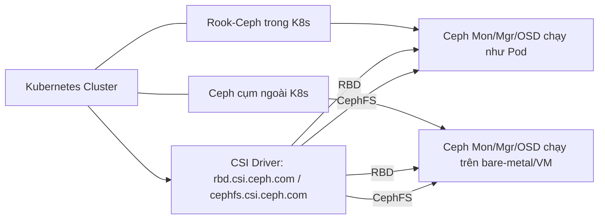

# 1) Hai mô hình triển khai



* **Rook-Ceph (in-cluster)**: K8s vừa chạy app vừa chạy Ceph. Dùng **Rook Operator** để quản lý Ceph.
* **External Ceph (out-of-cluster)**: K8s chỉ **kết nối** tới một cụm Ceph đã có sẵn. Dùng **ceph-csi** driver + thông số Mon/Pool.

> Quy tắc: nếu đội ngũ đã có Ceph on-prem ổn định → **External** đơn giản hơn. Nếu chưa có hạ tầng lưu trữ → cân nhắc **Rook-Ceph**.

---

# 2) Thành phần bắt buộc trong K8s

## 2.1 CSI Drivers (bắt buộc)

* **Ceph RBD CSI**: `rbd.csi.ceph.com` (block, RWO cho DB, stateful).
* **CephFS CSI**: `cephfs.csi.ceph.com` (filesystem chia sẻ, RWX).
  Triển khai qua **Helm/Operator** (không tự may thủ công).

## 2.2 Sidecars tiêu chuẩn (đi kèm driver)

* `csi-provisioner`, `csi-attacher`, `csi-resizer`, `csi-snapshotter`, `node-driver-registrar`, `livenessprobe`.

## 2.3 Node prerequisites

* **Kernel module**: `rbd` (cho RBD), `ceph` (cho CephFS).
* **Package**: `ceph-common` (rbd/ceph tools), đôi khi `rbd-nbd` nếu dùng NBD.
* **SELinux/AppArmor**: chính sách tương thích; bật `fsGroupPolicy` đúng cách.
* **Network**: Pod/Node **đi được** tới Ceph Mon (TCP 6789/3300+), latency ổn định.

## 2.4 Secrets & RBAC

* Secret chứa **user + key** của Ceph (không dùng `client.admin` cho prod).
* RBAC cho CSI đã có sẵn trong chart/manifest chính chủ.

## 2.5 StorageClass (+ VolumeSnapshotClass)

* Tối thiểu một **SC cho RBD** (RWO) và/hoặc **SC cho CephFS** (RWX).
* **VolumeSnapshotClass** nếu muốn snapshot/restore chuẩn mực.

---

# 3) Yêu cầu bên phía Ceph (hậu phương)

* **Monitors khả dụng** (3+ cho HA), `ceph -s` **HEALTH_OK**.
* **Pools**:

  * **RBD pool** (VD: `kube-rbd`) có profile/CRUSH phù hợp (replication EC tuỳ yêu cầu).
  * **CephFS** cần **filesystem** (MDSs) và **data pool + metadata pool**.
* **User**: tạo user chuyên dụng (VD: `client.k8s-rbd`, `client.k8s-cephfs`) với **caps tối thiểu**.
* **CRUSH/Topology** khớp hạ tầng (rack/host), replication phù hợp (thường 3).
* (Tuỳ chọn) **Encryption/KMS**: dm-crypt + Vault/KMS nếu yêu cầu.

---

# 4) Mẫu nhanh – External Ceph (khuyến nghị sản xuất)

## 4.1 Secret cho RBD (key đã base64)

```yaml
apiVersion: v1
kind: Secret
metadata:
  name: ceph-rbd-secret
  namespace: kube-system
type: "kubernetes.io/rook"
data:
  userID: Y2xpZW50Lms4cy1yYmQ=     # base64("client.k8s-rbd")
  userKey: QUJDREVGR0hJSktMTU5PUA== # base64("<ceph user key>")
```

## 4.2 StorageClass cho RBD (RWO)

```yaml
apiVersion: storage.k8s.io/v1
kind: StorageClass
metadata:
  name: sc-rbd-retain
provisioner: rbd.csi.ceph.com
parameters:
  clusterID: "<fsid-or-cluster-id>"
  pool: "kube-rbd"
  csi.storage.k8s.io/provisioner-secret-name: "ceph-rbd-secret"
  csi.storage.k8s.io/provisioner-secret-namespace: "kube-system"
  csi.storage.k8s.io/node-stage-secret-name: "ceph-rbd-secret"
  csi.storage.k8s.io/node-stage-secret-namespace: "kube-system"
  imageFeatures: "layering"
  # encryption: "true"                 # nếu bật dm-crypt
  # csi.storage.k8s.io/kms-provider: "vaulttokens" ...
reclaimPolicy: Retain
allowVolumeExpansion: true
volumeBindingMode: WaitForFirstConsumer
```

## 4.3 Secret & SC cho CephFS (RWX)

```yaml
apiVersion: v1
kind: Secret
metadata:
  name: cephfs-secret
  namespace: kube-system
type: "kubernetes.io/rook"
data:
  adminID: Y2xpZW50Lms4cy1jZXBoZnM=     # base64("client.k8s-cephfs")
  adminKey: QUJDREVGRyE=                # base64("<cephfs user key>")
---
apiVersion: storage.k8s.io/v1
kind: StorageClass
metadata:
  name: sc-cephfs-retain
provisioner: cephfs.csi.ceph.com
parameters:
  clusterID: "<fsid-or-cluster-id>"
  fsName: "cephfs"
  csi.storage.k8s.io/provisioner-secret-name: "cephfs-secret"
  csi.storage.k8s.io/provisioner-secret-namespace: "kube-system"
  csi.storage.k8s.io/node-stage-secret-name: "cephfs-secret"
  csi.storage.k8s.io/node-stage-secret-namespace: "kube-system"
reclaimPolicy: Retain
allowVolumeExpansion: true
volumeBindingMode: WaitForFirstConsumer
```

## 4.4 Snapshot Class (cho cả RBD/CephFS)

```yaml
apiVersion: snapshot.storage.k8s.io/v1
kind: VolumeSnapshotClass
metadata:
  name: vs-rbd-retain
driver: rbd.csi.ceph.com
deletionPolicy: Retain
---
apiVersion: snapshot.storage.k8s.io/v1
kind: VolumeSnapshotClass
metadata:
  name: vs-cephfs-retain
driver: cephfs.csi.ceph.com
deletionPolicy: Retain
```

---

# 5) Kiểm chứng – theo “Hiến Pháp”

1. **Xác minh nền**:

   * `kubectl get csidrivers` → có `rbd.csi.ceph.com`, `cephfs.csi.ceph.com`.
   * Node có `lsmod | egrep 'rbd|ceph'`; `rbd --version`, `ceph --version`.
   * `ceph -s` trên cụm Ceph phải **HEALTH_OK**.
2. **Bài test**:

   * Tạo PVC/POD với SC RBD (RWO) → ghi/đọc → xóa PVC (**Retain** còn PV).
   * Mở rộng PVC (resize) → FS thấy dung lượng tăng.
   * Snapshot → tạo Volume từ snapshot → Pod mount OK.
   * CephFS RWX: hai Pod ghi/đọc đồng thời, kiểm tra lock/metadata.
3. **Giám sát/Alert**: attach-error, mount timeout, pool full, PG degraded, MDS lag.
4. **Đường lui**: prod dùng `Retain`; quy trình **adopt PV** nếu mất PVC; backup key Secret.

---

# 6) Tối ưu – chiến lược vận hành

* **Phân tách SC**: `sc-rbd-prod-retain`, `sc-rbd-dev-delete`, `sc-cephfs-rwx-retain`.
* **IOPS/Throughput**: chọn pool/profile đúng workload (DB → RBD; content share → CephFS).
* **Topology**: đồng bộ zone/rack của Ceph và K8s; `WaitForFirstConsumer` bắt buộc.
* **Bảo mật**: user Ceph **least privilege**; cân nhắc **encryption + Vault KMS**.
* **Sao lưu**: dùng K10/Velero qua snapshot class; **test restore định kỳ**.

---

# 7) Chống sai lầm (đòn phản công)

* Dùng `client.admin` cho CSI → **cấm**.
* Không nạp `rbd`/`ceph` module trên node → mount fail.
* CephFS dùng cho DB OLTP → **không**. DB → RBD RWO.
* Nhiều default SC lung tung → PVC bám nhầm backend.
* Không giám sát `HEALTH_WARN/ERR` → hỏng pool mới biết.

---
