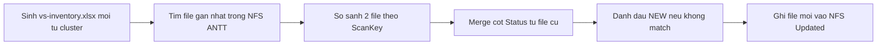

## Service Discovery Inventory repo
```
k8s-inventory-merge/
├── merge_inventory.py           # Python script chính
├── extract_inventory.sh         # shell chạy kubectl + jq
├── Jenkinsfile                  # Jenkins pipeline
```
## extract-inventory.sh
```sh
#!/bin/bash
set -e

OUT="/tmp/vs-inventory.csv"

kubectl get virtualservice -A -o json \
| jq -r '
  .items[]
  | . as $vs
  | $vs.spec.http[]?
    | .match[]? 
    | [
        $vs.metadata.namespace,
        $vs.metadata.name,
        ($vs.spec.hosts | join(",")),
        ($vs.spec.gateways | join(",")),
        ((.uri.prefix // .uri.exact // .uri.regex // "/") | sub("/+$"; ""))
      ]
  | @csv' | uniq > "$OUT"

echo "[+] Exported VS inventory to $OUT"
```
## merge-inventory.sh
```python
import pandas as pd
import os
from datetime import datetime

today = datetime.today().strftime("%Y-%m-%d")
inventory_path = f"/tmp/vs-inventory.csv"
updated_xlsx = f"/K8S-Inventory/Updated/vs-inventory-merged-{today}.xlsx"

# 1. Load current inventory
df_new = pd.read_csv(inventory_path, header=None)
df_new.columns = ["Namespace", "VirtualService", "Hosts", "Gateways", "ContextPath"]
df_new["ScanKey"] = df_new["Hosts"] + df_new["ContextPath"]

# 2. Find latest scanned file
dir_antt = "/K8S-Inventory/ANTT"
files = sorted([f for f in os.listdir(dir_antt) if f.startswith("k8s-vs-inventory") and f.endswith(".xlsx")])
if not files:
    raise Exception("Không tìm thấy file nào trong thư mục ANTT")

latest_file = os.path.join(dir_antt, files[-1])
df_old = pd.read_excel(latest_file)
df_old["ScanKey"] = df_old["Hosts"] + df_old["ContextPath"]

# 3. Merge Status
df_merged = pd.merge(
    df_new,
    df_old[["ScanKey", "Status"]],
    how="left",
    on="ScanKey"
)
df_merged["Status"] = df_merged["Status"].fillna("🆕 NEW")

# 4. Ghi kết quả
df_merged.drop(columns=["ScanKey"]).to_excel(updated_xlsx, index=False)
print(f"[+] Wrote updated file: {updated_xlsx}")
```
## Jenkinsfile

```groovy
pipeline {
  agent any
  environment {
    PYTHONUNBUFFERED = 1
  }
  stages {
    stage('Extract Inventory') {
      steps {
        sh 'bash extract_inventory.sh'
      }
    }
    stage('Merge Inventory') {
      steps {
        sh 'python3 merge_inventory.py'
      }
    }
  }
  post {
    success {
      echo '✅ Inventory merged và ghi ra thư mục Updated'
    }
    failure {
      echo '❌ Có lỗi khi xử lý'
    }
  }
}

```
## Workflow
