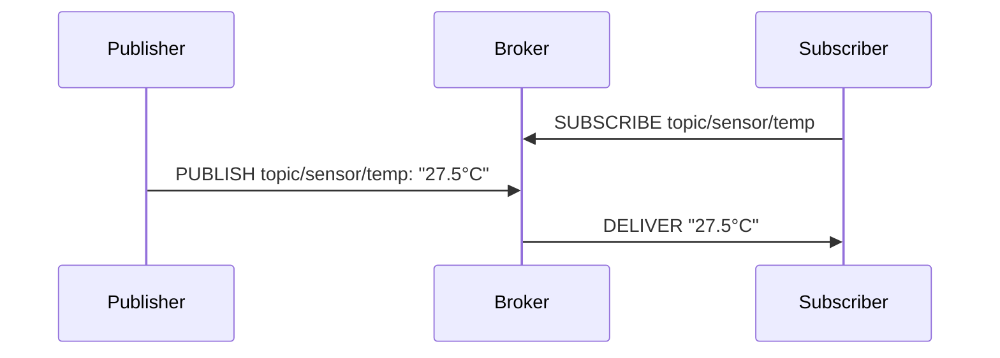

---

## 🧭 I. MÔ HÌNH PUB/SUB – ** KẺ GỬI NGƯỜI NHẬN**

### ❖ Tư tưởng nền tảng

Pub/Sub – viết tắt của **Publish/Subscribe** – là mô hình giao tiếp **bất đồng bộ – phi liên kết** (decoupled asynchronous communication model). Ta có ba vai trò:

|Vai trò|Chức năng|Ví dụ đời thường|
|---|---|---|
|🧙‍♂️ Publisher|Kẻ phát ngôn (gửi tin)|Phóng viên viết báo|
|🧑‍🎓 Subscriber|Kẻ tiếp nhận (nghe tin)|Người đọc báo|
|🏯 Broker|Kẻ trung gian (chuyển giao)|Toà soạn phân phối bài báo|

> **Người gửi và người nhận không biết nhau là ai.** Chúng chỉ gặp nhau thông qua _topic_ (chủ đề).

---

### ❖ Ví dụ



- **Subscriber** đăng ký quan tâm tới `topic/sensor/temp`.
    
- **Publisher** gửi dữ liệu về topic đó.
    
- **Broker** tự động chuyển đến đúng người đã đăng ký.  
    → **Decoupling**: Publisher không cần biết ai đang nghe.
    

---

### ❖ Ưu điểm đạo pháp Pub/Sub

|Ưu điểm|Giải thích|
|---|---|
|🎯 **Tách biệt producer và consumer**|Linh hoạt hơn so với RESTful (đồng bộ và gắn chặt client-server)|
|📡 **Realtime hoặc gần realtime**|Khi có sự kiện, tin sẽ tới ngay cho subscriber|
|📈 **Dễ mở rộng**|Nhiều publisher/subscriber hoạt động cùng lúc, broker chịu trách nhiệm phân phối|
|🧵 **Đa tầng QoS**|MQTT cho phép chọn mức độ tin cậy theo từng message|

---

## ⚙️ II. GIAO THỨC MQTT – **TIỂU THẦN GIAO CÁCH CẢM CHO THẾ GIỚI IOT**

MQTT (Message Queuing Telemetry Transport) là một **protocol dạng lightweight** chạy trên **TCP/IP**. Nó được thiết kế cho môi trường **băng thông thấp – độ trễ cao – thiết bị yếu** như IoT, sensor, thiết bị đầu cuối v.v.

---

### 🔐 1. Các thành phần chính

|Thành phần|Ý nghĩa|
|---|---|
|🔗 **Connect**|Client kết nối broker qua TCP socket|
|📬 **Publish**|Gửi message đến một `topic`|
|🛎️ **Subscribe**|Đăng ký nhận các message thuộc topic|
|🧹 **Unsubscribe**|Bỏ nhận một topic|
|💣 **Disconnect**|Ngắt kết nối|

---

### ⚔️ 2. Các mức độ QoS – **Tùy căn cơ mà pháp lực mạnh nhẹ**

|QoS|Mô tả|Tin cậy?|Ứng dụng|
|---|---|---|---|
|`0`|At most once (fire-and-forget)|Không|Sensor định kỳ (nhiệt độ, ánh sáng...)|
|`1`|At least once|Có thể trùng lặp|Cảnh báo cháy, gửi command|
|`2`|Exactly once|Tuyệt đối|Giao dịch tài chính, critical|

---

### 🧠 3. Giao thức ở tầng nào?

- MQTT là **application-layer protocol**, chạy **trên TCP/IP**, không phải HTTP.
    
- Không có encryption mặc định → cần **TLS** để bảo vệ dữ liệu.
    

---

### 🧱 4. Topic và wildcard – **Ngôn ngữ truyền đạo của MQTT**

```text
topic/sensor/temp
topic/sensor/humidity
```

- MQTT sử dụng **hierarchical topics**, phân cách bằng `/`
    
- Dùng wildcard để subscribe nhiều topic:
    
    - `topic/sensor/+` → nhận mọi sensor (temp, humidity,...)
        
    - `topic/#` → mọi thứ bắt đầu bằng `topic/`
        

---

## 🧩 III. TỔNG KẾT: TẠI SAO MQTT + PUB/SUB LÀ ĐẠO PHÁP VƯỢT TRỘI CHO IOT?

|Đặc điểm|Lợi ích thực chiến|
|---|---|
|🌪️ Lightweight|Thiết bị IoT yếu vẫn chạy ổn|
|🔥 Realtime|Phản hồi tức thời sự kiện|
|🧙‍♂️ Decoupling|Dễ mở rộng, bảo trì|
|🎛️ QoS đa dạng|Tuỳ nhu cầu chọn độ tin cậy|
|🧬 Topic design|Cấu trúc thông minh, dễ scale, dễ filter|

---