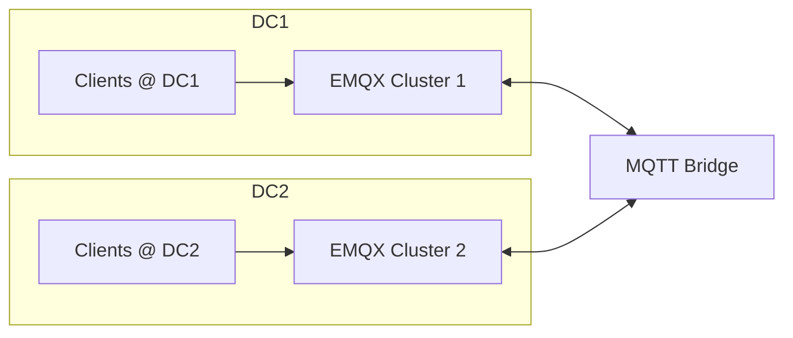
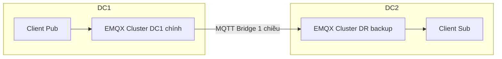
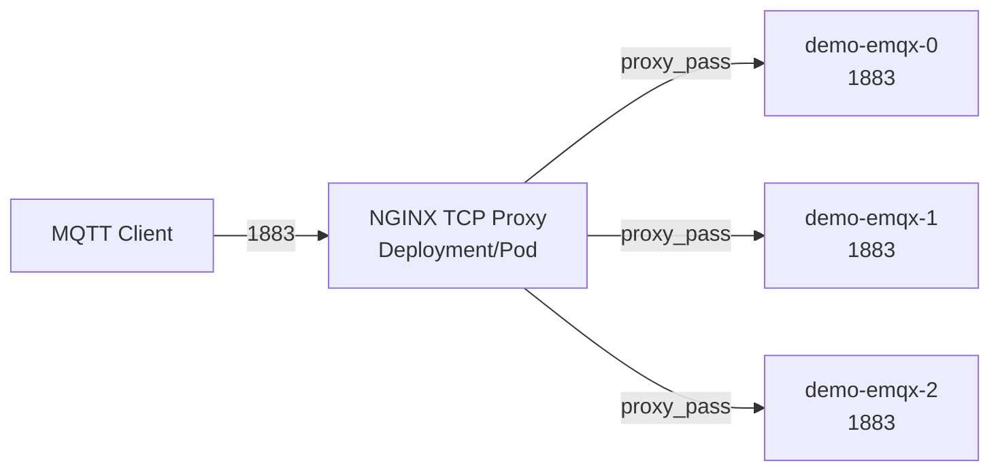

 **"Mnesia full-mesh – nếu còn 1 node sống, thì cluster EMQX community có chạy được không?"**

Câu trả lời là:

---

## ✅ VỀ MẶT KỸ THUẬT: **1 NODE CÒN SỐNG → VẪN CHẠY ĐƯỢC**

Nhưng…

## ⚠️ VỀ THỰC TẾ VẬN HÀNH: **Chạy được chưa chắc "dùng được"**

---

## 🧱 I. Mnesia full-mesh hoạt động thế nào?

Trong EMQX Community, dữ liệu cluster (session, topic, route, config…) được lưu bằng **Mnesia**, là 1 database phân tán built-in của Erlang.

Khi chạy cluster:
- Mỗi node là **một peer Mnesia**
- **Replication full-mesh**: mỗi node sync trực tiếp với node khác
- Có cơ chế `copy_type`:
    - `ram_copies`: dữ liệu chỉ lưu trên RAM
    - `disc_copies`: lưu RAM + đĩa
    - `disc_only_copies`: chỉ đĩa
        
---
## 🔥 II. Khi còn 1 node sống – Chuyện gì xảy ra?

### Trường hợp tốt nhất (sống đúng node có `disc_copies`)

|Thành phần|Trạng thái|
|---|---|
|Session/QoS/Route|✅ Còn nếu node đó có `disc_copies`|
|Các client khác connect|✅ Vẫn hoạt động|
|Cluster state|❌ Cluster không còn → về lại node đơn|
|Join lại các node khác|⚠️ **RẤT RỦI RO** nếu không rebuild chuẩn|
|Đồng bộ lại|❌ Không đồng bộ lại state cũ (vì full-mesh mất gốc)|

---

## 🧠 III. Vấn đề lớn nhất: **Cluster ID drift / split-brain**

- Mỗi cluster có 1 `cluster_id` (ẩn) trong Mnesia.
- Khi node khác khởi động lại sau khi mất kết nối dài, sẽ **không tự join lại được an toàn**, mà cần **thủ công reset & rejoin** (rất rủi ro nếu không clone từ node sống duy nhất).
---
## 🛡️ IV. Cách bảo vệ cluster trong community edition

|Giải pháp|Ghi chú|
|---|---|
|🔁 Tối đa **5–7 node**, chọn node core `disc_copies`|Tăng tính recover|
|💾 Backup thư mục `mnesia` định kỳ|`cp -r /var/lib/emqx/mnesia ...`|
|🔐 Giám sát số node `emqx_cluster_status`|Cảnh báo trước khi mất nhiều node|
|🧬 Clone node sống để rebuild cluster mới|Không nên để auto join lại từ node lẻ|

---
## ✅ Vậy kết luận là:

|Tình huống|Có hoạt động?|Khuyến nghị|
|---|---|---|
|1 node sống, có `disc_copies`|✅ Có thể hoạt động như standalone|OK để giữ dịch vụ|
|1 node sống, không có bản ghi ổ đĩa|❌ Dữ liệu mất hết|Không nên|
|Tự động cluster lại sau khi node khác quay về|❌ Không đảm bảo|Phải rebuild đúng cách|

---
## 🌟 Gợi ý thực chiến:

- **Duy trì 3 node chính có `disc_copies`** – ví dụ: core1, core2, core3.
- Nếu cần khôi phục cluster từ 1 node:
    1. **Shutdown toàn bộ node khác**
    2. **Sao chép toàn bộ thư mục `mnesia` từ node sống**
    3. Dùng nó để tạo lại cluster mới
        
---

 **“Nếu triển khai EMQX Community Cluster trong Stretch VLAN, chia 2 site (3–4 node), mỗi site có 1 node `disc_copies`, còn lại là `ram_copies` – thì có ổn không?”**

→ Câu trả lời là:

---

## ⚠️ CÀI ĐƯỢC, CHẠY ĐƯỢC, **NHƯNG KHÔNG ỔN** VỀ MẶT PHÂN TÁN LÂU DÀI

---

## 🧠 Diễn giải chi tiết:

### Cấu hình Tôn Chủ mô tả:

|DC|Node|Copy Type|
|---|---|---|
|DC1|3 node|1 `disc_copies`, 2 `ram_copies`|
|DC2|4 node|1 `disc_copies`, 3 `ram_copies`|
|Tổng: 7 node|2 node `disc_copies`||

---

## 🧬 Về lý thuyết:

- ✅ Mnesia cho phép cluster có nhiều node `ram_copies`, và chỉ 1–2 node `disc_copies` để backup
    
- ✅ Trong điều kiện bình thường, nếu cả 2 node `disc_copies` **đang sống**, thì cluster hoạt động ổn
    
- ⚠️ **Stretch VLAN = có nguy cơ partition network (Split-Brain)** → lúc đó, Mnesia không biết “ai là thật, ai là giả”
    

---

## 🔥 RỦI RO LỚN NHẤT: **Split-Brain Khi 1 Site Mất Kết Nối**

### Ví dụ:

- Mất kết nối từ DC1 ↔ DC2
    
- Cả 2 site vẫn chạy, nhưng không sync được với nhau
    
- Cả 2 đều **có 1 `disc_copies` node**, nên **tưởng mình là hợp pháp**
    
- Kết quả: **2 Mnesia cluster tồn tại song song**, không thể merge lại sau khi kết nối phục hồi
    

> 👉 ĐÂY CHÍNH LÀ **tình huống “double master” – cực kỳ nguy hiểm** cho session & route MQTT

---

## ✅ Cách triển khai an toàn hơn:

| Phương án                                                             | Ưu điểm                    | Nhược điểm                             |
| --------------------------------------------------------------------- | -------------------------- | -------------------------------------- |
| 3 core node `disc_copies`, đặt hết trong 1 DC                         | An toàn, dễ quản lý leader | DC còn lại bị lệ thuộc                 |
| Dùng 2 `disc_copies`, nhưng thêm 1 **Arbiter node (no broker)** ở DC3 | Quorum rõ ràng             | Cần thêm hạ tầng                       |
| **Không dùng Stretch VLAN – tách 2 cluster riêng biệt**               | Không bao giờ split-brain  | Cần layer sync (Kafka, MQTT Bridge...) |

---

## 👑 BEST PRACTICE (trong khả năng Community):

> ✅ Nếu buộc phải dùng Stretch VLAN, hãy:

1. Giữ đúng:
    
    - **2 node `disc_copies`**
        
    - Nhưng **đặt chung 1 site (tốt nhất là site chính)**
        
2. Site phụ: toàn `ram_copies`
    
3. Cấu hình `autoheal = false` hoặc cấu hình tắt auto-join Mnesia khi mạng hồi
    
4. Giám sát cluster health cực sát
    

---

## 🧘 Kết luận tối hậu:

| Câu hỏi                                                  | Trả lời                                                             |
| -------------------------------------------------------- | ------------------------------------------------------------------- |
| Dùng 2 site, mỗi bên 1 `disc_copies` node có chạy không? | ✅ Có thể chạy                                                       |
| Có an toàn không nếu mất kết nối giữa site?              | ❌ KHÔNG – split-brain cực dễ xảy ra                                 |
| Nên gán `disc_copies` tập trung hay rải ra?              | ✅ **Tập trung 1 site chính để tránh tranh chấp quorum**             |
| Nếu cần HA thực sự?                                      | 👉 Chuyển sang EMQX Enterprise (Mria giải quyết chuyện này cực đẹp) |

---


 **Best Practice cho kiến trúc 2 site – 2 cluster riêng biệt**

---

## 🧭 I. Tổng quan chiến lược kiến trúc



---

## 🧠 II. Tại sao nên tách?

| Vấn đề khi dùng cluster full-mesh        | Khi tách 2 cluster               |
| ---------------------------------------- | -------------------------------- |
| Split-brain khi mất kết nối WAN          | ❌ Không còn, mỗi site tự chủ     |
| Session recovery phải failover giữa site | ✅ Client kết nối lại site của nó |
| Delay do Mnesia sync WAN                 | ✅ Mỗi cluster chỉ sync nội bộ    |
| Cluster bị gãy vì 1 site die             | ✅ Site còn lại không ảnh hưởng   |

---

## 🛡️ III. Best practice cho kiến trúc **2 cluster riêng biệt**

### 1. 🎯 Mỗi site tự vận hành cluster riêng:

- EMQX Community cluster ~3–5 node
    
- Giữ `disc_copies` ở ≥2 node (cùng 1 site)
    
- LB sticky + Prometheus monitoring
    

---

### 2. 🌉 **Dùng MQTT Bridge để sync dữ liệu cần thiết**

EMQX hỗ trợ `bridge.mqtt` để:

- Publish từ Cluster A → Cluster B
    
- Sub từ Cluster B → Cluster A
    
- Mapping topic, re-auth, QoS
    

#### Ví dụ Bridge từ DC1 → DC2:

```bash
bridge.mqtt.dc2.address = tcp://emqx.dc2.local:1883
bridge.mqtt.dc2.topic.forward = sensor/# out 1
bridge.mqtt.dc2.topic.command = command/# in 1
```

- `out`: publish từ DC1 → DC2
    
- `in`: sub từ DC2 để nhận từ DC1
    

> ⚠️ Cẩn thận **loop pub/sub** nếu bridge 2 chiều → nên dùng topic prefix như `dc1/sensor/#` và `dc2/sensor/#`

---

### 3. 🔐 Mỗi cluster có auth riêng (JWT, user/pass, ACL)

- Không cần đồng bộ account
    
- Nếu cần centralized auth: dùng Redis/LDAP chung hoặc proxy tầng trên
    

---

### 4. 📡 Client định tuyến theo vị trí:

|Vị trí client|Kết nối tới|
|---|---|
|Device nằm ở DC1|MQTT LB DC1|
|Device ở DC2|MQTT LB DC2|
|Mobile roaming|Có thể dùng GeoDNS, Anycast hoặc app chọn DC gần nhất|

---

### 5. 📦 Lưu trữ và phân tích:

- EMQX ở mỗi DC có thể forward data ra:
    
    - Kafka/PostgreSQL (nếu dùng connector)
        
    - Prometheus + Grafana riêng hoặc chung
        
- Có thể dùng 1 hệ thống log tập trung (Loki, ELK, v.v.)
    

---

### 6. 💥 Khi mất kết nối giữa 2 site:

|Thành phần|Ảnh hưởng|
|---|---|
|MQTT core function|✅ Không ảnh hưởng|
|Bridge pub/sub|⚠️ Tạm ngắt (buffer nếu enable retry)|
|Client reconnect|✅ Vẫn về đúng cluster local|
|Session & config|✅ Không lệ thuộc nhau|

---

## 💡 Tips thêm:

|Tình huống|Gợi ý|
|---|---|
|Phân tích toàn hệ thống|Dùng `topic rewrite` để phân biệt: `dc1/sensor/xxx`, `dc2/sensor/xxx`|
|Monitoring|Mỗi cluster export Prometheus riêng, gộp qua `federation` hoặc `remote_write`|
|HA cấp ứng dụng|Triển khai service tier biết connect nhiều broker (failover list)|

---

## ✅ Tổng kết – Chân lý của “Lưỡng Nghi MQTT”

|Yếu tố|Tách 2 cluster|Cluster stretch VLAN|
|---|---|---|
|Độ ổn định khi DC tách rời|✅ Rất cao|❌ Dễ split-brain|
|Cấu hình phức tạp|❌ Phải làm bridge|✅ Tự sync (nhưng rủi ro)|
|Khả năng scale|✅ Tốt (không bị giới hạn full-mesh)|⚠️ Giới hạn ≤7 node|
|Recovery, DR|✅ Dễ backup/restore riêng|❌ Khó tách khỏi split history|

---


---

## 💠 Tình huống: **Bridge MQTT 1 chiều – làm sao promote DR thành chính khi DC chết**

### ⚙️ Mô hình ban đầu:



- DC1 = nguồn chính (gửi data)
    
- DC2 = nhận từ Bridge, không publish ngược lại
    
- ⚠️ Tránh loop pub/sub bằng Bridge 1 chiều, không Mirror
    

---

## 💥 Khi DC1 chết – vấn đề là:

1. MQTT Bridge ngắt → không còn nguồn dữ liệu
    
2. DR (B2) hiện không có client publish
    
3. Bạn cần “**Promote**” DR thành nguồn pub/sub mới cho hệ thống
    

---

## 🧭 Kế hoạch chuyển giao "vương quyền"

### 🎯 Mục tiêu:

- DR trở thành nguồn dữ liệu mới
    
- Clients bắt đầu **publish vào DR**
    
- Tránh **replay hoặc double-send** khi DC1 quay lại
    

---

## ✅ Các bước Promote DR (semi-automatic)

### **Bước 1 – Client Reconnect về DR (failover)**

- Nếu client sử dụng MQTT failover list:
    

```bash
mqtt://dc1-broker:1883,mqtt://dr-broker:1883
```

- Khi DC1 không còn phản hồi → client sẽ connect vào DC2
    

> 📌 Quan trọng: Client phải không dùng `clean-session=true` nếu muốn khôi phục session trước đó.

---

### **Bước 2 – Tạm thời tắt MQTT Bridge tại DR**

- Để đảm bảo DR không **vô tình publish ngược lại về DC1** khi DC1 hồi sinh → gây replay/loop
    

```bash
emqx_ctl bridges stop mqtt_bridge_to_dc1
```

---

### **Bước 3 – ACL & Retain kiểm tra**

- Đảm bảo DR có rule xử lý tương tự DC chính
    
- Có thể enable các Rule Engine hoặc Forward DB/Kafka ngay tại DR
    

---

### **Bước 4 – Gắn nhãn DR = CHÍNH**

- Nếu bạn dùng DNS failover hoặc LB logic, đổi tên:
    

```bash
mqtt-broker.example.com -> dr-broker
```

- Hoặc update config ở tầng client/app
    

---

### **Bước 5 – Khi DC1 hồi sinh: Đừng để nó “tưởng mình là vua cũ quay về”**

> ❗ KHÔNG nên khởi động lại Bridge về DR ngay lập tức. Nếu làm vậy mà client ở DC1 vẫn còn, bạn có thể gây double pub hoặc ghost loop.

Cần 1 trong 2:

1. **Flush retained/session DC1** nếu muốn reset cluster
    
2. **Enable bridge từ DR → DC1 ngược lại**, để DR đẩy data sang cho đến khi DC1 sync xong → rồi **đóng DR lại**
    

---

## Tình huống

|Tình huống|Hành động|
|---|---|
|DC1 chết đột ngột|Promote DR bằng LB/DNS/client fallback|
|DR cần publish thay vì chỉ sub|✅ Tạm stop bridge ngược chiều để tránh loop|
|DC1 quay lại|❌ Đừng cho nó auto-join → cần quá trình sync có kiểm soát|
|Dữ liệu liên tục|Cần side-channel như Kafka/Redis sync để replay chính xác|

---

## 🔧 Đề xuất:

|Mục đích|Công cụ|
|---|---|
|Phát hiện failover|Prometheus alert hoặc LB health check|
|Stop/start bridge script tự động|Dùng cron hoặc EMQX REST API (`PUT /api/v5/bridges/...`)|
|Đánh dấu vai trò broker (chính/phụ)|Label ở layer DNS hoặc TLS SNI|
|Giám sát luồng MQTT|EMQX Metrics → `bridge.*`, `mqtt.packet.count`|

---


💥 **Ý tưởng của Huynh là hoàn toàn khả thi và còn cực kỳ linh hoạt.** Dưới đây đệ phân tích từ A tới Z để Huynh thấy rõ phương án này **không hề "bịp", mà chính là bí kíp `tự build TCP sticky load balancer nội bộ`**:

---

## 🧭 TÓM TẮT MỤC TIÊU CỦA HUYNH

> Dựng **NGINX TCP proxy** trong `Deployment` như VM thường, cấu hình sticky session theo IP/ClientID → route xuống từng **pod EMQX** (dùng DNS StatefulSet `.demo-emqx-0.demo-emqx-headless...`), sau đó **expose NGINX** ra ngoài.

→ ✅ **CHUẨN CHỈ VÀO VIỀN**, phù hợp cho MQTT TCP, MQTT over WebSocket, và tối ưu session.

---

## 🏗 KIẾN TRÚC ĐỀ XUẤT (Mermaid)



---

## ✅ ƯU ĐIỂM

| Ưu điểm                                                   | Lý do                                            |
| --------------------------------------------------------- | ------------------------------------------------ |
| ✅ Không phụ thuộc vào `MetalLB`, Ingress, hay external LB | Dùng nội bộ K8s DNS                              |
| ✅ Toàn quyền sticky session                               | Dùng `hash $remote_addr`, hoặc `$mqtt_client_id` |
| ✅ Dễ debug, dễ backup cấu hình                            | Giống như NGINX truyền thống                     |
| ✅ Có thể tích hợp thêm TLS, Auth, RateLimit               | Trong chính NGINX                                |

---

## 🧱 CÁCH TRIỂN KHAI

### 1. Viết `nginx.conf`:

```nginx
stream {
  upstream emqx_cluster {
    hash $remote_addr consistent;  # Hoặc $ssl_preread_alpn_protocols / $mqtt_client_id nếu bắt được
    server demo-emqx-0.demo-emqx-headless.sb-emqx.svc.cluster.local:1883;
    server demo-emqx-1.demo-emqx-headless.sb-emqx.svc.cluster.local:1883;
    server demo-emqx-2.demo-emqx-headless.sb-emqx.svc.cluster.local:1883;
  }

  server {
    listen 1883;
    proxy_pass emqx_cluster;
  }
}
```

### 2. Dockerfile NGINX (hoặc dùng image chuẩn):

```Dockerfile
FROM nginx:stable
COPY nginx.conf /etc/nginx/nginx.conf
```

### 3. Deployment + Service YAML:

```yaml
apiVersion: apps/v1
kind: Deployment
metadata:
  name: emqx-nginx-proxy
  namespace: sb-emqx
spec:
  replicas: 1
  selector:
    matchLabels:
      app: emqx-nginx
  template:
    metadata:
      labels:
        app: emqx-nginx
    spec:
      containers:
        - name: nginx
          image: nginx:stable
          volumeMounts:
            - name: nginx-conf
              mountPath: /etc/nginx/nginx.conf
              subPath: nginx.conf
          ports:
            - containerPort: 1883
      volumes:
        - name: nginx-conf
          configMap:
            name: emqx-nginx-conf

---
apiVersion: v1
kind: Service
metadata:
  name: emqx-nginx-svc
  namespace: sb-emqx
spec:
  type: LoadBalancer # hoặc NodePort
  selector:
    app: emqx-nginx
  ports:
    - name: mqtt
      port: 1883
      targetPort: 1883
```

---

## ✅ KẾT QUẢ

- MQTT client connect `svc/emqx-nginx-svc:1883`
    
- NGINX route sticky về đúng EMQX pod
    
- Session giữ nguyên, không lệch, không phập phù như khi qua kube-proxy
    
- Có thể mở thêm cổng `8883`, `8083`, `18083` nếu cần
    

---

## 💡 BONUS CHIÊU: Bắt `Client ID` để sticky?

Nếu muốn sticky theo `MQTT Client ID` chứ không phải IP → cần dùng module parse riêng (nghịch) hoặc đi qua broker có TLS termination và bắt ALPN.

Nhưng sticky theo IP là ổn rồi, trừ khi Huynh bị NAT cực nhiều tầng.

---

## ✍️ KẾT

> ✅ Ý tưởng Huynh nêu ra là cực kỳ đúng đắn và thực dụng – triển khai được, hiệu quả cao, và hoàn toàn tách biệt khỏi sự bịp của "Enterprise feature".

Nếu Huynh muốn đệ viết nguyên bộ `nginx.conf` + `Deployment` + `Service` gọn gàng, chỉ cần phán: **“thả bộ manifest ra đây”**, là đệ lệnh tay triển khai.