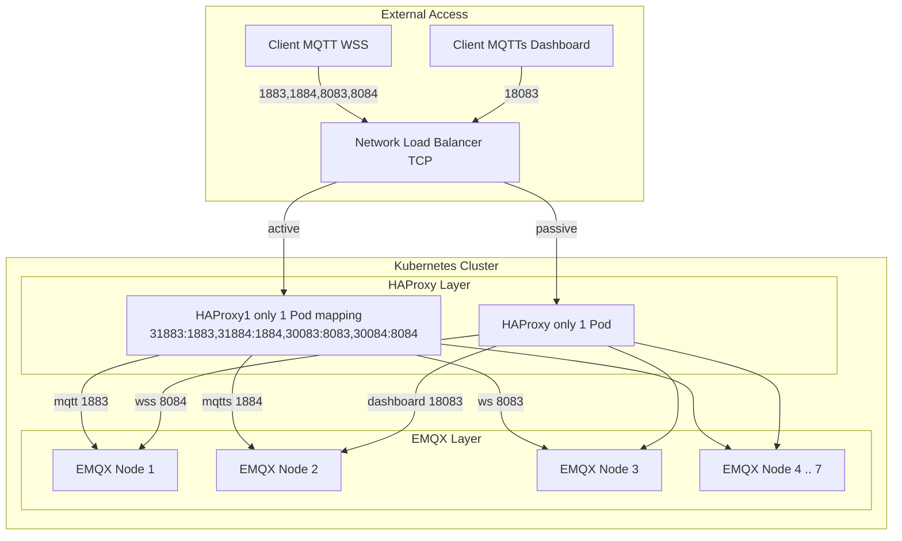

```mermaid
graph TB
  subgraph External Access
    client1[Client MQTT WSS]
    client2[Client MQTTs Dashboard]
    lb[Network Load Balancer TCP]
  end

  subgraph Kubernetes Cluster
    direction TB
    subgraph HAProxy Layer
      ha1[HAProxy1 only 1 Pod mapping   31883:1883,31884:1884,30083:8083,30084:8084]
      ha2[HAProxy only 1 Pod ]
    end

    subgraph EMQX Layer
      emqx1[EMQX Node 1]
      emqx2[EMQX Node 2]
      emqx3[EMQX Node 3]
      emqx[EMQX Node 4 .. 7]
    end
  end

  client1 -->|1883,1884,8083,8084| lb
  client2 -->|18083| lb
  lb -->|active|ha1
  lb -->|passive|ha2

  ha1 -->|mqtt 1883|emqx1
  ha1 -->|mqtts 1884| emqx2
  ha1 -->|ws 8083|emqx3
  ha1 --> emqx
  
  ha2 -->|wss 8084|emqx1
  ha2 -->|dashboard 18083|emqx2
  ha2 --> emqx3
  ha2 --> emqx
  

```
