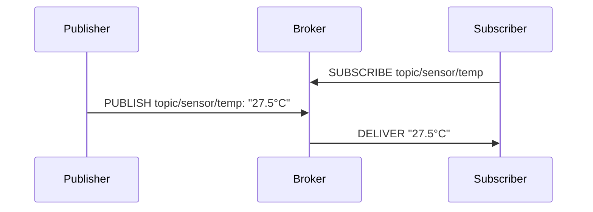
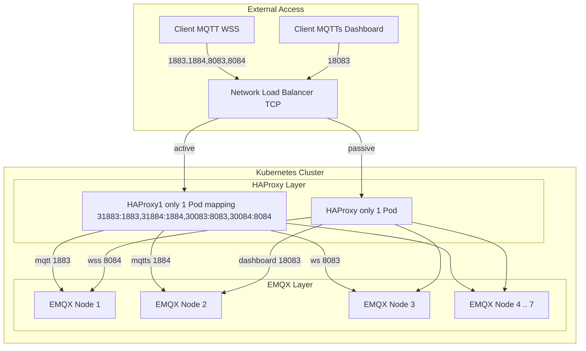
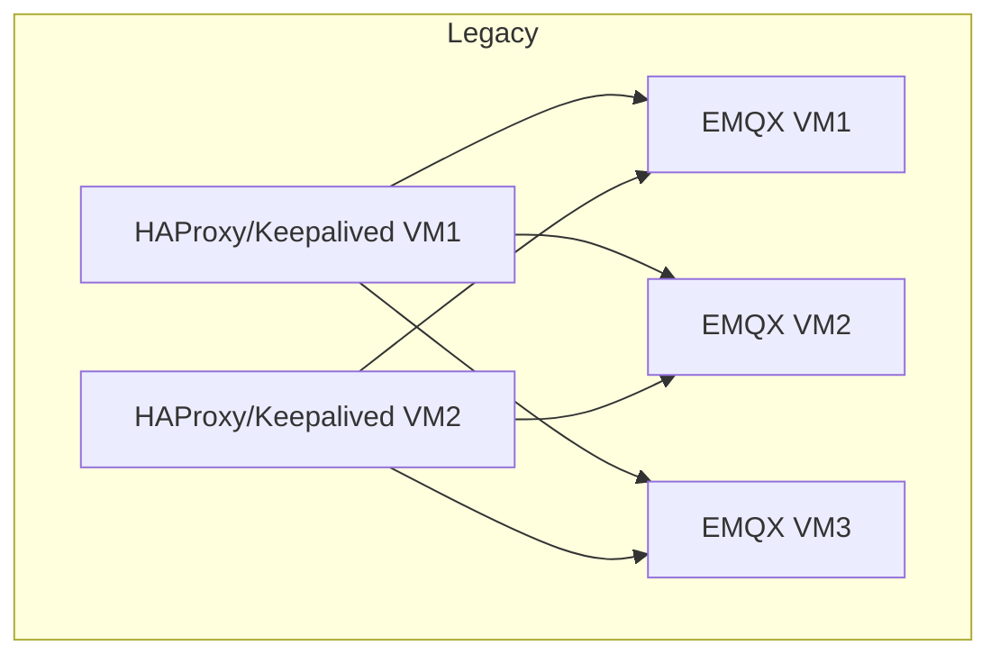

# Tài liệu triển khai hệ thống EMQX trên Kubernetes
## 1. Tổng quan

### 1.1. MÔ HÌNH PUB/SUB – **PHÂN LY KẺ GỬI NGƯỜI NHẬN**
### ❖ Tư tưởng nền tảng
Pub/Sub – viết tắt của **Publish/Subscribe** – là mô hình giao tiếp **bất đồng bộ – phi liên kết** (decoupled asynchronous communication model). Ta có ba vai trò:

|Vai trò|Chức năng|Ví dụ đời thường|
|---|---|---|
|🧙‍♂️ Publisher|Kẻ phát ngôn (gửi tin)|Phóng viên viết báo|
|🧑‍🎓 Subscriber|Kẻ tiếp nhận (nghe tin)|Người đọc báo|
|🏯 Broker|Kẻ trung gian (chuyển giao)|Toà soạn phân phối bài báo|

> **Người gửi và người nhận không biết nhau là ai.** Chúng chỉ gặp nhau thông qua _topic_ (chủ đề).
### ❖ Ví dụ



- **Subscriber** đăng ký quan tâm tới `topic/sensor/temp`.
- **Publisher** gửi dữ liệu về topic đó.
- **Broker** tự động chuyển đến đúng người đã đăng ký.  
    → **Decoupling**: Publisher không cần biết ai đang nghe.
### ❖ Ưu điểm Pub/Sub

|Ưu điểm|Giải thích|
|---|---|
|🎯 **Tách biệt producer và consumer**|Linh hoạt hơn so với RESTful (đồng bộ và gắn chặt client-server)|
|📡 **Realtime hoặc gần realtime**|Khi có sự kiện, tin sẽ tới ngay cho subscriber|
|📈 **Dễ mở rộng**|Nhiều publisher/subscriber hoạt động cùng lúc, broker chịu trách nhiệm phân phối|
|🧵 **Đa tầng QoS**|MQTT cho phép chọn mức độ tin cậy theo từng message|

### ⚙️ 1.2 GIAO THỨC MQTT

MQTT (Message Queuing Telemetry Transport) là một **protocol dạng lightweight** chạy trên **TCP/IP**. Nó được thiết kế cho môi trường **băng thông thấp – độ trễ cao – thiết bị yếu** như IoT, sensor, thiết bị đầu cuối v.v.

### 🔐 1.2.1. Các thành phần chính

|Thành phần|Ý nghĩa|
|---|---|
|🔗 **Connect**|Client kết nối broker qua TCP socket|
|📬 **Publish**|Gửi message đến một `topic`|
|🛎️ **Subscribe**|Đăng ký nhận các message thuộc topic|
|🧹 **Unsubscribe**|Bỏ nhận một topic|
|💣 **Disconnect**|Ngắt kết nối|
### ⚔️ 1.2.2. Các mức độ QoS – **Tùy mạnh nhẹ**

|QoS|Mô tả|Tin cậy?|Ứng dụng|
|---|---|---|---|
|`0`|At most once (fire-and-forget)|Không|Sensor định kỳ (nhiệt độ, ánh sáng...)|
|`1`|At least once|Có thể trùng lặp|Cảnh báo cháy, gửi command|
|`2`|Exactly once|Tuyệt đối|Giao dịch tài chính, critical|
### 🧠 1.2.3. Giao thức ở tầng nào?
- MQTT là **application-layer protocol**, chạy **trên TCP/IP**, không phải HTTP.
- Không có encryption mặc định → cần **TLS** để bảo vệ dữ liệu.
### 🧱 1.2.4. Topic và wildcard – **Ngôn ngữ của MQTT**

```text
topic/sensor/temp
topic/sensor/humidity
```

- MQTT sử dụng **hierarchical topics**, phân cách bằng `/`
- Dùng wildcard để subscribe nhiều topic:
    - `topic/sensor/+` → nhận mọi sensor (temp, humidity,...)
    - `topic/#` → mọi thứ bắt đầu bằng `topic/`
        
## Summarize

| Đặc điểm         | Lợi ích                                  |
| ---------------- | ---------------------------------------- |
| 🌪️ Lightweight  | Thiết bị IoT yếu vẫn chạy ổn             |
| 🔥 Realtime      | Phản hồi tức thời sự kiện                |
| 🧙‍♂️ Decoupling | Dễ mở rộng, bảo trì                      |
| 🎛️ QoS đa dạng  | Tuỳ nhu cầu chọn độ tin cậy              |
| 🧬 Topic design  | Cấu trúc thông minh, dễ scale, dễ filter |

---

## 2. Kiến trúc hệ thống hiện tại 

## Thành phần và vai trò

| Thành phần | Vai trò chính                                                                                                 |
| ---------- | ------------------------------------------------------------------------------------------------------------- |
| EMQX Nodes | Broker MQTT xử lý kết nối, publish/subscribe                                                                  |
| HAProxy    | Load balancer tầng ngoài, chịu trách nhiệm TLS và failover, Router MQTT nội bộ chuyển lưu lượng về EMQX nodes |
| ConfigMap  | Chứa cấu hình HAProxy chuẩn chỉnh                                                                             |
| TLS Secret | Secret TLS hợp nhất, mount vào container                                                                      |
| Helm Chart | Điều phối toàn bộ deployment EMQX và HAProxy                                                                  |

### 2.1 Mô hình (triển khai trên k8s)



### 2.2  So sánh với VM truyền thống
### Mô hình truyền thống (VM)



### Bảng so sánh

| Tiêu chí           | Mô hình VM Truyền thống      | Mô hình K8s hiện tại                 |
| ------------------ | ---------------------------- | ------------------------------------ |
| Hạ tầng triển khai | VM tĩnh, khó scale           | K8s, hỗ trợ autoscale                |
| HA Load Balancer   | keepalived + script thủ công | HAProxy Active-Passive ngoài cluster |
| TLS                | Cấu hình rải rác từng node   | Merge TLS tại HAProxy                |
| CI/CD              | Thủ công                     | Helm chart + GitOps ready            |
| Giám sát & quản lý | Rời rạc                      | Centralized + Prometheus stack       |
| Rolling update     | Có thể disconnect client     | Giảm rủi ro nhờ sticky + HPA         |
| Phân quyền EMQX    | Khó kiểm soát user access    | RBAC rõ ràng, API support            |
| DB backend         | Mnesia                       | Mnesia (OpenSource giới hạn 7 nodes) |

---

## 3. Cấu hình HAProxy

### Tầng Load Balancer phụ trợ nội bộ (HAProxy trong cluster)

Mỗi HAProxy là một **Deployment riêng biệt**, nằm trong namespace `sb-emqx`, không đồng bộ với EMQX – **tách biệt hoàn toàn** workload để dễ khống chế và bảo trì.

**Đặc điểm nổi bật:**

* **Replica = 1**, đảm bảo mỗi pod chỉ chạy đơn lẻ, phù hợp với HA Active–Passive ngoài cluster.
* Expose port trực tiếp qua **NodePort**, không dùng Ingress – tránh terminate TLS tại tầng này.
* **TLS Passthrough hoàn toàn**, không terminate → yêu cầu file `.pem` kết hợp từ `crt + key`.

```yaml
initContainers:
- name: merge-cert
  image: busybox
  command: ['sh', '-c', 'cat /tls/tls.crt /tls/tls.key > /pem/server.pem']
```

**Chi tiết cấu hình:**

| Thành phần        | Mô tả                                                                 |
| ----------------- | --------------------------------------------------------------------- |
| `ConfigMap`       | Chứa toàn bộ `haproxy.cfg` tự quản lý                                 |
| `TLS Secret`      | Gồm `tls.crt`, `tls.key` mount vào `/tls`, hợp nhất thành `.pem`      |
| `emptyDir` Volume | Dùng làm nơi lưu `server.pem` tạm thời tại runtime                    |
| `NodePort` Ports  | Expose các cổng: MQTT (`31883`), MQTTs (`38883`), WS/WSS, Dashboard   |
| `balance source`  | Sticky session theo IP client, tránh mất session khi reconnect        |
| `resources`       | Được kiểm soát bằng block `haproxy.resources` trong values.yaml       |
| `nodeSelector`    | Chạy cố định trên các node có `app: metallb`, hỗ trợ IP LB riêng biệt |

**Lưu ý:** TLS Passthrough giúp HAProxy không xử lý payload, giảm độ phức tạp, đồng thời đảm bảo **EMQX là nơi duy nhất hiểu MQTTs, WSS...**

---

## 4. Triển khai Helm Chart

Chart EMQX sử dụng là **Helm chart gốc**, clone từ:

```
https://github.com/emqx/emqx/tree/main/deploy/charts/emqx
```

Tuy nhiên đã được **tuỳ biến lại sâu** để đáp ứng kiến trúc:

* **Tách HAProxy thành workload phụ trợ riêng** (có điều kiện `haproxy.enabled`)
* Cho phép mount TLS từ `Secret` + hợp nhất `.pem`
* Tách toàn bộ cấu hình `haproxy.cfg` vào `ConfigMap` ngoài chart (dễ audit & versioning)

**Ví dụ override cấu hình HAProxy:**

```yaml
haproxy:
  enabled: true

  nodeSelector:
    app: metallb

  tolerations:
    key: app
    operator: Equal
    value: non-system
    effect: NoSchedule

  resources:
    requests:
      cpu: 500m
      memory: 128Mi
    limits:
      cpu: 2000m
      memory: 2512Mi
```

**Tính năng Helm chart hỗ trợ thêm:**

| Thành phần              | Mô tả                                                               |
| ----------------------- | ------------------------------------------------------------------- |
| `envFrom`               | Inject biến môi trường từ `ConfigMap`, ví dụ định nghĩa `EMQX_HOST` |
| `customConfigMap`       | Mount file `haproxy.cfg` độc lập, không nằm trong chart template    |
| `haproxy-initContainer` | Hợp nhất `crt + key` trước khi HAProxy khởi động                    |
| `volumeMounts` rõ ràng  | Mount TLS, mount config, mount cert `.pem`                          |

---

## 5. Phân quyền & bảo mật EMQX

* EMQX hỗ trợ ACL chi tiết theo pattern:

  ```
  allow publish "iot/+/data"
  allow subscribe "iot/client/#"
  deny all
  ```
* User được lưu kèm salt/hash (kiểm tra tại `Security → Authentication → Built-in Database`).
* Phân quyền theo nhóm user group:

  * Gán ACL riêng từng user hoặc group
  * Dùng dashboard hoặc API để quản lý quyền truy cập topic


---

##  6. Sao lưu và phục hồi

###  6.1 Tính chất dữ liệu trong EMQX Open Source

Hệ thống hiện tại sử dụng **EMQX phiên bản mã nguồn mở (Open Source)**. Khác với phiên bản Enterprise, bản Open Source **không sử dụng cơ sở dữ liệu ngoài (external database)** mà lưu toàn bộ dữ liệu hệ thống vào **Mnesia** – một **embedded database** nội bộ do Erlang cung cấp.

Mnesia lưu trữ cục bộ trên đĩa, tại thư mục:

```
/opt/emqx/data
```

Các dữ liệu quan trọng bao gồm:

| Thành phần dữ liệu           | Vai trò                                                        |
| ---------------------------- | -------------------------------------------------------------- |
| Danh sách người dùng (Users) | Xác thực thiết bị, phân quyền kết nối                          |
| Luật phân quyền (ACL)        | Kiểm soát publish / subscribe                                  |
| Cấu hình runtime nội bộ      | Bao gồm plugins, listeners, rules,... nếu không config từ file |
| Retained Messages (nếu bật)  | Lưu lại bản tin cuối cùng cho mỗi topic                        |

###  6.2. Rủi ro mất dữ liệu: không phụ thuộc nền tảng

Vì Mnesia **lưu cục bộ**, nên **dù triển khai trên VM hay trên Kubernetes**, nếu mất dữ liệu ổ đĩa nơi EMQX lưu Mnesia thì toàn bộ thông tin sẽ **không thể khôi phục** nếu không có bản sao dự phòng.

| Môi trường | Rủi ro tương tự                            |
| ---------- | ------------------------------------------ |
| VM         | Mất ổ đĩa / mất máy chủ vật lý             |
| Kubernetes | Mất PersistentVolume / mất backend storage |
|            |                                            |

➡️ **Tóm lại:** Không phải Kubernetes hay VM có rủi ro cao hơn, mà là **bản chất EMQX Open Source** không hỗ trợ HA cho dữ liệu nếu không có thiết lập backup riêng.
###  6.3 Chiến lược sao lưu đề xuất

Tùy vào hạ tầng lưu trữ và yêu cầu phục hồi, có thể triển khai nhiều chiến lược khác nhau:

| Phương pháp                     | Ưu điểm                                    | Nhược điểm                         |
| ------------------------------- | ------------------------------------------ | ---------------------------------- |
| 🎯 Mount volume phụ + rsync     | Triển khai đơn giản, kiểm soát được        | Có thể lỗi nếu backup lúc đang ghi |
| 🎯 Backup qua API (Users/ACL)   | Dễ tích hợp vào GitOps, CI/CD              | Không lưu session / retained msg   |
| 🎯 Snapshot volume (nếu hỗ trợ) | Backup toàn bộ đĩa, khôi phục nguyên trạng | Cần backend hỗ trợ snapshot        |
| 🎯 Dùng Velero / Stash          | Tự động hóa toàn bộ backup/restore         | Cần setup riêng và tài nguyên      |

###  6.4 Phục hồi dữ liệu

Để EMQX nhận diện đúng node sau khi restore, cần tuân thủ:

* **Giữ nguyên hostname**: Mnesia nhận diện node qua hostname Erlang (vd: `emqx@node-1`)
* **Mount đúng volume cũ vào đúng đường dẫn**
* **Không khởi tạo cùng lúc nhiều bản restore** để tránh lỗi cluster state
###  6.5 Ghi chú về HA dữ liệu và lựa chọn phiên bản

Trong bối cảnh hiện tại, hệ thống sử dụng **EMQX Open Source** với cơ sở dữ liệu cục bộ (`mnesia`) – vốn không hỗ trợ **HA cho dữ liệu** nếu mất hoàn toàn volume lưu trữ. Điều này có nghĩa:

* Nếu một node EMQX bị mất đĩa, các thông tin như user, ACL, retained message sẽ **không thể phục hồi** trừ khi đã có cơ chế sao lưu trước đó.
* Mô hình triển khai không bao gồm backend DB ngoài, cũng không có cluster failover cho dữ liệu.

Tuy nhiên, phía đối tác đã xác nhận rõ:

> **"Các dữ liệu topic nếu mất thì cũng không sao, có thể thiết lập lại."**

Vì vậy, nhóm kỹ thuật **không cần triển khai EMQX Enterprise** hay thiết lập external database như Redis, PostgreSQL, MongoDB. Việc chọn bản Open Source là **có những ưu điểm sau**:

* Tối giản chi phí
* Giảm độ phức tạp hệ thống
* Dễ vận hành, dễ khôi phục theo kiểu "cài lại là xong"

| Tiêu chí                  | EMQX Open Source (Mnesia)     | EMQX Enterprise             |
| ------------------------- | ----------------------------- | --------------------------- |
| Dữ liệu lưu ở đâu         | Trực tiếp trên ổ đĩa local    | External DB (Redis, SQL...) |
| Mất volume = mất dữ liệu? | ✅ Có, nếu không có backup     | ❌ Không, nếu DB còn         |
| Hỗ trợ HA dữ liệu?        | ❌ Không                       | ✅ Có                        |
| Cách phòng rủi ro         | Backup thủ công hoặc snapshot | Đảm bảo DB HA ngoài         |

📌 **Lưu ý:** 
- Mọi kiến trúc production sử dụng EMQX Open Source cần **tự chủ động backup** nếu không muốn rủi ro mất trắng. Đây không phải hạn chế của nền tảng triển khai, mà là **giới hạn thiết kế của Mnesia**.
- Trong trường hợp tương lai có thay đổi về yêu cầu dữ liệu hoặc cần mở rộng khả năng HA dữ liệu, có thể **nâng cấp lên bản Enterprise** với backend rời, nhưng **không phải là nhu cầu hiện tại**.
