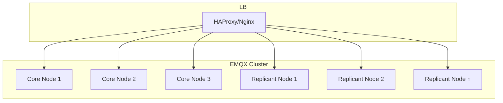
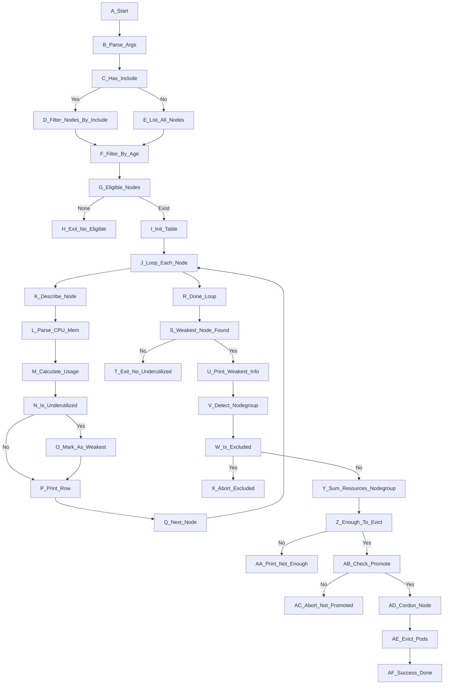

```sh
printf "%-30s %-40s %s\n" "Namespace" "PVC" "Delete Command"
echo "---------------------------------------------------------------------------------------------"

for ns in $(kubectl get ns --no-headers -o custom-columns=":metadata.name"); do
  pvc_list=$(kubectl get pvc -n "$ns" --no-headers 2>/dev/null | awk '{print $1}')
  
  # Nếu không có PVC thì bỏ qua
  [ -z "$pvc_list" ] && continue
  
  for pvc in $pvc_list; do
    used=$(kubectl get po -n "$ns" -o json 2>/dev/null | jq -r --arg pvc "$pvc" '
      .items[]
      | .spec.volumes[]? 
      | select(.persistentVolumeClaim.claimName == $pvc) 
      | .persistentVolumeClaim.claimName' | wc -l)
    
    if [ "$used" -eq 0 ]; then
      printf "%-30s %-40s kubectl delete pvc %s -n %s\n" "$ns" "$pvc" "$pvc" "$ns"
    fi
  done
done

```




mosquitto_sub \
  -h demo-emqx-0.demo-emqx-headless.sb-emqx.svc.cluster.local \
  -p 8883 \
  -t test/topic \
  --insecure \
  -v

mosquitto_pub \
  -h demo-emqx-0.demo-emqx-headless.sb-emqx.svc.cluster.local \
  -p 8883 \
  -t test/topic \
  -m "Test trực tiếp" \
  --insecure

demo-emqx-haproxy

Note: demo-emqx-haproxy tên của svc haproxy, lệnh thực từ pod bên trong cluster, cùng namespace

mosquitto_sub \
  -h demo-emqx-haproxy \
  -p 30071 \
  -t test/topic \
  --insecure \
  -v

mosquitto_pub -h demo-emqx-haproxy -p 30071 -t test/topic   -m "Test trực tiếp" --insecure

config haproxy đang thế này 
```
frontend mqtt-tls  
bind *:30071  
default_backend emqx-tcp-tls  
  
backend emqx-tcp-tls  
mode tcp  
balance source  
option tcp-check  
stick-table type string len 32 size 100k expire 30m  
default-server inter 3s fall 3 rise 2  
stick on req.payload(0,0),mqtt_field_value(connect,client_identifier)  
server demo-emqx0 demo-emqx-0.demo-emqx-headless.sb-emqx.svc.cluster.local:8883 check-send-proxy send-proxy-v2  
server demo-emqx1 demo-emqx-1.demo-emqx-headless.sb-emqx.svc.cluster.local:8883 check-send-proxy send-proxy-v2  
server demo-emqx2 demo-emqx-2.demo-emqx-headless.sb-emqx.svc.cluster.local:8883 check-send-proxy send-proxy-v2
```


//dc2-nasfileuat.seabank.com.vn/ABI_WorkingDocs/


mqttx pub \
  -t 'topic/temp' \
  -m '25.5' \
  -h demo-emqx \
  -p 30071 \
  --protocol mqtts --insecure -i mqttx-pub

mqttx pub \
  -t 'topic/temp' \
  -m '25.5' \
  -h demo-emqx \
  -p 30071
mqttx pub -t 'topic/temp' -m '35.5' -h demo-emqx-haproxy -p 30071 --protocol mqtts --insecure --ca test1.crt

emqtt_bench/bin/emqtt_bench  pub -t t -h demo-emqx-haproxy -p 30071 -s 16 -q 0 -c 10 -I 10
emqtt_bench/bin/emqtt_bench  sub -t t -h demo-emqx-haproxy -p 30071 -c 500

## List module của ansible đối với f5
https://docs.ansible.com/ansible/latest/collections/f5networks/f5_modules/index.html

## Các module có liên quan đến dns
### 1. [`bigip_device_dns`](https://docs.ansible.com/ansible/latest/collections/f5networks/f5_modules/bigip_device_dns_module.html)

> **Cấu hình hệ thống DNS resolver nội bộ của thiết bị F5**.

- Tác động tới: `/sys/dns`
    
- Cho phép cấu hình:
    
    - `name_servers` → list IP DNS để thiết bị truy vấn
        
    - `search` → search domain suffix
        
- ❌ Không liên quan đến record DNS (A/CNAME).
    
- ✅ Thường dùng khi F5 cần truy vấn DNS ra ngoài (chứ không phải để phục vụ DNS cho client).
    

---

### 2. [`bigip_dns_cache_resolver`](https://docs.ansible.com/ansible/latest/collections/f5networks/f5_modules/bigip_dns_cache_resolver_module.html)

> **Tạo cache DNS resolver object trên F5** để dùng trong profile DNS.

- Tác động tới: `ltm dns cache resolver`
    
- Cho phép F5 thực hiện **DNS caching** khi forwarding query.
    
- Có thể cấu hình DNS forwarder, TTL, enable/disable.
    
- ❌ Không liên quan đến DNS record.
    
- ✅ Phục vụ mục đích cache DNS lookup trong profile forwarding hoặc resolving.
    

---

### 3. [`bigip_dns_nameserver`](https://docs.ansible.com/ansible/latest/collections/f5networks/f5_modules/bigip_dns_nameserver_module.html)

> **Tạo đối tượng "nameserver" bên trong cấu hình DNS profile**.

- Tác động tới: `ltm dns nameserver`
    
- Xác định IP nào là DNS server mà profile DNS dùng để forward.
    
- ❌ Không tạo/đổi record DNS.
    
- ✅ Dùng để cấu hình đường đi của DNS query nếu bạn setup forwarding chain.
    

---

### 4. [`bigip_dns_resolver`](https://docs.ansible.com/ansible/latest/collections/f5networks/f5_modules/bigip_dns_resolver_module.html)

> Tạo DNS resolver object – giống với module `cache_resolver` nhưng hỗ trợ **full resolve** không cache.

- Cũng cấu hình nameservers, search domains,...
    
- ❌ Không quản lý DNS zone hay DNS record.
    
- ✅ Dùng để hỗ trợ các profile DNS dạng **resolver (recursive)**.
    

---

### 5. [`bigip_dns_zone`](https://docs.ansible.com/ansible/latest/collections/f5networks/f5_modules/bigip_dns_zone_module.html)

> **Cấu hình zone DNS nội bộ** trên BIG-IP **GTM/DNS module**.

- Tác động tới: `gtm dns zone`
    
- Cho phép tạo:
    
    - Tên zone (ví dụ `example.com`)
        
    - Zone type (master/slave/hint/forward)
        
    - External primaries (nếu zone được transfer từ bên ngoài)
        
- ⚠️ **Quan trọng**: **zone thôi, KHÔNG có record-level quản lý**.
    
- ❌ Không cấu hình record A/CNAME.
    

> ⛔ Cần thêm bước thủ công/tmsh/API để push record DNS vào zone.

---

### 6. [`bigip_gtm_dns_listener`](https://docs.ansible.com/ansible/latest/collections/f5networks/f5_modules/bigip_gtm_dns_listener_module.html)

> Cấu hình DNS listener trên F5 GTM (tức IP + port nào nhận DNS query từ client).

- Cho phép chỉ định:
    
    - IP/Port
        
    - ACL, VLAN, profile DNS
        
- ❌ Không đụng đến DNS record hay zone nội dung.
    
- ✅ Quan trọng nếu F5 làm **DNS authoritative** hoặc relay.
    

---

### 7. [`bigip_monitor_dns`](https://docs.ansible.com/ansible/latest/collections/f5networks/f5_modules/bigip_monitor_dns_module.html)

> Tạo health monitor DNS (gửi query tới server và kiểm tra phản hồi).

- Gửi câu hỏi DNS kiểu A/CNAME đến server cụ thể → dùng làm monitor cho pool member.
    
- ✅ Dùng để check server DNS hoạt động đúng.
    
- ❌ Không tạo record DNS.
    

---

### 8. [`bigip_profile_dns`](https://docs.ansible.com/ansible/latest/collections/f5networks/f5_modules/bigip_profile_dns_module.html)

> Cấu hình DNS profile (forwarding hoặc resolver) áp dụng cho listener.

- Điều chỉnh behavior như:
    
    - Cache TTL
        
    - DNSsec
        
    - Query name normalization
        
- ❌ Không đụng đến record hoặc zone content.
    

---

## 📌 Tổng hợp

|Module|Có tạo/đổi record DNS không?|Ghi chú|
|---|---|---|
|`bigip_device_dns`|❌|Chỉ là DNS resolver config|
|`bigip_dns_cache_resolver`|❌|DNS cache setting|
|`bigip_dns_nameserver`|❌|Chỉ là nameserver object|
|`bigip_dns_resolver`|❌|Resolver cho query|
|`bigip_dns_zone`|⚠️ Zone DNS thôi|KHÔNG quản lý record|
|`bigip_gtm_dns_listener`|❌|DNS listener config|
|`bigip_monitor_dns`|❌|DNS query health monitor|
|`bigip_profile_dns`|❌|Profile DNS behavior|

---

## 🧭 Đánh giá 

- Có thể F5 không hỗ trợ quản lý record DNS (A/CNAME) bằng Ansible trực tiếp.
    
- Để làm việc với DNS record, cần:
    
    - Dùng **tmsh command** → gọi qua `bigip_command`
        
    - Hoặc xem có API để tương vào không.


---



### 🧭 **Giải thích chi tiết flowchart `check-utilized.sh`**

| ID                            | Diễn giải                                                                           |
| ----------------------------- | ----------------------------------------------------------------------------------- |
| **A_Start**                   | Bắt đầu thực thi script.                                                            |
| **B_Parse_Args**              | Phân tích tham số dòng lệnh: `--include`, `--exclude`, `--promote-evict`.           |
| **C_Has_Include**             | Kiểm tra có truyền `--include` không.                                               |
| **D_Filter_Nodes_By_Include** | Lọc danh sách node theo regex `--include`. Dùng khi muốn kiểm tra nhóm node cụ thể. |
| **E_List_All_Nodes**          | Nếu không truyền `--include`, liệt kê toàn bộ node trong cluster.                   |
| **F_Filter_By_Age**           | Loại node mới spawn dưới 1 giờ (tránh false positive khi node chưa ổn định).        |
| **G_Eligible_Nodes**          | Kiểm tra còn node hợp lệ không sau khi lọc.                                         |
| **H_Exit_No_Eligible**        | Nếu không còn node hợp lệ → thoát, kết thúc.                                        |
| **I_Init_Table**              | In ra tiêu đề bảng thống kê sử dụng tài nguyên.                                     |
| **J_Loop_Each_Node**          | Bắt đầu vòng lặp qua từng node đủ điều kiện.                                        |
| **K_Describe_Node**           | Gọi `kubectl describe node` để lấy thông tin chi tiết.                              |
| **L_Parse_CPU_Mem**           | Trích xuất lượng CPU & Memory request/allocatable từ bảng `Non-terminated Pods`.    |
| **M_Calculate_Usage**         | Tính toán tỷ lệ sử dụng % cho CPU và Memory.                                        |
| **N_Is_Underutilized**        | Nếu CPU < 50% **hoặc** cả CPU + Mem đều thấp → đánh dấu là underutilized.           |
| **O_Mark_As_Weakest**         | Ghi nhận node yếu nhất trong các node underutilized.                                |
| **P_Print_Row**               | In từng dòng bảng, kèm cột "Underutilized?"                                         |
| **Q_Next_Node**               | Chuyển sang node kế tiếp.                                                           |
| **R_Done_Loop**               | Kết thúc vòng lặp toàn bộ node.                                                     |
| **S_Weakest_Node_Found**      | Có node underutilized nào không?                                                    |
| **T_Exit_No_Underutilized**   | Nếu không → kết thúc. Không cần hành động.                                          |
| **U_Print_Weakest_Info**      | In thông tin node yếu nhất được chọn.                                               |
| **V_Detect_Nodegroup**        | Phân tích prefix nodegroup (cắt bỏ 2 block cuối trong tên node).                    |
| **W_Is_Excluded**             | Kiểm tra nodegroup có nằm trong danh sách `--exclude` không.                        |
| **X_Abort_Excluded**          | Nếu có → bỏ qua không cordon/evict node này.                                        |
| **Y_Sum_Resources_Nodegroup** | Tổng hợp lượng tài nguyên dư từ các node cùng group khác (CPU và Mem).              |
| **Z_Enough_To_Evict**         | So sánh xem có đủ tài nguyên để chuyển workload từ node yếu sang không.             |
| **AA_Print_Not_Enough**       | Nếu không đủ tài nguyên dự phòng → dừng, không được phép cordon/evict.              |
| **AB_Check_Promote**          | Kiểm tra có truyền `--promote-evict` không để bật hành động thật sự.                |
| **AC_Abort_Not_Promoted**     | Nếu không có flag `--promote-evict` → chỉ báo cáo, không hành động.                 |
| **AD_Cordon_Node**            | Gọi `kubectl cordon` để chặn node yếu khỏi nhận thêm workload.                      |
| **AE_Evict_Pods**             | Gọi `kubectl drain` hoặc `kubectl evict` để di tản workload.                        |
| **AF_Success_Done**           | Xác nhận hoàn thành quy trình xử lý node yếu.                                       |
