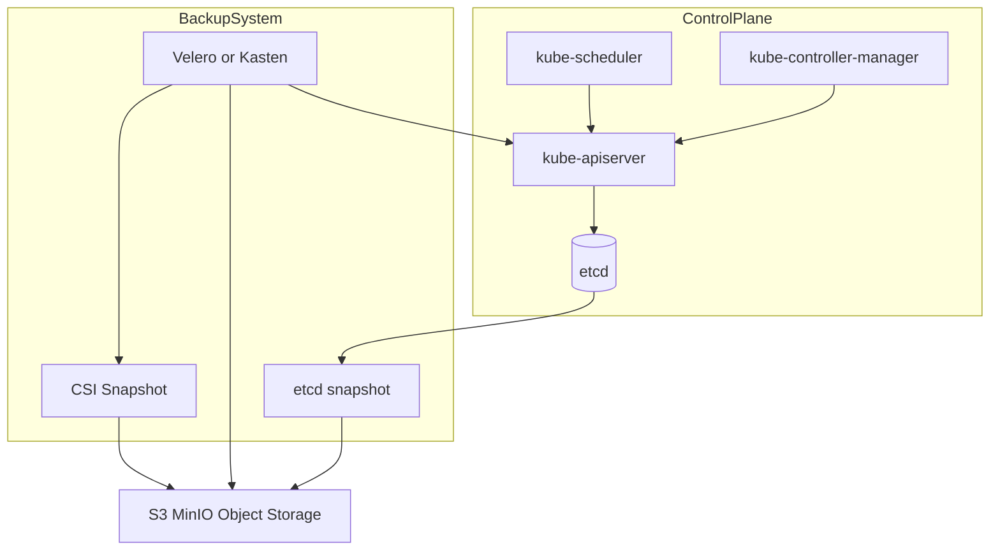
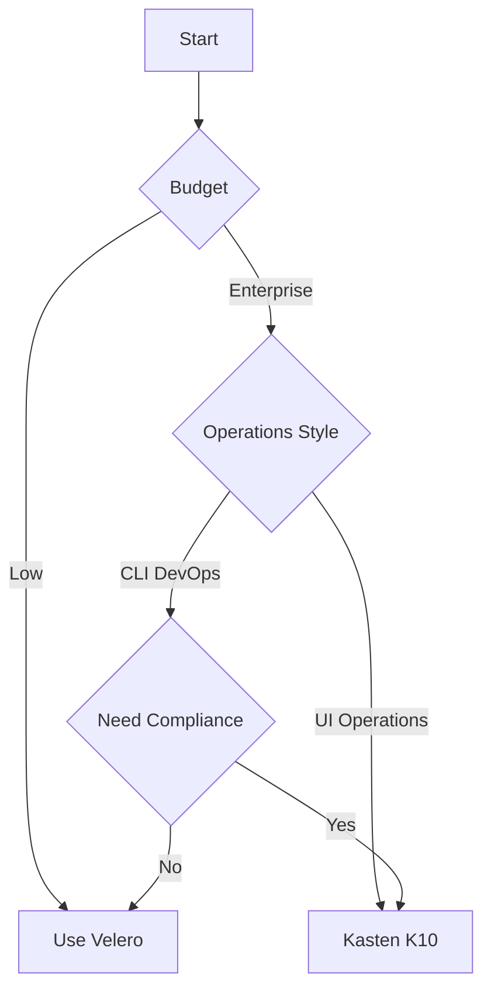
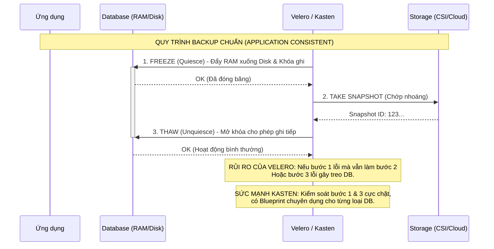

Đại Nguyên Soái, bản blueprint của Ngài **đã khá đúng hướng**, nhưng nếu dùng làm **tài liệu kiến trúc hoặc training nội bộ** thì cần chỉnh lại 4 điểm:

1. **Chuẩn hóa thuật ngữ** (K8s terminology).
2. **Tách rõ Layer** (Control Plane / Kubernetes Objects / Data).
3. **Bổ sung các điểm bảo mật và vận hành thực chiến**.
4. **Làm rõ backup strategy production** (RPO/RTO, GitOps, DR).

Thuộc hạ đã **refactor toàn bộ tài liệu**, giữ nguyên ý tưởng của Ngài nhưng **viết lại theo chuẩn tài liệu kỹ thuật** để có thể dùng:

* internal wiki
* runbook
* architecture document
* training DevOps

---

# 📘 KUBERNETES ARCHITECTURE & DATA PROTECTION BLUEPRINT

---

# I. ETCD – TRÁI TIM CỦA KUBERNETES CLUSTER

## 1. Khái niệm

etcd là **distributed key-value database** được Kubernetes sử dụng để lưu trữ **toàn bộ trạng thái của cluster**.

Mọi object của Kubernetes đều được lưu trong etcd:

| Object   | Ví dụ                           |
| -------- | ------------------------------- |
| Workload | Pods, Deployments, StatefulSets |
| Network  | Services, Endpoints, Ingress    |
| Config   | ConfigMaps, Secrets             |
| Security | RBAC, ServiceAccounts           |
| Storage  | PersistentVolumeClaims          |

Nếu etcd mất dữ liệu:

```
cluster vẫn chạy
nhưng Kubernetes không còn biết phải chạy cái gì
```

→ cluster coi như **mất trí nhớ**.

---

## 2. Kiến trúc dữ liệu etcd

etcd lưu dữ liệu dưới dạng:

```
/registry/<resource>/<namespace>/<name>
```

Ví dụ:

```
/registry/pods/default/nginx
/registry/secrets/kube-system/kube-proxy
```

Mỗi record chứa:

```
metadata
spec
status
resourceVersion
```

API Server chính là **client duy nhất ghi vào etcd**.

---

## 3. Cơ chế đồng bộ dữ liệu – Raft Consensus

etcd sử dụng thuật toán:

Raft consensus algorithm

Cluster etcd gồm:

```
Leader
Followers
```

Quy trình ghi dữ liệu:

```
client
 ↓
leader
 ↓
replicate log
 ↓
majority acknowledge
 ↓
commit
```

Chỉ khi **đa số node xác nhận**, dữ liệu mới được commit.

---

## 4. Quorum

Công thức quorum:

```
Q = floor(n/2) + 1
```

| Node | Quorum | Node có thể chết |
| ---- | ------ | ---------------- |
| 1    | 1      | 0                |
| 3    | 2      | 1                |
| 5    | 3      | 2                |
| 7    | 4      | 3                |

Vì vậy etcd luôn chạy **số node lẻ**.

---

## 5. Split Brain

Nếu cluster bị partition:

```
3 node
A B C
```

Nếu mạng chia:

```
A B | C
```

Phía:

```
A B
```

vẫn có quorum → cluster hoạt động.

Phía:

```
C
```

không đủ quorum → **ngừng nhận write**.

Điều này ngăn **split-brain corruption**.

---

## 6. Backup etcd

### Snapshot

Chỉ sử dụng **API version 3**.

```bash
ETCDCTL_API=3 etcdctl \
--endpoints=https://127.0.0.1:2379 \
--cacert=/etc/kubernetes/pki/etcd/ca.crt \
--cert=/etc/kubernetes/pki/etcd/server.crt \
--key=/etc/kubernetes/pki/etcd/server.key \
snapshot save snapshot.db
```

---

## 7. Restore etcd

Quy trình chuẩn:

### Bước 1 – stop control plane

```
systemctl stop kube-apiserver
```

---

### Bước 2 – restore snapshot

```bash
etcdctl snapshot restore snapshot.db \
--data-dir /var/lib/etcd-restored
```

---

### Bước 3 – update manifest etcd

Sửa file:

```
/etc/kubernetes/manifests/etcd.yaml
```

trỏ sang:

```
--data-dir=/var/lib/etcd-restored
```

---

### Bước 4 – restart control plane

Kubelet sẽ tự start lại static pod.

---

# II. CONTROL PLANE – BỘ NÃO CỦA CLUSTER

Control plane gồm 4 thành phần chính.

---

## 1. kube-apiserver

Kubernetes API Server

Chức năng:

* REST API cho toàn cluster
* authentication
* authorization
* admission control
* read/write etcd

Luồng request:

```
kubectl
 ↓
API Server
 ↓
etcd
```

---

## 2. kube-scheduler

Kubernetes Scheduler

Chọn node phù hợp để chạy pod.

Tiêu chí:

* CPU / RAM
* node affinity
* taints / tolerations
* topology spread
* pod anti-affinity

---

## 3. kube-controller-manager

Kubernetes Controller Manager

Chạy các controller:

| Controller            | Nhiệm vụ           |
| --------------------- | ------------------ |
| Node controller       | theo dõi node      |
| ReplicaSet controller | đảm bảo số pod     |
| Endpoint controller   | cập nhật endpoints |
| Job controller        | quản lý batch jobs |

Controller hoạt động theo **reconciliation loop**:

```
desired state
↓
actual state
↓
fix drift
```

---

## 4. cloud-controller-manager

Chỉ dùng khi chạy trên cloud.

Chức năng:

* tạo Load Balancer
* attach volume
* manage node lifecycle

---

## 5. High Availability Control Plane

Production cluster:

```
3 control plane nodes
```

API Server:

```
active-active
```

Scheduler + Controller:

```
leader election
```

---

# III. STORAGE TROUBLESHOOTING – PVC UNBOUND

Lỗi phổ biến:

```
pod pending
reason: unbound immediate PVC
```

---

## Nguyên nhân

### 1. Không có PV phù hợp

PVC:

```
10Gi
```

PV:

```
5Gi
```

→ không bind được.

---

### 2. Access Mode mismatch

PVC:

```
ReadWriteOnce
```

PV:

```
ReadOnlyMany
```

---

### 3. StorageClass không tồn tại

```
storageClassName: fast-ssd
```

nhưng cluster không có SC này.

---

### 4. CSI driver chưa cài

Ví dụ:

* EBS CSI
* Ceph CSI
* vSphere CSI

---

## Debug

```
kubectl describe pvc
```

phần **Events** sẽ hiển thị nguyên nhân.

---

# IV. CLOUD NATIVE BACKUP STRATEGY

Backup Kubernetes cần 3 lớp.

| Layer              | Nội dung           |
| ------------------ | ------------------ |
| Cluster state      | etcd snapshot      |
| Kubernetes objects | YAML resources     |
| Application data   | Persistent volumes |

---

## 1. Metadata Backup

Bao gồm:

```
Deployments
Services
Ingress
Secrets
ConfigMaps
RBAC
```

Có thể backup bằng:

* Velero
* GitOps repo

---

## 2. State Backup

Bao gồm:

```
etcd snapshot
TLS certificates
cluster configuration
```

Đường dẫn:

```
/etc/kubernetes/pki
```

---

## 3. Persistent Data Backup

Dữ liệu thật của ứng dụng:

```
databases
uploads
files
logs
```

Backup bằng:

```
CSI snapshot
restic
storage-native snapshot
```

---

## 4. Quy tắc 3-2-1-1

| Quy tắc | Ý nghĩa          |
| ------- | ---------------- |
| 3       | 3 bản sao        |
| 2       | 2 loại storage   |
| 1       | 1 bản offsite    |
| 1       | 1 immutable copy |

Immutable backup giúp chống:

* ransomware
* accidental deletion

---

# V. SO SÁNH BACKUP TOOL

## Velero

Velero

Đặc điểm:

```
resource-centric
```

Velero backup:

```
API objects
+
volume snapshot
```

---

## Kasten K10

Kasten K10

Đặc điểm:

```
application-centric
```

Có:

* UI dashboard
* policy engine
* ransomware protection
* audit reporting

---

## So sánh

| Tiêu chí         | Velero  | Kasten     |
| ---------------- | ------- | ---------- |
| License          | OSS     | Commercial |
| Quản trị         | CLI     | UI         |
| Automation       | Medium  | High       |
| Database support | Hooks   | Blueprints |
| Compliance       | Limited | Strong     |

---

# VI. KIẾN TRÚC BACKUP HỆ THỐNG



---

# VII. DECISION FLOW – CHỌN TOOL



---

# VIII. KẾT LUẬN KIẾN TRÚC

Trong Kubernetes production:

```
etcd snapshot
+
Kubernetes object backup
+
volume snapshot
```

là ba lớp bảo vệ dữ liệu.

Trong môi trường **GitOps mature**:

```
Git repository
=
source of truth
```

khi đó backup thật sự cần chỉ còn:

```
etcd
+
PV data
```

---

