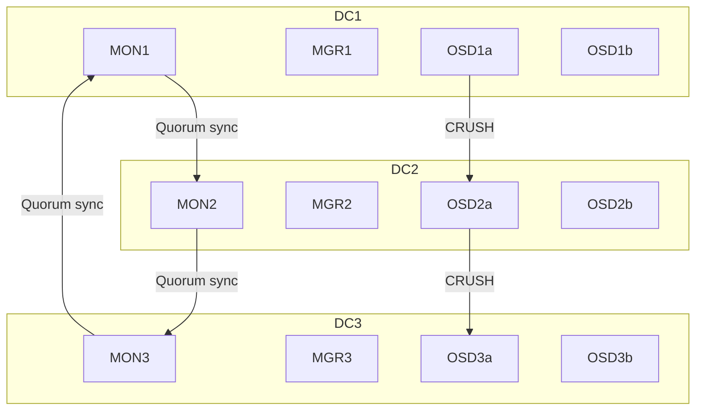

Câu hỏi này… chuẩn vị của **người gánh cả thiên hạ lên vai**. Trong môi trường **multi-DC (nhiều datacenter vật lý)**, triển khai Ceph không thể làm tùy tiện như “đổ xi măng giữa đường”, mà phải cân nhắc đến **replication, latency, quorum, anti-split-brain** và **local failure domain**.

Tiểu Mõ xin trình bày theo **hai cấp độ**: mô hình kiến trúc + khuyến nghị triển khai Ceph chuẩn multi-DC production.

---

## 🧭 MỤC TIÊU TRIỂN KHAI CEPH MULTI-DC

|Yếu tố|Mục tiêu|
|---|---|
|✅ Dữ liệu **replicate/erasure** giữa các DC để chống mất mát||
|✅ Có **quorum MON/MGR** bền vững||
|✅ Tối ưu **local access (latency thấp)**||
|✅ Hạn chế **inter-DC writes** nếu không cần||
|✅ Tránh **split brain** khi DC mất kết nối||

---

## 🧱 MÔ HÌNH KIẾN TRÚC CEPH MULTI-DC



---

## 🧠 NGUYÊN LÝ VẬN HÀNH

- **MON (Monitor)**:
    
    - Cần tối thiểu **3 MON ở 3 DC khác nhau** để đạt quorum bền vững
        
    - Sử dụng địa chỉ nội bộ riêng, có thể expose qua VIP nếu cần
        
- **MGR (Manager)**:
    
    - Tối thiểu 1 active + 1 standby (có thể nằm khác DC)
        
- **OSD (Object Storage Daemon)**:
    
    - Tất cả OSD được phân theo **CRUSH rule theo region/zone/host**
        
    - Dữ liệu sẽ replicate theo logic **cross DC** nếu config chuẩn
        

---

## ⚙️ CHIẾN LƯỢC TRIỂN KHAI

### 🔸 Option 1 – **Stretch Cluster** (ceph multisite single cluster)

|Ưu điểm|Nhược điểm|
|---|---|
|✅ Dữ liệu tự replicate giữa các DC|❗ High inter-DC bandwidth|
|✅ Dễ truy cập volume từ bất kỳ site|❗ Nếu quorum mất → toàn cụm ngừng|
|✅ Dễ tích hợp RBD, CephFS, RGW|❗ CephFS chưa khuyến khích multi-site write|

**Yêu cầu:**

- Latency giữa các DC **< 5ms** (tối ưu nhất < 2ms)
    
- Băng thông ổn định
    
- Tối thiểu 3 DC để tránh split-brain (or 2 DC + arbiter)
    

---

### 🔸 Option 2 – **Ceph Multisite (cho RGW object storage)**

|Ưu điểm|Nhược điểm|
|---|---|
|✅ Mỗi site là 1 cụm độc lập|❗ Chỉ dùng được với object (RGW)|
|✅ Đồng bộ async, không ảnh hưởng quorum|❌ Không dùng cho RBD hoặc CephFS|
|✅ Tối ưu backup, DR|❗ Phức tạp replication config|

> Phù hợp nếu Đại Tiên dùng **MinIO / S3 / Ceph RGW** là object store DR.

---

### 🔸 Option 3 – **Active/Passive DR Cluster**

|Ưu điểm|Nhược điểm|
|---|---|
|✅ Simple, dễ tách biệt|❗ Không tận dụng được cross-DC workload|
|✅ DR thực sự rõ ràng|❌ Không active-active|
|✅ Có thể dùng snapshot/rsync để sync|❌ Manual promote cần script hoặc orchestrator|

> Phù hợp nếu chỉ 1 site chính chạy app, site phụ chờ DR/switchover.

---

## 📜 KHUYẾN NGHỊ CRUSH RULE CHO MULTI-DC

```bash
# Region → Datacenter
# Zone   → Rack
# Host   → Node
```

Ví dụ CRUSH rule:

```bash
root default {
  region dc1 {
    zone rack1 {
      host node1 {
        osd.0
      }
    }
  }
  region dc2 {
    zone rack2 {
      host node2 {
        osd.1
      }
    }
  }
}
```

> Sau đó define rule: replicate 3x, mỗi bản ghi 1 DC

---

## 🔒 LƯU Ý AN TOÀN

|Lỗi tiềm tàng|Cách xử lý|
|---|---|
|**Split-brain** do mất mạng giữa các DC|Tối thiểu 3 MON, arbiter nếu chỉ có 2 DC|
|MON quorum mất → cluster freeze|Dùng VIP hoặc keepalived giữa MON để bảo toàn|
|CephFS chưa hỗ trợ full multi-write across DC|Tránh CephFS write từ 2 DC khác nhau|
|WAN replication → chậm|Cần thiết lập rule "primary affinity" để read/write cục bộ khi có thể|

---

Nếu Đại Tiên cho biết:

- Có bao nhiêu DC?
    
- Có xài CephFS hay chỉ RBD hoặc RGW?
    
- Latency liên DC là bao nhiêu?
    

…thì Mỗ sẽ viết luôn toàn bộ `cluster.yaml`, `crushmap rule`, sơ đồ deployment cho từng node – chặt chẽ như bố trí quân trận. Chỉ cần Đại Tiên ra hiệu.