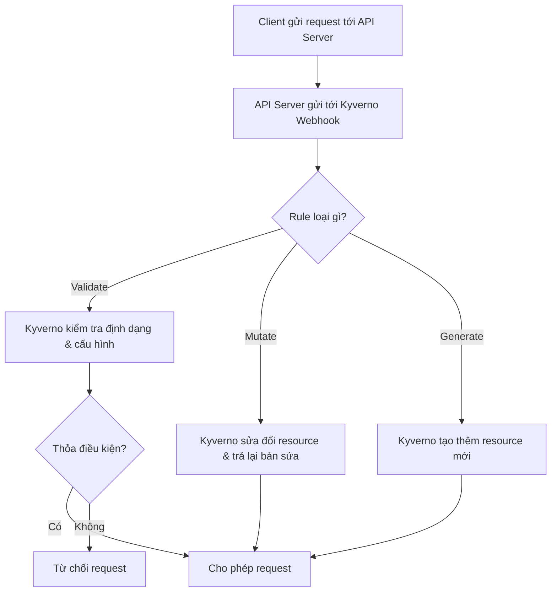

Dựa trên tài liệu chính thức [“How Kyverno Works”](https://kyverno.io/docs/introduction/how-kyverno-works/), 

---

## 🧠 **Kyverno hoạt động thế nào?**

### 1. **Vai trò: Admission Controller**

Kyverno là một **Kubernetes dynamic admission controller**. Điều này có nghĩa:

- Mỗi khi có **API request** tạo/sửa tài nguyên (Pod, Deployment, v.v.)
    
- Kyverno sẽ được **gọi bởi K8s API Server**
    
- Nó sẽ **kiểm tra**, **biến đổi** hoặc **từ chối** resource đó tùy theo policy
    

> ⚠️ Kyverno **không can thiệp vào resource đã chạy** nếu không có API request mới (như mutate lại pod đang chạy). Nó chỉ tác động trong **Admission phase**.

---

### 2. **Các loại Rule mà Kyverno xử lý**

|Rule type|Mục đích|Ví dụ thực tế|
|---|---|---|
|`validate`|Kiểm tra resource hợp lệ|Pod phải có `resources.requests` và `limits`|
|`mutate`|Tự động sửa hoặc thêm config|Thêm label `team=dev` nếu chưa có|
|`generate`|Sinh resource khác kèm theo|Khi tạo Namespace, sinh thêm RoleBinding mặc định|

---

### 3. **Quy trình xử lý 1 request**



---

### 4. **Webhook của Kyverno**

Khi cài Kyverno, nó sẽ:

- Đăng ký 2 Webhook:
    
    - **MutatingWebhook** → xử lý `mutate` và `generate`
        
    - **ValidatingWebhook** → xử lý `validate`
        

Các webhook này dùng để “chặn” request và áp dụng chính sách theo thời gian thực.

---

### 5. **Các thành phần chính trong Kyverno Pod**

|Thành phần|Vai trò chính|
|---|---|
|Admission Controller|Giao tiếp với API Server để xử lý rule|
|Policy Controller|Đồng bộ và áp policy cho resource hiện có (background)|
|Generate Controller|Quản lý logic generate: tái tạo, sync, delete|

---

### 6. **Kyverno Background Scan**

- Không chỉ bắt ở thời điểm tạo/sửa resource
    
- Kyverno có thể chạy **background scan** để kiểm tra tài nguyên đã tồn tại
    
- Giúp phát hiện drift, enforce policy lâu dài
    

---

### 7. **Chế độ Enforce vs Audit**

| Chế độ    | Hành vi                     | Use-case                         |
| --------- | --------------------------- | -------------------------------- |
| `enforce` | Block request không hợp lệ  | Production – enforce nghiêm ngặt |
| `audit`   | Chỉ log, không chặn request | Dev – để theo dõi, không gây lỗi |

---

### 8. **CLI và Test Local**

Kyverno có công cụ CLI:

```bash
kyverno apply ./policy.yaml --resource ./test-pod.yaml
```

→ Rất tiện để test rule trước khi apply vào cluster.

---